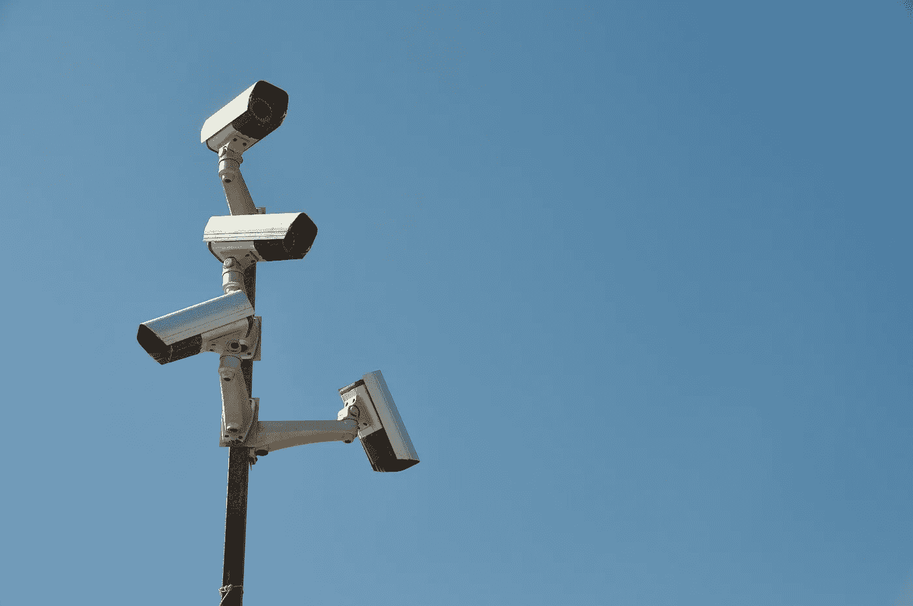

# 什么是监督共产主义？

> 原文：<https://medium.com/geekculture/what-is-surveillance-communism-67c8a3a9a56e?source=collection_archive---------26----------------------->

## 资本主义现在看起来没那么糟糕了，哈！

Image from Pixabay.com

## 首先，让我们谈谈监视资本主义…

我昨天刚刚发布了一个博客，关于一个我认为是祖博夫教授创造的概念，叫做 [*监视资本主义*](https://dereklondon.medium.com/what-is-surveillance-capitalism-4eed38323b0?sk=9a9df854c53ba4a9b82f2e09c99cb798) 。这基本上是实施人工智能的公司能够跟踪…