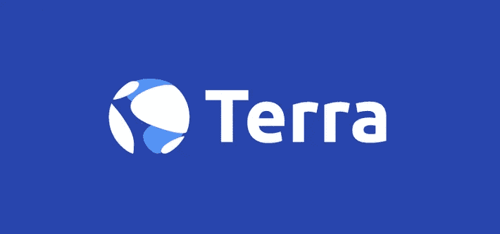
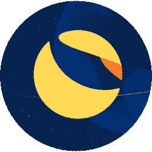
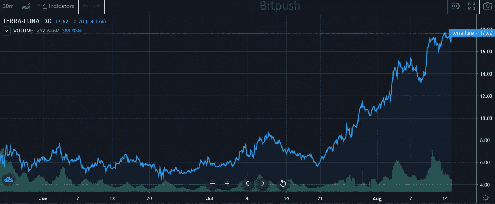
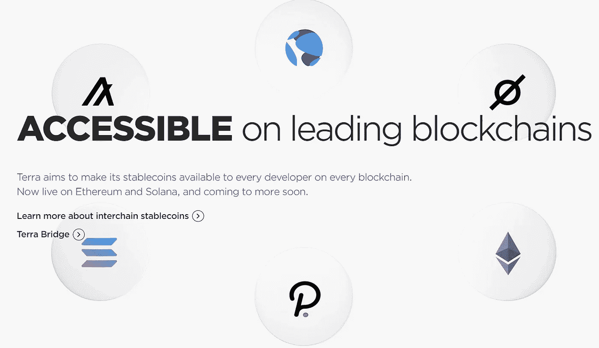
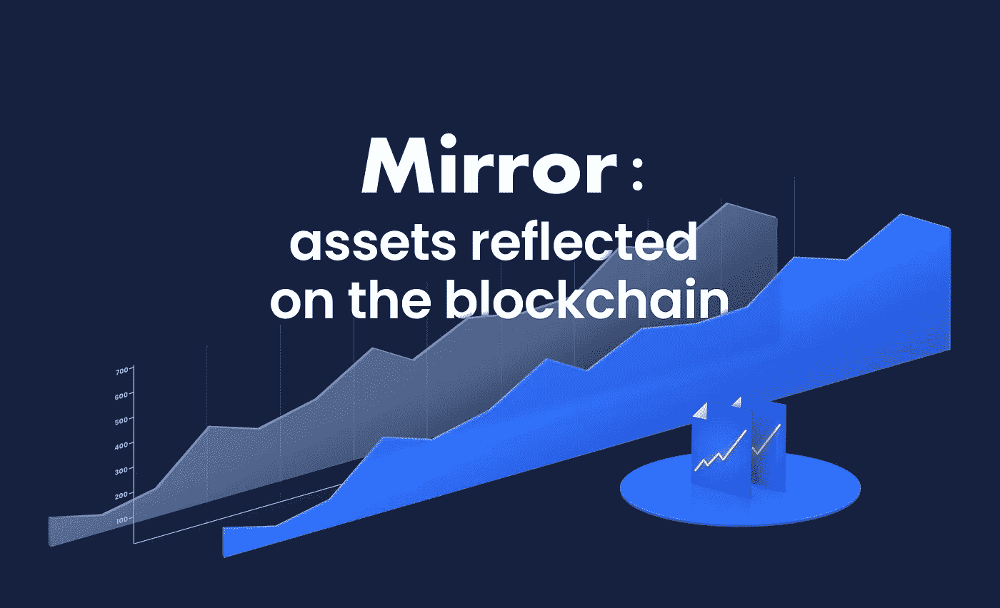
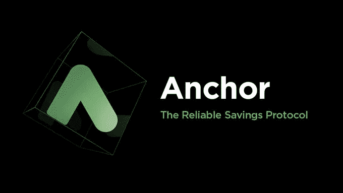

# 前 25 名中增长最快的加密货币 Terra 是什么？

> 原文：<https://medium.com/geekculture/what-is-terra-the-fastest-growing-cryptocurrency-in-the-top-25-c1d5f9270d91?source=collection_archive---------4----------------------->

Terra 和它的 [UST](https://en.bitpush.news/articles/tag/ust) stablecoin 是区块链项目的一部分，该项目旨在成为全球支付系统的骨干。通过它们的锚协议和镜像协议，它们能够作为一个分散的银行，提供更高的收益率和更低的费用。他们即将到来的更新，哥伦布-5，将为[月神](https://en.bitpush.news/articles/tag/luna)带来更大的效率和稀缺性。

在过去的一年里，DeFi 一直承诺要成为下一代银行，消除中间人，为用户提供更大的收益机会。DeFi 中的大量使用来自稳定硬币，这是一种与另一种资产(通常是美元)1:1 挂钩的硬币。大多数大型稳定币都是集中的，这意味着有一个注册的实体持有稳定币的抵押品，确保其保持钉住。虽然这是一个简单的解决方案，但它带来了许多问题，因为稳定币背后的中央公司可以有效地控制谁持有它以及它可以花在什么地方，这使得它们并不比我们当前的支付解决方案更好。Terra 和 UST stablecoin 正在解决这个问题，它的快速采用是 Terra 的 LUNA coin 在不到一个月的时间里上涨了近 500%的原因。

Terra 是由 Do Kwon 和韩国的 Terraform 实验室创建的。Terra 区块链 mainnet 于 2019 年 4 月发布，使用 LUNA 作为其原生加密货币。在某些方面，Terra 类似于以太坊的智能合约区块链，因为它允许智能合约在 Terra 区块链上被创建和部署。然而，它也有一个令人难以置信的独特和令人兴奋的特点，使它从其他项目中脱颖而出:UST 稳定币。

UST 是一种分散的算法稳定币，这意味着它没有 1:1 的真实美元支持。相反，它使用 LUNA 硬币作为算法稳定方法。任何人都可以通过燃烧他们的月神来铸造 UST，所以燃烧 1 美元的月神将创造 1 美元的 UST。反过来也是一样，所以 1 美元的 UST 可以被烧成 1 美元的月神。这内在地将两枚硬币联系在一起，并使露娜的成功依赖于对 UST 的收养。铸造的 UST 越多，需要燃烧的月神就越多，这意味着供应越少，导致价格上涨。

2020 年末发布的 UST 稳定币已经拥有超过 20 亿美元的市值。由于其采用是 LUNA 增长的主要驱动力，Terraform 实验室团队一直致力于通过多种方法提高其采用率，主要是通过与其他区块链的桥梁。UST 可以在以太坊、Polygon、Solana、币安智能链和即将推出的 Polkadot 上找到。Terra 区块链也是使用 Cosmos SDK 构建的，这意味着它将很快与整个 Cosmos 生态系统互操作。

UST 不仅用于传统的 DeFi 活动，如 Uniswap 上的流动性供应，而且还有基于 Terra 区块链构建的革命性 DeFi 应用。其中之一是镜像协议，这是最大的合成股票协议，总价值近 20 亿美元。使用 Mirror，任何人都可以提供 UST 作为抵押来创造一只股票，比如苹果、特斯拉，甚至 GameStop。然后，他们可以使用这只股票，这只股票通过使用甲骨文与现实世界的价格挂钩，就像他们使用任何其他加密货币令牌一样。

Terra 上正在构建的另一个令人兴奋的协议是 Anchor Protocol，它自称是“区块链上被动收入的黄金标准”。该协议允许用户存入 UST 并获得稳定的 20%年收益率。这种高收益是通过利用来自多个区块链的赌注回报实现的，包括 Terra、以太坊、Solana 和 Polkadot。任何人都可以将这些加密货币存入 Anchor，然后硬币的收益率用于实现这一利率。

9 月 9 日 Terra 的一个令人兴奋的更新是哥伦布-5 的发布，这是 Terra 区块链的下一次升级。用户感到兴奋的主要功能是 LUNA 交易费的燃烧，现在这些费用将进入 Terra 社区的国库。这将会产生类似于 EIP-1559 对以太坊的影响，并且将会是另一种持续减少月神供应的方法。这也将使更多的互操作性与顶级区块链，进一步扩大 UST 的影响力。

Terra 持有者在未来几个月有很多值得兴奋的事情，这已经反映在最近的价格走势中。持有 LUNA 的主要风险是，如果出现某种不可预见的事件，导致 UST 盯住美元的机制被打破，或者缺乏对 UST 的采用。然而，随着越来越多的区块链和交易所采用 UST，这种风险变得不太可能，UST 也更接近其成为全球支付基础设施骨干的目标。

林肯·穆尔