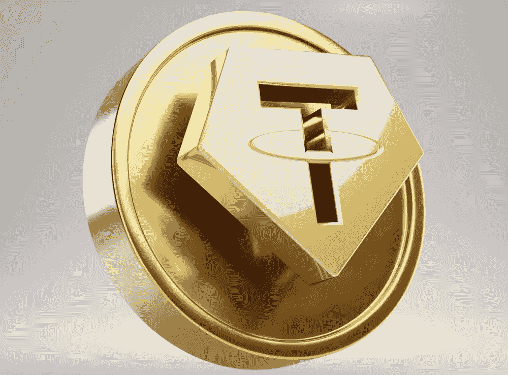

# 什么是系绳(USDT)？

> 原文：<https://medium.com/geekculture/what-is-tether-usdt-2938c0601146?source=collection_archive---------14----------------------->

当然，你听说过 USDT 在密码世界。

Tether 是一种加密货币，希望与美元保持 1:1 的平价，这意味着流通中的代币由相同数量的美元支持，使其成为价格与 1 美元挂钩的[稳定币](/@patoman07/what-is-a-stablecoin-c1efcebaf1f6)。

USDT 最初是通过 Omni 层在比特币协议上发行的，但随后也转移到了其他区块链。事实上，它的大部分供应是作为一个 [ERC-20 代币](https://blog.cryptostars.is/what-is-erc-20-eff33a8029e)存放在以太坊区块链。

它也可以在 TRON network、EOS、Algorand、Solana 等网站上下载。

> Tether 是一种稳定币，是一种加密货币，旨在保持价格稳定。

## 起源

J.R. Willett 在 2012 年 1 月在线发布的一份文件中概述了在比特币协议基础上创造更多货币的前景。(JR Willet 被称为“发明 [ICO](https://blog.cryptostars.is/what-is-an-initial-coin-offering-ico-e9531b3a10c3) 的人”)。

威利特继续协助在加密货币 Mastercoin 中实现这一概念，以鼓励采用这一新的“第二层”。Mastercoin 协议将为 Tether 加密货币提供技术基础，Mastercoin 基金会的早期成员之一 Brock Pierce 将成为 Tether 的联合创始人。克雷格·塞拉斯，另一个系绳创造者，是 Mastercoin 基金会的首席技术官。

Tether 的前身最初名为“Realcoin”，是由联合创始人布洛克·皮尔斯、里夫·科林斯和克雷格·塞拉斯于 2014 年 7 月在圣莫尼卡成立的一家公司。第一批代币于 2014 年 10 月 6 日在比特币网络发布。2014 年 11 月 20 日，Tether 首席执行官里夫·柯林斯(Reeve Collins)宣布该项目更名为“Tether”。

该公司还宣布推出一项私人测试计划，将实现三种货币的“Tether+ token ”:美元的 USTether (US+)、欧元的 EuroTether (EU+)和日元的 YenTether (JP+)。

## 为什么创造了 USDT？

你可能会问，与一美元等值的加密货币能有多大好处。尤其是现在我们有了美元和使用美元的数字支付方式。

事实上，当我们考虑以下因素时，像 USDT 这样稳定的货币很有意义:

*   **转账时不会受到任何限制:** USDT 拥有传统加密货币的所有优势。这意味着你可以很容易地以最低的成本将 USDT 传送到世界上的任何地方。
*   **它提供了一种保护交易平台上交易者投资的方式:**例如，交易者可以买卖比特币，然后在交易结束时将他的余额兑换成 USDT。通过这种方式，它可以保护自己免受比特币价值波动的影响，直到恢复运营。
*   **提供了一个安全的支付平台，就波动性而言:**这是由于加密货币的恒定价值为一美元，当波动性不受欢迎时，它是支付系统的完美选择，但您仍然希望利用加密货币。

## USDT 是如何工作的？

Tether 是一种[稳定币](/@patoman07/what-is-a-stablecoin-c1efcebaf1f6)，一种旨在保持加密货币估值稳定的加密货币，与其他著名加密货币如[比特币](/@patoman07/what-is-bitcoin-d92a02be0f4c)和[以太坊](/@patoman07/what-is-ethereum-57df6e0ee4a)的价格大幅波动相反。

这将使它不再被用作投机投资的媒介，而是被用作一种贸易手段和一种财富储存形式。

创建 Tether 的目的是通过弥合法定货币和加密货币之间的差距，为消费者提供稳定性、透明度和低交易费用。它与美元挂钩，与美元保持一比一的价值比。

USDT 背后的组织 Tether Ltd 根据其美元储备铸造和焚烧流通中的代币——Tether Ltd 声称在其银行账户中储存了 1:1 的 USDT 对美元储备比率。因此，USDT 可以与美元等值交易。

除了通过 USDT 提供美元敞口外，Tether Ltd 还支持人民币(CNHT)、欧元(EURT)和黄金盎司(XAUT)。

根据全球加密货币市场数据来源 CryptoCompare 的一项调查，比特币与系绳交易继续占兑换成法定货币或稳定货币的 BTC 的绝大部分。

2022 年 1 月，USDT 占所有比特币交易的 55%。

## 争论

据称，Tether Ltd 在 2017 年 11 月遭到黑客攻击，价值 3100 万美元的 Tether tokens 被盗。

2018 年 1 月，当保证真实世界储备得以维持的必要审计没有发生时，它遇到了另一个绊脚石。相反，它宣布从审计公司分离，随后当局发出传票。有人担心被批评缺乏透明度的该公司是否有足够的储备来支持硬币。

2019 年 4 月，纽约司法部长 Letitia James 指控加密货币交易所 Bitfinex 的运营商 Tether Ltd .的母公司 iFinex Inc .向投资者隐瞒了混合客户和公司资金的 8.5 亿美元损失。

根据法庭文件，这些资产被委托给一家名为 Crypto Capital Corp .的巴拿马公司，没有管理消费者提款的合同或协议。

这笔钱失踪后，Bitfinex 据称从 Tether 的现金储备中攫取了至少 7 亿美元，以弥补差额。

这些组织在一份声明中表示，这些论文“是在不诚实的情况下产生的，并带有欺诈性的陈述。”

相反，我们被告知，这些秘密资金已被没收和保护，而不是丢失。我们正在并一直在积极尝试执行我们的权利和补救措施，并获得这些现金的释放。

不幸的是，纽约总检察长办公室似乎决心破坏这种努力，损害我们的消费者。

阅读这篇[文章](https://www.theverge.com/22620464/tether-backing-cryptocurrency-stablecoin)了解更多详情。

## 优势

*   **交易时间:**在常规银行系统中，处理美元存款和取款通常需要 1-4 个工作日。如果交易发生在晚上或周末银行关门时，处理时间可能会延长。
    Tether 交易速度以分钟为单位，这对于经常希望以分钟而不是以天为单位进行交易的加密货币交易者来说非常有利。
*   **交易费用** : SWIFT(环球国际金融电信协会)交易费用高昂，从 20 美元到 30 美元不等，甚至更多。
    特别是如果您使用的是交易所不接受的法定货币，那么您将被收取外汇兑换费以及转账金额的一定百分比。
    栓系钱包之间的交易不收取任何费用。
*   **价格稳定**:当使用 Tether 而不是另一种货币购买时，加密货币是不稳定的。作为投资，货币不够稳定。
    许多交易所不接受法定货币，但会接受 Tether。
*   **靠边站**:在任何事情发生时都不表态。“套现”，等待更好的机会或市场时机。准备好你的绳索。没有必要冒险或把钱留在交换者身上。

## 不足之处

*   **有人怀疑 Tether 有限公司是否在 USDT 代币与其银行准备金之间保持 1: 1 的抵押关系:**这是因为对该系统进行全面公开的审计从来都是不可能的。结果，USDT 在 2017 年面临可怕的局面，其价值大幅低于与美元的 1: 1 比率，跌至 0.9: 1。同样，Tether Ltd 也卷入了各种争议，包括 Bitfinex 黑客危机和 Tether 自己的危机，这两起事件都导致了数百万美元的损失。
*   **中心化:**因为是由事务所管理的加密货币，所以其功能由他们决定。
*   **缺乏匿名性:**为了生产代币，需要向银行存款，这降低了隐私，并将你的数据交到了一家公司的手中。
*   **不开采:**由于其资产支持的性质，系绳是不可开采的。新 USDT 发行给进行法定货币存款的经过验证的用户。
*   不清楚它的实现方式。没有关于它在 Omni 协议上的实现的 Github 库。唯一知道的是它在以太坊和 EOS 上的智能合约，其余的就不清楚了。

## 结论

Tether 在加密货币中有一个作用，在波动不足时填补空白。

当使用任何加密货币时，要谨慎，并在开始投资时继续研究和监控新闻中的任何新信息。