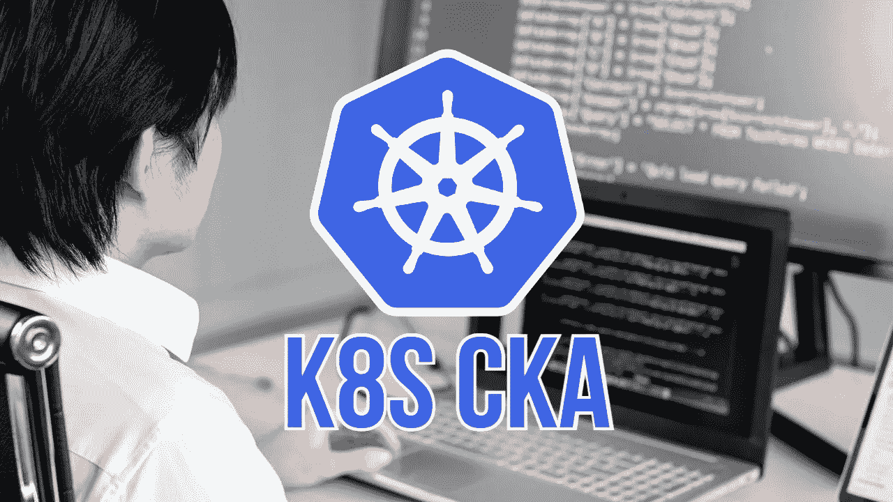

# 什么是库伯内特认证管理员(CKA)考试？

> 原文：<https://medium.com/geekculture/what-is-the-certified-kubernetes-administrator-cka-exam-ca65b4ade05e?source=collection_archive---------16----------------------->

认证 Kubernetes 管理员(CKA)计划是由 CNCF 或云本地计算基金会和 Linux 基金会合作创建的，旨在帮助开发 Kubernetes 生态系统。

CNCF 进一步描述了他们场地的地形:

> 作为速度最快的开源项目之一，Kubernetes…