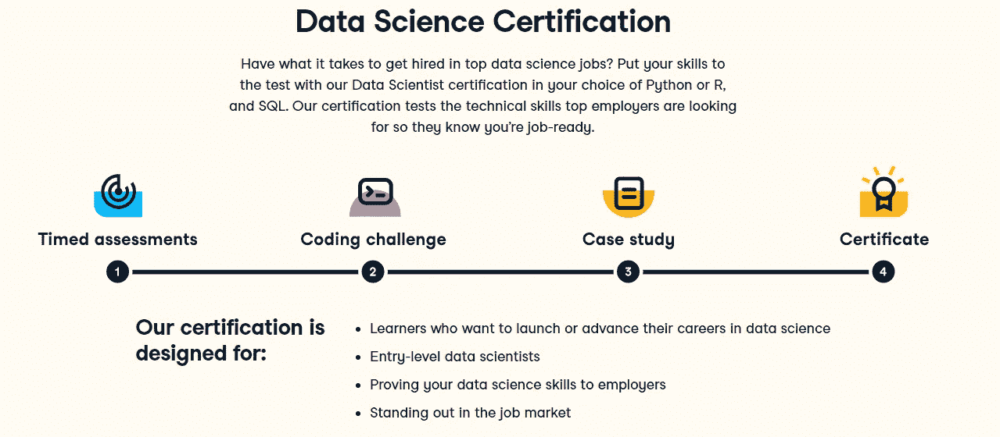

# 数据科学家保持理智的代价是什么？

> 原文：<https://medium.com/geekculture/what-is-the-cost-of-sanity-for-a-data-scientist-12a5d78f3b4b?source=collection_archive---------20----------------------->

一个简单的数据错误，让我对一切产生了怀疑，把我带进了黑暗的地方。

Photo by [Maksym Kaharlytskyi](https://unsplash.com/@qwitka?utm_source=medium&utm_medium=referral) on [Unsplash](https://unsplash.com?utm_source=medium&utm_medium=referral)

有时候聪明会让你失去理智。我正在为[数据营夏季挑战赛](https://www.datacamp.com/summerchallenge)进行技术测试，在开始的 10 分钟内，我注意到数据有问题。我检查了箱线图，在 2018 年，有一个异常值。我不能删除它，因为我需要这个数字来成功地通过测试。我搜索了网站，找到了所有数据的 pdf 文件。是的，最后少了整整一个零。我回去纠正错误，当我认为我得到了最好的结果。我收到一条错误消息“我的数据框没有正确的值”。这是我深入调试的时刻。我检查了我的代码 15 次，但我没有发现问题，所以我开始寻找在线资源或任何其他可以帮助我完成这项任务的功能。我花了 8 个小时才意识到这不是一个难题，答案是基于错误的数据。这个故事的寓意是，不要自作聪明，描述和数据或解决方案总有错误。保持沉默🙆。

[Summer Certification Challenge | DataCamp](https://www.datacamp.com/summerchallenge)

获得 DataCamp 的数据科学认证并不是一件容易的事情。你必须首先学习 Python、数据分析和 SQL 的基础知识，然后才能通过****定时评估**测试，因为分数必须超过 90 个百分点才能进入下一阶段。然后是编码的改变，我陷入了不够好的困境。**

**你能做些什么来避免我的错误？**

1.  **总是阅读两遍问题陈述，并在开始编码之前给自己一些时间。**
2.  **在写一行代码之前，先把事情计划好。**
3.  **不要自作聪明，尽可能简单地尝试这个问题，没有什么技巧性的问题。**
4.  **如果你被卡住了，休息一下，出去喝杯咖啡，即使是在考试期间。**
5.  **第一次尝试没有得到答案没关系，这并不意味着你不够好。**

> **你可以在 [LinkedIn](https://www.linkedin.com/in/1abidaliawan/) 和 [Polywork](https://www.polywork.com/kingabzpro) 上关注我，我在那里发布了关于数据科学和机器学习的惊人文章。**