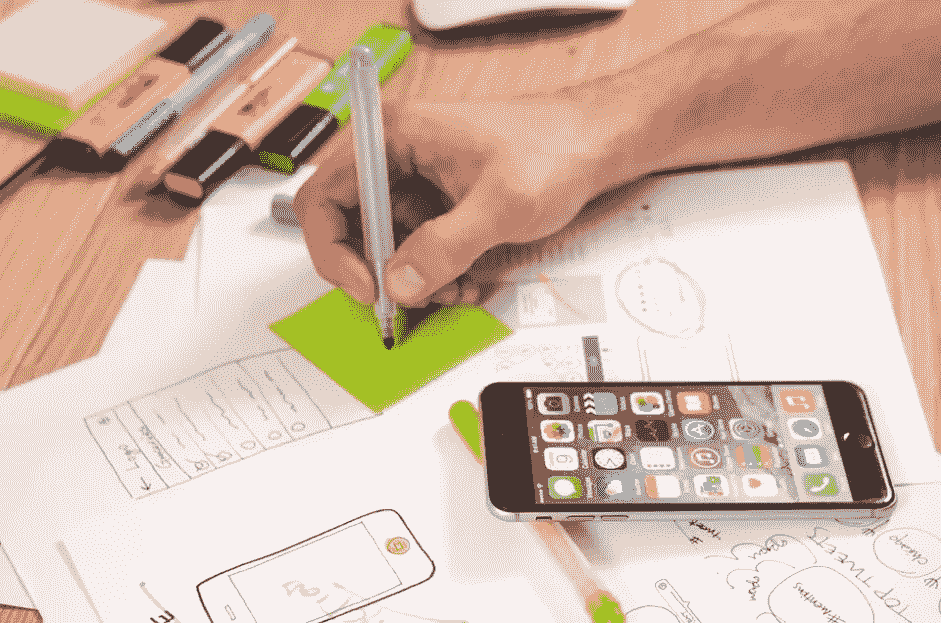

# 产品设计师和 UX 设计师的区别是什么

> 原文：<https://medium.com/geekculture/what-is-the-difference-between-a-product-designer-and-a-ux-designer-a70f250121f9?source=collection_archive---------3----------------------->

产品设计和用户体验设计(UXD)都在我们日常使用技术和产品的过程中扮演着至关重要的角色，但它们服务于不同的目的。产品设计师负责思考产品创建过程的每一步，而 UX 设计师则专注于产品介绍给用户后，用户如何与产品互动。

请继续阅读，了解产品设计师和 UX 设计师的区别，以及这两种角色如何融入整个科技行业。为了利用 UI/UX 设计师的所有优势，与一家 [UI/UX 设计服务公司](https://www.hiddenbrains.com/ui-ux-development.html)合作。

## **什么是 UI/UX 设计？**

UI/UX 设计师通常被称为视觉设计师、界面设计师和信息架构师。他们负责应用程序或网站的外观和感觉，以最大限度地提高可用性。UI/UX 设计在 web 和应用程序开发中起着重要的作用。

## UI/UX 设计的两个主要目标是:

1)创造满足用户需求的迷人体验

2)确保每个人都能获得这些体验

## **什么是产品设计？**

产品设计指的是产品的所有方面——外观、感觉质量、可用性等。虽然产品设计师通常负责创建面向消费者并出售给消费者的产品(如网站或应用程序)，但没有理由说它不能应用于其他环境。

# 产品设计师和 UX 设计师有什么区别？

## **设计方法**

产品设计师和 UX 设计师之间唯一显著的区别是他们关注的焦点。

两者的总体作用都是为客户解决问题，创造满足需求或提供乐趣的产品，但产品设计师可能更专注于某些设计方法，如界面/视觉设计，而 UX 设计师可能专注于其他方法，如行为心理学或客户研究和分析。

例如，UX 设计师可以在编写客户需求方面扮演积极的角色，而产品设计师可以通过视觉元素的迭代来领导开发。

## **所需技能**

主要的区别是，产品设计师更关心如何将功能组合在一起，以便为用户创造最佳体验。相比之下，用户体验设计师需要在与客户互动的每一步考虑产品如何吸引(或排斥)客户。

UX 设计师和产品设计师都需要精通前端网络技术，比如 HTML、CSS 和 JavaScript。对干净、现代的设计和优秀的沟通技巧有眼光是很重要的。还需要良好的解决问题的能力和对用户的同理心。

## **设计师的角色**

产品设计师的主要关注点是如何工作和看起来如何，而 UI/UX 设计师必须考虑这些方面，并将它们与网站结构和用户行为结合起来，以确保这三者和谐地一起工作。

这个角色包含了形式和功能，同时考虑到用户的需要、需求和愿望，以创建一个有效的界面。这两个角色的观点也不同；虽然 UI/UX 设计师通常更善于分析，但产品设计师倾向于成为创造性的问题解决者，他们会毫不犹豫地选择编码过程。

## **工资**

在许多主要的应用程序开发公司，产品设计师比 UX 设计师挣得多。在一些地方，工资几乎翻了一倍，也有更多的发展机会。在许多主要的应用程序开发公司，产品设计师比 UX 设计师挣得多。

产品设计师通常会获得更高的报酬，因为他们创造了整个产品，而 UX 的设计师只是利用他们的技能来改进产品设计师创造的产品。产品设计师也可以与工程师或团队的其他成员合作来改进应用程序，而 UX 的设计师在这些领域没有能力。

这些设计工作并不总是有固定的要求，但在决定哪一个适合你之前，你应该考虑一些重要的差异。

## **结论**

产品和用户体验设计师都能创造出令人惊叹的产品。然而，关键是要知道什么时候使用一个而不是另一个。这两个角色都有自己特定的职责，即使它们有些重叠。精通这两个学科的设计师可以为他们的客户提供更多的价值，并产生更好的结果。

产品设计师的主要职责是确保应用程序或网站的每个功能都有它的位置，而 UI 设计师更喜欢交付交互式、吸引眼球和易于导航的设计。