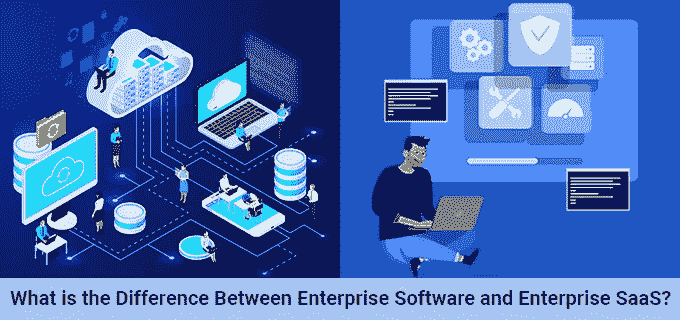

# 企业软件和企业 SaaS 有什么区别？

> 原文：<https://medium.com/geekculture/what-is-the-difference-between-enterprise-software-and-enterprise-saas-7cc0192df900?source=collection_archive---------11----------------------->

Difference Between Enterprise Software and Enterprise SaaS

**目录**

> 1.[什么是企业软件？](#b715)
> 
> 2.[什么是企业 SaaS(软件即服务)？](#abd4)
> 
> 3.[企业软件和企业 SaaS 的区别](#aff2)
> 
> 4.[如何在企业软件和企业 SaaS 之间选择合适的系统](#7fb3)
> 
> 5.[结论](#a65b)

每当涉及到业务流程时，每一步都需要对结果有透彻的理解。如果业务流程不准确，或者没有满足需求，或者没有达到预期，那么从中获益的机会是零。因此，在决定使用哪种类型的软件应用程序来实现适当的业务流程时，有两种选择:企业软件和企业 SaaS(软件即服务)。

从这两种方法中选择哪一种可能有点困难，因为这两种方法都提供了最好的服务。因此，在这篇博客中，我们将了解这些方法中的每一种，并讨论其核心区别，以及为您的组织选择正确软件解决方案的方法。

# *1。什么是企业软件？*

企业应用程序基本上是公司用来更专注于解决业务问题的工具。这些应用程序提供诸如会计、信息共享、客户关系管理、自动计费等服务。大多数情况下，所有不同的[类型的企业应用程序](https://www.tatvasoft.com/outsourcing/2021/05/what-are-the-types-of-enterprise-software.html)都是根据它们的角色按照不同的功能进行分类的。

简单来说，企业软件就像任何其他可以在大公司或政府办公室使用的程序或系统一样。ERP 的主要目标是在公司内部提供控制、提高工作效率和管理数据。

# 2.什么是企业 SaaS(软件即服务)？

企业 SaaS(软件即服务)被定义为三种主要的云应用之一。另外两个是 IaaS 和 PaaS。它们由第三方提供商托管。用户可以通过互联网访问 SaaS。它被认为是公司使用的传统工具和技术的最佳替代品之一。企业 SaaS 应用程序既便宜又易于实现。

按照软件开发专家的说法，SaaS 的范围可以惠及每一个商业组织，而且每天都在扩大。SaaS(软件即服务)基本上是一个云平台，公司每月支付费用以获得服务。但是管理基础设施的责任不在公司。因此，基于云的 SaaS 模式最适合中小型企业。

# 3.差异—企业软件与企业 SaaS

让我们来看看软件开发世界中的两种主要方法，企业软件和企业 SaaS(软件即服务)之间的主要区别。

1.  数据转换

SaaS 的实现更简单，这使得数据转换过程更加简洁。企业 SaaS 数据转换的标准流程是将重要数据转移一次，然后只转换成员信息或联系方式等基线信息。可以导入更详细的数据，但这通常不符合 SaaS 的标准方法。

另一方面，对于企业级软件，实现过程可能包括两次或更多次数据转换迭代。企业软件包含广泛的数据集，如事件出席历史、财务数据和产品购买历史。

2.费用

谈到成本，SaaS 倾向于遵循月费和服务模式。因此，SaaS 应用程序的初始成本将低于企业软件，但以后如果您需要任何新功能，它可能会花费很多。

另一方面，企业软件的[定价模型遵循软件许可、定制和软件维护。因此，如果您选择企业模式，初始成本会高得多，但它将包含您的企业从第一天起就需要的所有特性和功能。](https://alcorfund.com/insight/enterprise-software-pricing-models-and-their-impact-on-startups/)

3.操作

企业软件和企业 SaaS 的操作完全不同。SaaS 的可定制性有限，不允许企业根据需要执行所有功能。

而对于企业系统，由于其定制的方法，它解决了所有的业务功能需求。

4.用户化

使用 SaaS 软件，定制被限制在工具必须提供的任何功能上。它可以是创建新字段或创建新实体。由于这一限制，SaaS 只能提供多租户环境。而这并不能实现纯粹的定制。

另一方面，企业软件的最大优势之一是它提供定制。因为商家有自己的软件，可以定制系统需求。

# 4.如何在企业软件和企业 SaaS 之间选择合适的系统？

在过去的几年里，企业解决方案市场有了很大的发展。它包括各种交付解决方案和模型。而企业软件即服务提供了一系列基于前提的企业解决方案。

因此，如今，较小的利基软件供应商与 Oracle 和 SAP 这样的行业巨头一起提供企业解决方案。这让各组织在选择企业资源规划系统时发挥了更大的作用。而遗留系统与定制的企业解决方案相比存在不足。

所以，当谈到选择 SaaS 或 ERP，你必须问自己一些问题，然后再做决定。这是必要的，因为不是每个解决方案都适合您的业务。这些问题可能包括-

1.  企业是否需要高度定制的解决方案？
2.  您是否希望将任何新的应用程序与现有的遗留软件集成在一起？
3.  您选择的应用程序是否具备所有必需的功能？
4.  部署范围是否明确？
5.  软件部署的截止日期是什么时候？
6.  您的公司需要升级其 IT 基础架构吗？

# 5.结论—企业软件与 SaaS

正如在这篇博客中看到的，企业 SaaS 和 ERP 应用程序都是你的业务的一个很好的选择，但不是每个人都需要一个。其背后的主要原因是，业务应用程序不仅与软件有关，还与业务流程有关。此外，适应新的业务流程和平台对任何企业来说都具有挑战性。因此，组织必须考虑所有选项。

ERP 和 SaaS 解决方案都提供了管理公司、员工和资源的新方法。所以选择一个满足所有业务需求的。