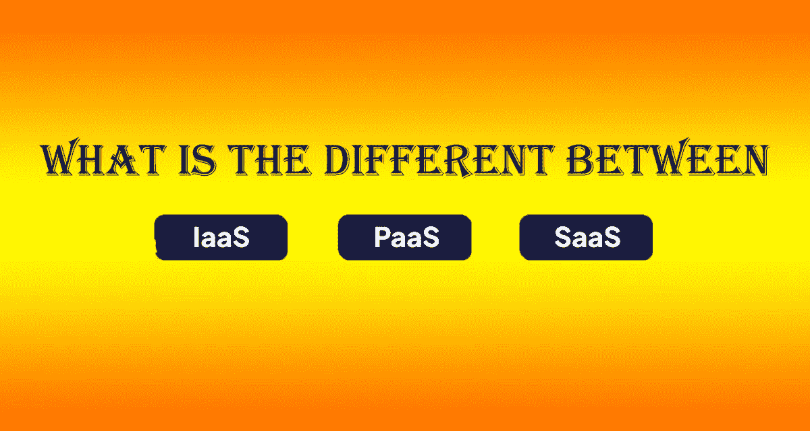
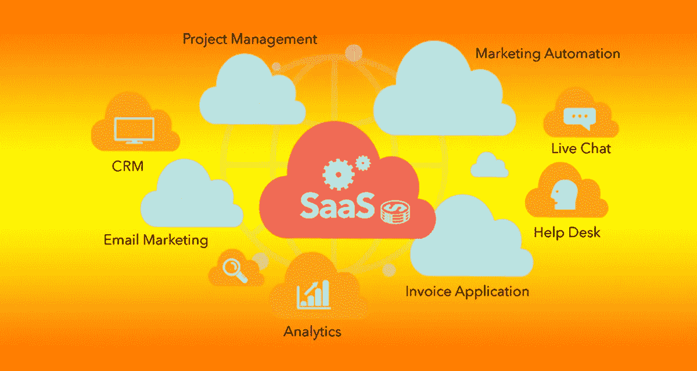
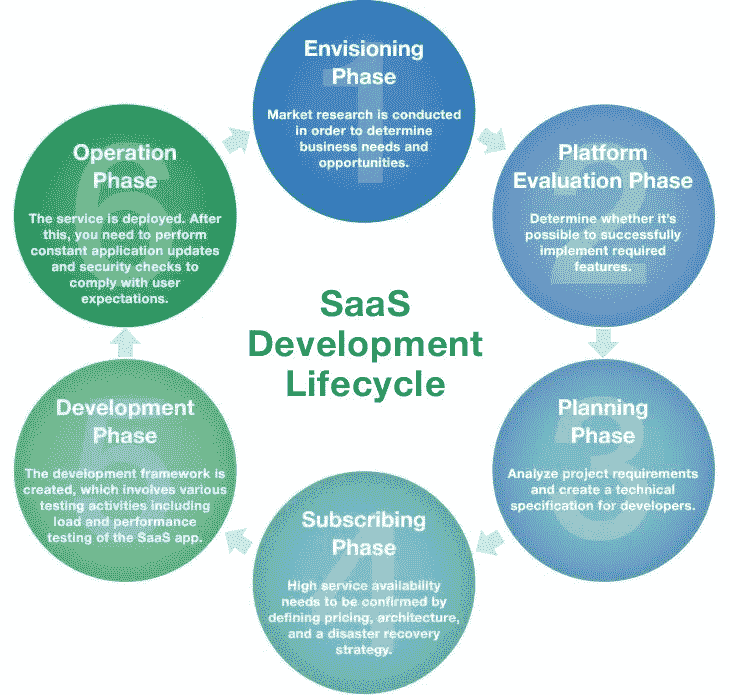
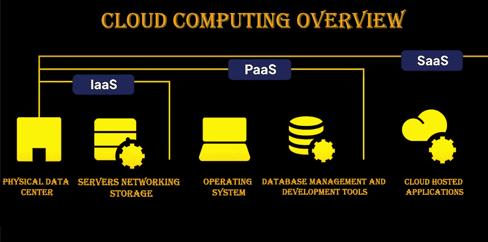
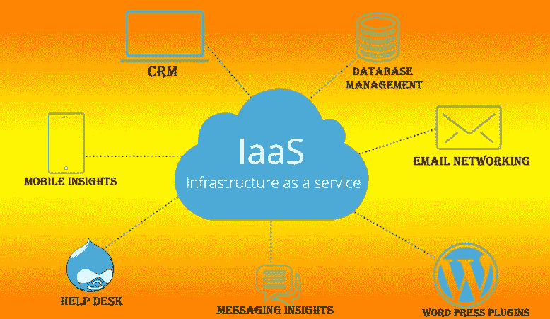
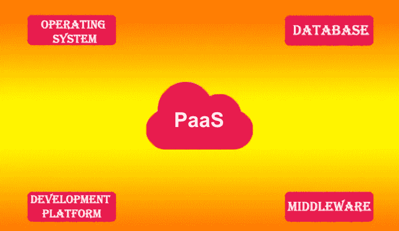

# SaaS、PaaS、IaaS 之间有什么区别？

> 原文：<https://medium.com/geekculture/what-is-the-difference-between-saas-paas-iaas-725a169ca22b?source=collection_archive---------8----------------------->

## SaaS 产品 vs PaaS 产品 vs IaaS 产品 vs 云

**What is the difference between SaaS, PaaS, IaaS**

如今，在技术领域，您可能到处都能听到 Saas 和云这个术语。你可能想知道这是什么 SaaS 和云！如果你是一个技术人员，那么你必须知道这些术语，如果不是，那么不要担心，我在这里启发你们！再次，你的友好的叙述者 Karthik，在这里解释这个有趣的话题。今天我要写一个最有趣的话题！无非就是这个——SaaS vs PaaS vs IaaS vs 云！

什么是 SaaS？

SaaS 的完整形式是软件即服务。SaaS 的核心是基于云集成的产品和服务，这听起来好像是指同一件事。确切地说，如果公司的服务或产品存在于云技术中，那么它很有可能同时是基于 SaaS 和云的平台。没有云技术，你甚至不能考虑 Saas，而 **Saas 是云系统**的内部部分。而您的 SaaS 应用程序几乎肯定也是云计算。但是要记住，你的云服务可能不是 SaaS！

**What is SaaS?**

**SaaS 是云计算的一个元素**。基于云的计算包含三个要素，

1.软件即服务(SaaS)

2.平台即服务(PaaS)

3.基础设施即服务(IaaS)

# 基于 SaaS 的应用程序是如何工作的？

简而言之，SaaS 式的应用程序，只不过是你运行的任何不基于你的假设的特定软件。这清楚地解释了大多数 Saas 产品在浏览器或任何其他类似的云平台上工作。

伙计们很清楚 SaaS 不像 WordPress 插件，它不能安装在你的首选设备上。

> “产品往往会成功，这要归功于对用户真正重要的单一核心用例”——奥斯曼·拉腊基

21 世纪的技术繁荣为 SaaS 技术的发展铺平了道路，而这种以主机为中心的经济高效的计算软件被认为是给技术世界的一份厚礼。它在帮助品牌快速满足需求和在全球范围内发展公司业务方面发挥着至关重要的作用。

**SaaS Development Cycle**

在最近的统计数据中，SaaS 证明了它提高了组织的常规整体投资回报率。相比之下，它通常会降低应用程序的维护和部署成本。SaaS 的成本效率是 Saas 软件成功背后的最大因素之一。它包括降低 TCO(总拥有成本),并有助于提高 B2B 和 B2C 业务的整体利润。

此外，与其他产品相比，SaaS 产品为客户提供了各种优势。SaaS 向您保证，体验每一个软件的最新版本，没有任何新的更新顺利运行。SaaS 的未来正指向成功。因此，对于 SaaS 产品的未来发展没有任何疑问。此外，这将促进消费者的增长。

SaaS 的例子有 Google G-Suite、Salesforce CRM 和 Cisco Webex

# 什么是云计算？

基于云的产品是借助云计算技术运行任何东西的软件。此外，基于 Saas 的应用是云计算产品的固有部分。SaaS、PaaS 和 IaaS 是基于云技术的原则开发的。

如果你是一个企业主，正在寻找稳定的互联网连接，那么你可能必须使用基于云的技术。

**Cloud Computing Overview**

云计算帮助用户以更高的效率传输更快的数据。先进的未来技术的出现使全球服务器能够通过顶级的云应用程序安全地存储其数据库。

> “有了云，个人和小型企业可以打个响指，立即建立企业级服务。”——Roy Stephen

什么是基础设施即服务(IaaS)？

基础架构即服务提供了整个利用率基础架构，无需任何本地服务器。一些著名的云计算如 AWS、Azure 和 GCP 大多依赖于 IaaS。如今，许多基于技术的服务都是由 IaaS 处理的。

**What is Infrastructure as Service**

**什么是平台即服务(PaaS)？**

平台即服务(PaaS)架构在 IaaS 之上。PaaS 与框架脚本集成来管理应用程序。它包括无服务器云计算框架，如 AWS Elastic Beanstalk、AWS Lambda、Zoho CRMs 等。这些框架通常由软件开发人员处理，以便他们能够生成软件的动态。

**What is Platform as a service**

# 基于云/SaaS 的服务的总体优势？

基于云的和基于 SaaS 的产品/服务对其客户具有类似的优势:

1.  **简单快捷的安装:**云计算结束了漫长的安装过程**。此外，运行这些文件不需要额外的驱动程序。云平台确保软件从其第三方服务器平稳运行，因此客户端不会经历服务器端的停机，最终，这将为平稳运行过程铺平道路。**
2.  **数据同步的速度比您预期的要快:**整个网络中的所有数据都可以在几分之一秒内同步。在云洞察的帮助下，可以传输和存储业务通信的完整代码更新。
3.  **比其他网络更具成本效益:**相比之下，云存储网络比其他数据库管理网络更高效。对客户和服务提供商双方都有利。云计算具有成本效益，处理和管理数据的能力更强。
4.  **确保标准化，防止数据重复和丢失:**基于云的平台提供冗余层插槽，确保数据的安全保护。这些见解可用于防止重要数据丢失和停机。
5.  **安全可靠的存储系统:**云服务将确保您数据库的整体安全性。可以启用双因素身份验证和公共/私有云模式来保护您的重要数据。

## 云计算产品的未来范围

存储管理的未来将取决于基于云的产品。云计算的未来范围将是百老汇，云技术将在未来几年见证指数级增长。

云平台的用户友好界面引起了全球客户的兴趣。此外，这种简单的数据操作体验赢得了全球主要客户的青睐。例如，如果你想输入特定的数据 ie(a[perosn]的年龄)，cloud inbuild 产品不会要求大量的信息，而是使用他们的智能云算法来改善他们的用户体验。(就像特斯拉如何制造世界上安全的自动豪华汽车，以帮助他们的客户体验无忧驾驶，并保持其品牌声誉)

云计算的持续增长最终授权了基于 SaaS 的平台的光明未来。

顶级的安全性和隐私性是分散平台保护数据所有权的额外优势。您资产的全部所有权将与云同步。

**结论**

云计算将在未来的技术领域扮演重要角色。未来，每个数据和数据库管理系统都将与云基础设施 IaaS、SaaS 和 PaaS 平台集成。

> “云是关于如何进行计算，而不是在哪里进行计算。”——保罗·马丁

现在我们已经到了博客的最后想法，我希望我写的关于 SaaS 和云计算的文章能帮助你对这些未来技术有一些起码的了解。我将带着另一个有趣的技术话题回来。直到那时再见！请在评论区提出您的建议，以便我们交流技术知识。

知识永远是力量！