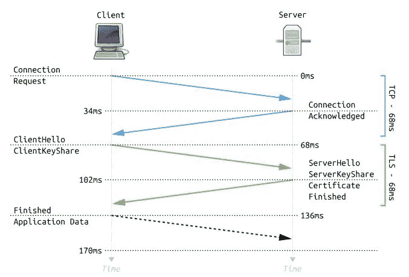

# TLSv1.2 和 TLSv1.3 有什么区别？

> 原文：<https://medium.com/geekculture/what-is-the-distinction-between-tlsv1-2-and-tlsv1-3-fcc5c00f635b?source=collection_archive---------10----------------------->

在浏览网站时，我们都见过浏览器中 URL 前面的填充锁图标。你有没有想过它为什么会在那里？这是什么意思？我们知道，通过 web 发送的数据是加密的，因此它可以提供数据的机密性(只有目标方可以读取数据，任何窥探方都不能看到数据)和完整性(接收方收到的数据应该与发送方发送的数据相同)。在上一篇文章中，我讨论了 RSA 和 Diffie-hellman 密钥交换算法，该算法描述了发送方和接收方如何共享密钥来执行加密和解密。但是这一切是如何在网络上与传输协议协同工作的呢？

这里我们将讨论什么是 TLS，它是如何工作的，TLSv1.2 和 TLSv1.3 有什么区别？在传输层，我们需要确保数据的机密性、身份验证和完整性。为了确保这些目标，TLS 于 1999 年问世。TLS 代表传输层安全，因此它工作在 TCP 协议之上。TCP 连接建立后，发生 TLS 握手，基本上，TLS 握手是一个 ***选择密码组*** (加密算法) ***密钥交换算法、*** 在发送方和接收方之间共享密钥，以及 ***认证预期发送方和接收方*** 的过程。这里我们将讨论 TLSv1.2 和 TLSv1.3。这些是目前使用的 TLS 协议，由于其缺点，TLSv1.3 很快将取代 TLSv1.2。

**tlsv 1.2**

在 TLSv1.2 握手中，客户端首先与服务器建立 TCP 连接，该客户端向服务器发送 hello 数据包以及密码套件(客户端浏览器支持的加密算法)，然后服务器向客户端发送 hello 数据包及其证书，该证书有助于服务器的身份验证，并同意客户端支持的任何一个密码套件(这需要 1 RTT)。从服务器收到这个 hello 数据包后，客户端使用 RSA 或 Diffie-Hellman 密钥交换算法来共享密钥(这需要 1RTT)。

TLSv1.2 handshake( [picture source](https://www.paolotagliaferri.com/cdn-cgi/image/format=auto,metadata=copyright,quality=85,scale-down,width=1000/https://www.paolotagliaferri.com/content/images/2020/03/Full_TLS_1.2_Handshake.svg.png))

在 TLSv1.2 中，握手需要 2 RTT。以下是 TLSv1.2 用于以下任务的算法:

*   **对于密钥交换:使用 ECDHE(** 短暂椭圆曲线 Diffie Hellman 算法)，也使用 RSA。
*   **认证:ECDSA(** 椭圆曲线数字签名算法)
*   **数据加密**:伽罗瓦计数器模式下的高级加密标准，使用 128 位密钥。
*   **对于** ( *PRF* / *数据完整性* ): **SHA256，**安全哈希算法，256 位摘要。

***TLSv1.2 缺点:***

握手需要 2 RTT 时间。它支持数十种可用的密码套件组合，这可能导致服务器和客户端可能不同意相同的密码套件，从而导致几个 RTT 的浪费。TLSv1.2 配置包括 4 种不同的算法(一种用于密钥交换，第二种用于认证，第三种用于加密，最后一种用于完整性检查)，这使得其配置很复杂。在 TLSv1.2 中，某些算法(如 Diffie-hellman 密钥交换算法)的参数选择留给了客户端，这可能会导致弱密钥设置，从而导致安全问题。

**TLSv1.3**

为了解决 TLSv1.2 的缺点，TLSv1.3 于 2018 年问世。I ***n TLSv1.3 握手只需要 1RTT。*** 在 TLSv1.3 中，删除了围绕认证和密钥交换算法的选择。也不再选择 RSA 作为密钥交换算法。在握手中，当客户端发送 hello 数据包时，它也发送了密钥交换算法的密钥共享参数，因为现在客户端可以乐观地猜测哪个密码适合服务器将要同意的密码，因为可能的密码套件的可变性较小。作为响应，服务器发送 hello 数据包及其证书、选择的密码套件和密钥共享参数。从服务器收到 hello 数据包及其密钥共享部分后，客户端生成密钥并开始传输数据。

TLSv1.3 Handshake [(picture source](https://www.paolotagliaferri.com/cdn-cgi/image/format=auto,metadata=copyright,quality=85,scale-down,width=1000/https://www.paolotagliaferri.com/content/images/2020/03/Full_TLS_1.3_Handshake.svg.png))

在 TLS v1.3 中，为了简化和避免错误配置，密码套件仅指定了两种算法:

*   **用于数据加密**:伽罗瓦计数器模式下的高级加密标准，使用 256 位密钥。
*   **For ( *PRF* / *数据完整性* )** : SHA384 **，**安全哈希算法，384 位摘要。

**在 TLS 1.3 中，有三个认证选项:**

*   **RSA:** 仅用于签名，不用于密钥交换。
*   **ECDSA:** 椭圆曲线数字签名算法
*   **EdDSA** :爱德华兹曲线数字签名算法

因为根据设计，服务器可以在 TLS 1.3 握手中更早地开始加密数据，所以它可以对整个握手序列进行签名(使用其私钥)，并将其包含在发送给客户端的响应中。然后，客户端可以使用服务器的公钥验证签名是否有效，这证明它拥有私钥。

## TLS 1.3 密钥交换

正如我们上面所讨论的，客户机“猜测”服务器支持什么，并在初始消息中将它的一半和 Diffie-Hellman 参数发送给服务器。