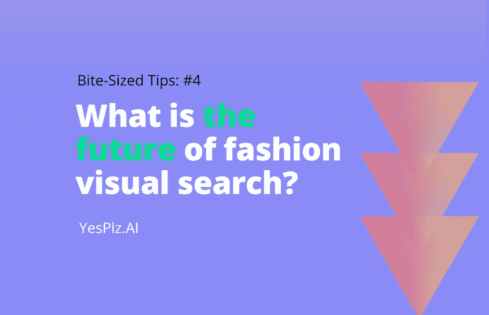
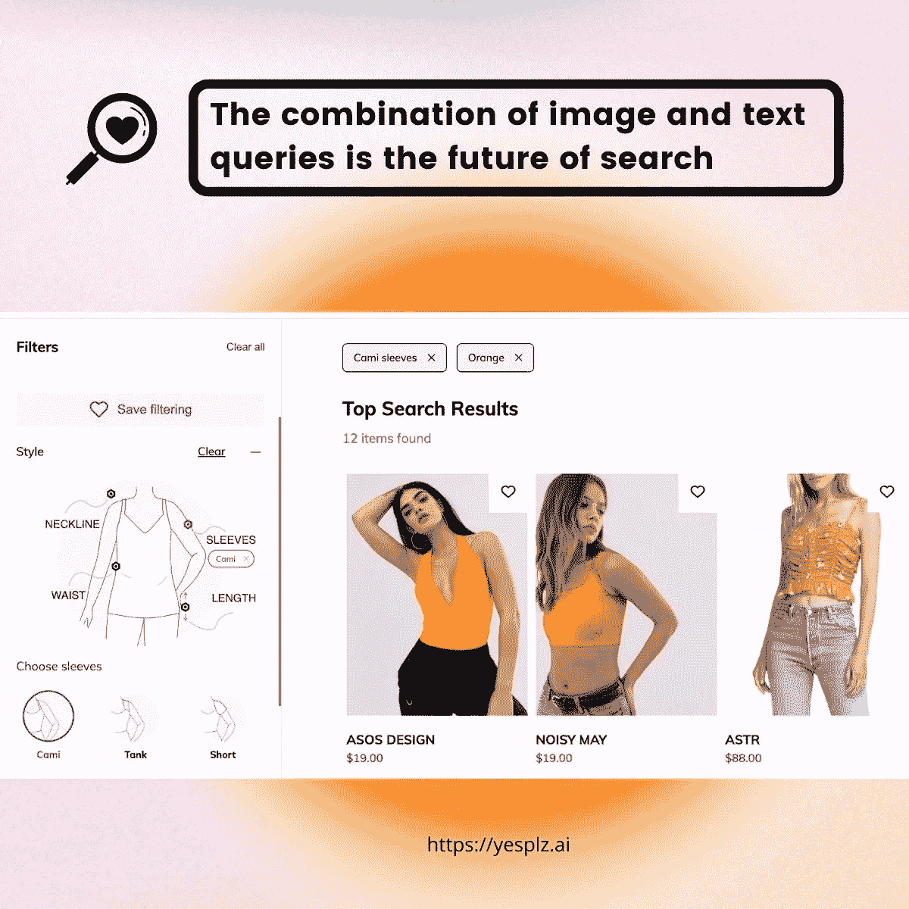
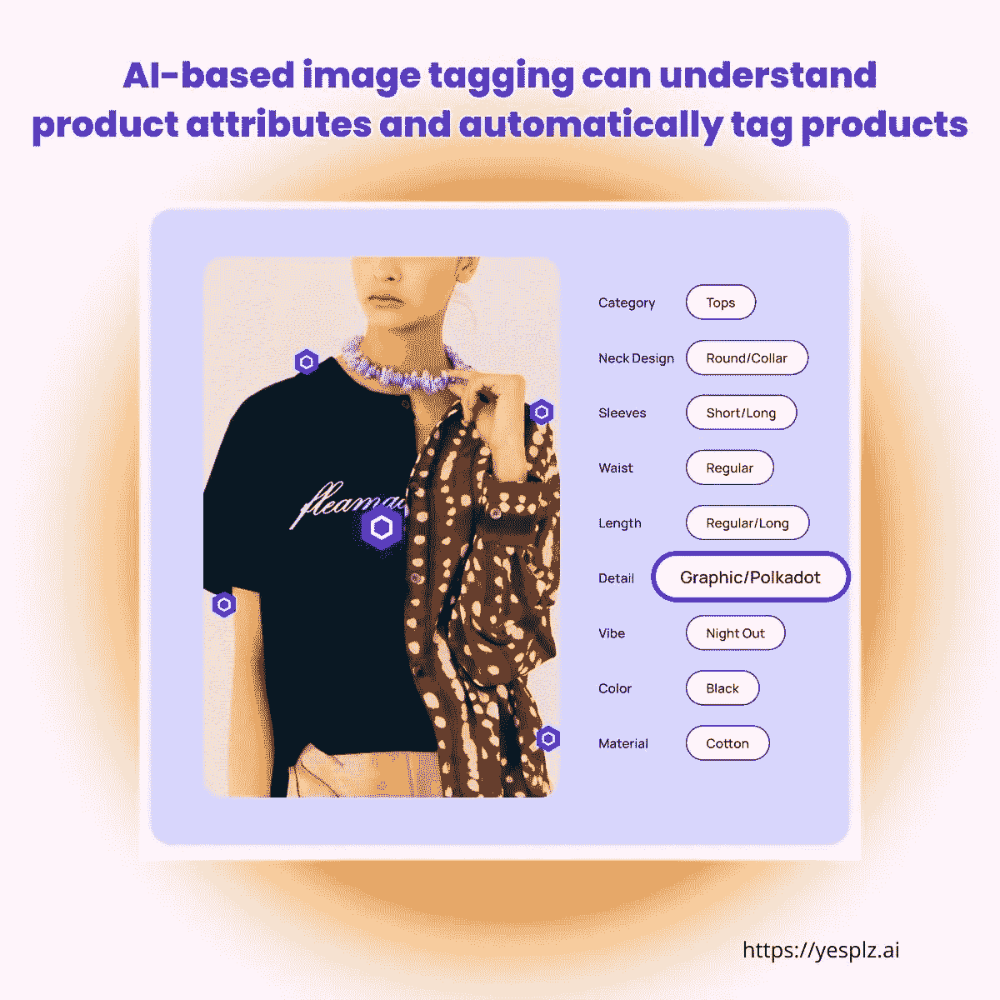

# 视觉发现在时尚界的前景如何？

> 原文：<https://medium.com/geekculture/what-is-the-future-of-visual-discovery-in-fashion-f25262582267?source=collection_archive---------16----------------------->

(以上是 YesPlz AI 关于时尚视觉搜索的网络研讨会的片段)

虽然没有人有预测未来的水晶球，但跟踪视觉发现发展的专家们注意到了具有持久力的突出趋势。远离元宇宙、 [NFTs](https://yesplz.ai/resource/trend-report-fashion-tech-and-nfts.html) 和[机器人影响者](https://www.instagram.com/lilmiquela/?hl=es)的宏伟愿景，我们看到了视觉发现未来的方向性趋势:时尚电子商务作为一个整体正在朝着视觉优先的搜索和发现方法发展——那些明白我们正在达到时尚视觉搜索采用的拐点的人将在未来处于更好的位置。

# 时尚视觉搜索可以进化整个搜索之旅

用户希望看到视觉搜索融入他们的搜索之旅——但目前的许多尝试缺乏与客户之旅的整体整合。而且，在讨论时尚视觉搜索时，不可能不提到顾客旅程的其他部分，比如产品推荐。

像 YesPlz 这样的时尚人工智能公司正在训练他们的算法，不仅可以理解搜索查询的内容，还可以理解时尚背景。例如，搜索跑鞋的用户可能还想要其他运动服装。YesPlz 的算法还可以从用户行为中学习，从而提供更准确、更时尚的推荐。

我们预测，视觉发现的未来将使用时尚视觉搜索来促进产品推荐等领域的高度个性化。

[**在 LINKEDIN 上关注 yes plz AI**](https://www.linkedin.com/company/yesplz)

# 时尚视觉搜索的未来是多模态的

电子商务中的视觉搜索不仅仅局限于图片，尽管顾名思义。多模态搜索的概念，结合了图像输入和文本提示，具有改变搜索的能力。趋势是走向更多的多模态搜索，像李维斯这样的零售商采用混合文本-图像搜索，结果是人和技术之间更多的合作。

电子商务和 NLP(自然语言处理)中的视觉搜索可以促进对搜索查询的更好理解，使它们更丰富，并增加额外的数据层。换句话说，随着技术的不断发展，文本和图像搜索的结合会产生更准确的搜索结果。

例如，用户可以从基于视觉的搜索开始，然后使用基于文本的产品过滤器进一步细化他们的搜索。

# 时尚视觉搜索硬件的未来

我们都看过宣称智能眼镜是未来硬件的文章，但还没有看到它们开花结果。也许在未来，智能眼镜将达到一个拐点，并将与视觉搜索相结合——或者一种新的新硬件将上市。

只有时间会告诉我们什么样的硬件可以与时尚视觉搜索相结合。

我们还希望看到时尚视觉搜索嵌入电子商务网站，因为客户[对搜索体验](https://yesplz.ai/resource/year-in-review-fashion-and-ecommerce-trends-2021.html)的要求越来越高(未来只会继续要求更多，因为社交商务等其他平台提供视觉优先的购物体验)。

# 作为超个性化基础的时尚视觉搜索

视觉发现体验不仅包括搜索过程，还包括一个完整的超个性化生态系统，可以解决以下业务问题:

1) **速度:**客户想要闪电般的产品推荐
2) **相关性:**客户想要准确的搜索结果
3) **重新定位:**客户想要看到与上下文相关的广告

时尚视觉搜索是[超个性化](https://yesplz.ai/resource/trend-report-fashion-tech-and-hyper-personalization.html)的核心——所有这些相关的、时尚前沿的产品推荐都需要了解用户行为的先进技术。而且，随着产品目录越来越复杂，零售商正在努力跟上产品标签。[基于 AI 的图像标签](https://yesplz.ai/resource/image-tagging.html)可以理解商品属性，自动给商品贴标签，节省零售商的宝贵时间。

当超个性化做得好的时候，它可以解决另一个困扰时尚行业的主要问题:过度生产和浪费。顾客会收到超个性化的推荐，并购买他们喜欢的产品，并将它们放在自己的衣柜里。

# 时尚视觉搜索的未来就在眼前

零售商已经开始实施多模式搜索，并采用新的方式吸引购物者参与搜索体验。时尚视觉搜索有潜力创造更好的超个性化，更准确的搜索结果，和更高的购物者满意度。随着我们朝着视觉优先的未来方向前进，我们预测，采用时尚视觉搜索的电子商务品牌将处于长期成功的有利地位。

有兴趣了解更多关于时尚视觉搜索的知识吗？

[联系 YesPlz AI，免费咨询 20 分钟。](http://www.yesplz.ai/contact.html)