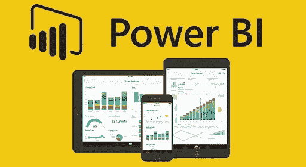
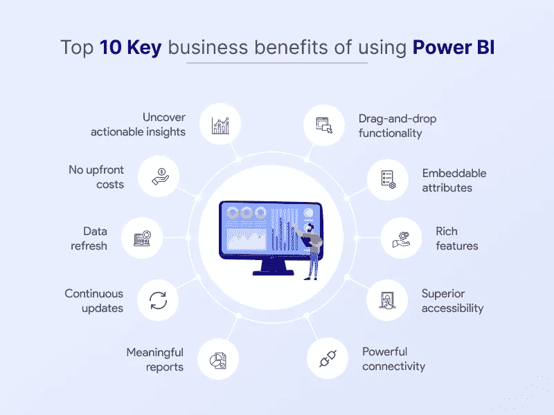
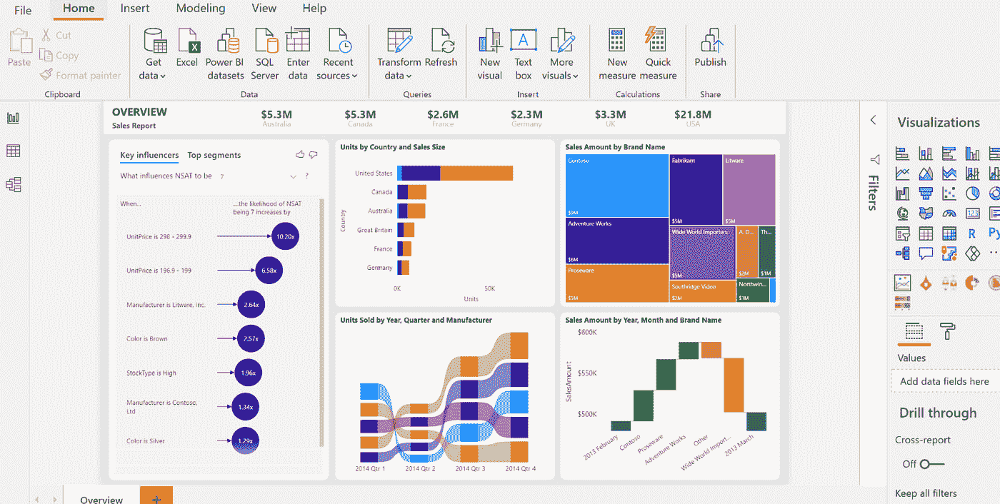
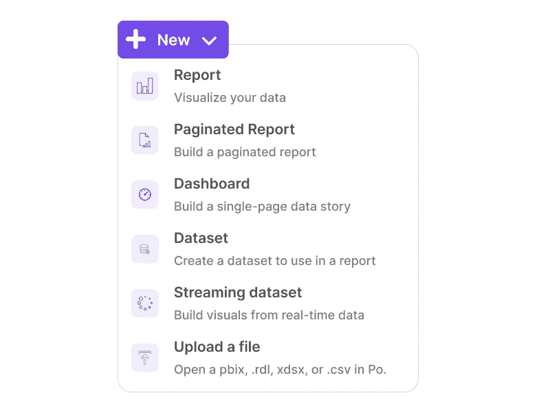
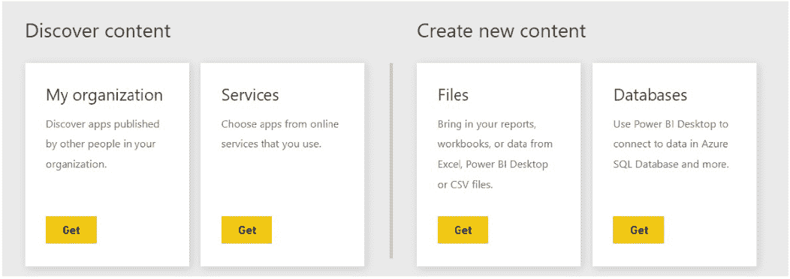
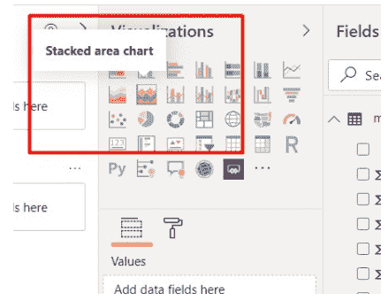

# Power BI 在分析中的重要性是什么，它如何转变您的业务？

> 原文：<https://medium.com/geekculture/what-is-the-importance-of-power-bi-in-analytics-and-how-it-can-transform-your-business-3c874d752db0?source=collection_archive---------5----------------------->

[source](https://archerpoint.com/wp-content/uploads/2020/03/power-bi.jpg)

当今的企业正在向数字化企业转型。数字业务需求与传统业务有很大不同，尤其是在收集和使用信息的方式上。

虽然一些企业级解决方案可供希望利用其数据资产的企业使用，但大多数组织由于预算限制或内部政策而无法使用这些解决方案。PowerBI 填补了 Google Sheets 等低成本(免费)解决方案和 Oracle Cloud at Scale 或 SAP HANA 等高成本(每月数千美元)解决方案之间的差距。

Power BI 是微软软件套件的一部分，是一个分析和报告平台。它使企业能够连接到广泛的数据源，并快速轻松地创建丰富的可视化。其强大的可视化功能使其对于快速发现趋势或发现问题非常有价值。

让我们继续阅读，以更好地理解 Power BI 的用途和重要性。

# 什么是 Power BI？

PowerBI 作为商业智能工具非常强大，主要由数据分析专家使用。它显示和分析来自许多来源的实时数据，包括云和内部数据。它是 Microsoft Office 套件不可或缺的一部分，可以与 Excel 一起使用，通过仪表板、报告和图表来可视化大型业务数据集。

PowerBI 为最终用户提供自助服务功能，无需 IT 资源或高级技术知识。BI 在这里指的是商业智能，它使用信息技术来创建、管理和分发数据以做出决策。Power BI 工具使用微软产品，如 Excel、SQL Server 和 Azure，企业在商业智能流程中使用这些产品。

除了生成有洞察力的数据分析和报告，它还允许您在组织内共享和协作这些洞察力，使其成为推动您的业务成功并将您的企业转变为有竞争力的企业的重要工具。

总而言之，它是一个高级分析工具，使您能够快速分析您的数据。如果您希望实现业务转型，并在决策中更加以数据为导向和敏捷，使用正确的工具至关重要，而 Power BI 应该是您的首选。

# Power BI 如何帮助企业发展？

功率 BI 对企业的重要性是巨大的。借助其各种功能，它有可能改变您的业务。Power BI 使用可视化技术使数据更容易理解，使企业主能够从他们每天处理的信息中获得更多。

作为一项基于云的服务，Power BI 可随时随地访问，非常适合可能没有内部 it 专家的小型企业。Power BI 的总体目标是通过在一个易于使用的包中为用户提供对实时分析的访问，实现更明智的决策。您可以通过以下方式将 Power BI 用于商业智能:

*   使用自助报告工具发现数据模式 Power BI 最令人印象深刻的工具之一是其使用可视化分析大量数据的能力。
*   易于使用的界面—它提供了一个简单的拖放界面，因此用户可以轻松地将各种报告放在一起，而无需学习复杂的代码或脚本语言。
*   自我报告工具—由于自助报告工具减少了对内部 IT 部门的依赖，企业不再需要在高薪或额外人员上花费太多资金。

# 为什么 Power BI 是分析的重要工具？

Source: powerbi.microsoft.com

PowerBI 是为数据科学家或分析人员设计的工具。这有助于他们提出不同形式的数据可视化，使用户更容易理解。

由于大多数以业务为导向的个人对数据分析如何工作没有深刻的理解，Power BI 商业智能解决方案****易于理解并可免费使用。对于希望在数据分析方面领先竞争对手的企业来说，This‌使其成为一个必不可少的工具。****

****要了解 Power BI 在分析方面的用途，请查看其结构或 Power BI 构建模块:****

1.  ******可视化******

****可视化以易于理解的格式显示数据集的具体细节。例如，您可以使用它们来显示不同时间段的销售业绩，用按季度着色的条形来显示每个月。****

****不同的‌Visualizations 包括:****

*   ****地图****
*   ****图表****
*   ****圆形分格统计图表****
*   ****条形图****
*   ****卡片可视化等。****

******2。数据集******

****数据集是 PowerBI 用来创建可视化的数据集合。****

******3。报告******

****当多个可视化一起出现时，用户可以很容易地分析报告。****

******4。仪表板******

****在单个框架中出现多个报告会创建一个仪表板。创建仪表板是为了便于可视化和共享。****

******5。平铺******

****平铺是指仪表板上的单个可视化效果。****

# ****使用 PowerBI 有什么好处？****

****PowerBI 提供了 Power BI 的一系列有意义的用途。我们在此提及其中一些:****

1.  ****PowerBI 使用不同的技术为不同的企业提供有意义的信息。****
2.  ****Power BI 有三个版本:****

*   ****Power BI 台式机，****
*   ****Power BI 移动应用程序，以及****
*   ****电力 BI 服务****

****Power BI Desktop 是免费的，因此组织中的任何人都可以下载并立即开始使用它。在这里，您可以连接到数据并生成设计丰富的报告。****

****然后，这些报告可以作为仪表板发布到 Power BI 的云版本，称为 Power BI 服务。它是 Power BI 服务，可以将报告发布为仪表板，供用户从任何设备上使用。****

****Power BI 还提供移动应用程序，允许您通过 iOS、Android 和 Windows 设备与云和内部数据进行交互。****

****3.该工具由[微软 PowerBI 开发者](https://www.valuecoders.com/hire-developers/hire-power-bi-developer-consultants?utm_source=Medium&utm_medium=Organic%2FAnu_B11&utm_id=PowerBI)开发，这使得它可以与其他微软 Office 产品兼容。因此，对于普通用户来说，它不需要复杂的学习曲线。****

****4.借助 PowerBI，企业可以跨不同平台连接其所有业务数据，创建交互式报告，以各种受众可访问的方式可视化数据，并发现数据中隐藏的趋势，从而为组织带来显著好处。****

****5.Power BI 是微软在许多组织中使用最广泛的分析工具之一。微软不断增加新功能和改进现有功能，为用户提供最佳价值。****

****6.Power BI 使用户能够保护敏感信息并满足各种安全性和合规性标准。它利用了微软的云应用安全功能。此外，Power BI 的敏感标签功能使管理员可以轻松提醒用户哪些数据/信息是敏感的，因此应该以不同方式处理。它还具有进一步保护数据的加密功能。****

# ****PowerBI 工作流程和基本特性****

****要在 PowerBI 中获取数据，请在您的工作区中查找“New”选项，并从那里选择“dataset”。****

********

****它会将您带到一个新窗口，您可以从中选择数据源。****

********

****[Source](https://www.analyticsvidhya.com/)****

****对于您处理的数据类型，您可能会在 internet 上找到它，或者将其存储在您系统的本地文件中。****

****各种类型的 Power BI 许可证提供的内容各不相同，但简而言之，将数据导入 Power BI 的过程非常简单。****

****Power BI 的重要性是巨大的，因此它可以被称为 BI 和数据分析巨头。让我们来看看其中的一些。****

******DAX —数据分析表达式******

****数据分析表达式(DAX)是用于在 Power BI 中创建公式和表达式的函数。许多 DAX 表达式也可以在 Power BI 中使用，以便对数据进行操作。Power BI 可以处理大量数据，这也是数据科学家和分析师认为它是非常强大的 BI 工具的原因之一。****

******在仪表盘上轻松分享报告******

****仪表板可以直接发布到 Power BI，这意味着您可以轻松地与他人共享它们。无需通过电子邮件或云服务发送大文件。随着管道变得更加顺畅，仪表板会随着底层数据的变化而近乎实时地更新。****

******人工智能******

****借助 Power BI，用户可以利用图像识别和文本分析。他们还可以将它与 Azure 机器学习集成在一起。****

******可定制的简单易懂的视觉效果******

****Power BI 有许多可定制的图表、视觉效果和模板，可以帮助企业更好地了解他们的数据。人类比其他类型的信息更容易处理视觉信息；因此，使用图表、图形或图像等视觉工具来理解大量复杂的数据更容易。****

****可视化效果出现在 Power BI 的右侧面板上。人们所要做的就是将数据拖放到这些图形中。****

******PowerBI 与不同工具的集成******

****Power BI 最重要的用途之一是，它不仅可以与 Office 365、Dynamics 365 和 SharePoint 等微软软件配合使用，还可以与 Spark、Hadoop、Google Analytics、SAP、Salesforce 等外部工具配合使用。****

****这种广泛的兼容性使该软件在许多行业都非常有用，如营销、销售、分析、战略、人力资源和运营等。****

******直观的用户界面******

****Power BI 因其直观的用户界面而成为有效的业务解决方案。用户可以轻松创建仪表板、报告和任何类型数据的可视化。它的视觉效果使数据一目了然，同时清晰地显示大量信息。****

********

****PowerBI 上的不同可视化****

********

****[Source](https://www.analyticsvidhya.com/)****

****在 PowerBI 上制作的图表示例****

******结论******

****Power BI for business intelligence 无与伦比的特性使其成为理想的数据分析工具。它让用户筛选大数据集。无论是分析数据、制作报告，还是预测未来趋势以做出准确决策，Power BI 都能胜任。希望在其分析战略中看到 Power BI 优势的企业需要将该工具纳入其业务战略。****

****如果您也在寻找提高生产率、改善效率和增加利润的方法，请将 Power BI 纳入您的分析策略。其无限的云存储空间对于需要额外空间来存储大型数据集的企业来说是一个福音。****

****要获得所有这些好处，您可以联系一家[**PowerBI 咨询服务**](https://www.valuecoders.com/microsoft-power-bi-development-services-company?utm_source=Medium&utm_medium=Organic%2FAnu_B11&utm_id=PowerBI) 提供商，以改进您的业务决策，深入了解数据，并获得竞争优势。从一家知名公司雇佣强大的商务智能开发人员来提供你的企业所缺乏的一切。****