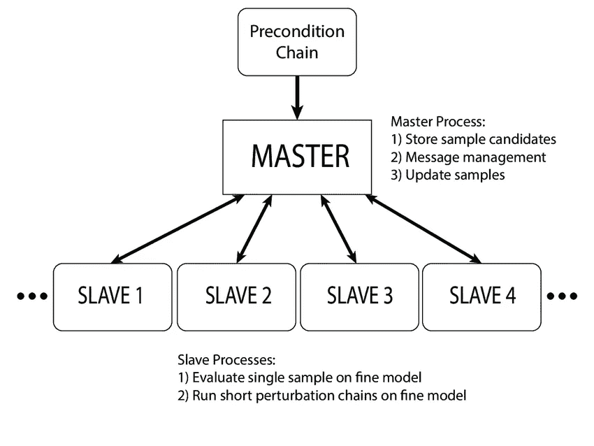

# 什么是 Linux 权限？

> 原文：<https://medium.com/geekculture/what-is-the-linux-permissions-5338df2f3fdf?source=collection_archive---------13----------------------->

## 了解如何使用 chmod 和 chown 来编辑 Linux 权限


Photo by [Eliobed Suarez](https://unsplash.com/@eliobedsuarez?utm_source=medium&utm_medium=referral) on [Unsplash](https://unsplash.com?utm_source=medium&utm_medium=referral)

Linux 权限系统可以看作是一个家。你只允许某些人，比如你的家人，在任何时候进入你的家。而且你只允许你的朋友进入你家，当你给他们手动权限的时候。你不允许任何陌生人进入你的家。同样，您不希望人们访问任何文件和文件夹。否则，您可能会危及系统的安全性。然而，对于大多数 Linux 初学者来说，理解 Linux 权限系统可能很困难。

下面是对 Linux 权限的解释。

## Linux 如何管理权限？


Photo by [Will Porada](https://unsplash.com/@will0629?utm_source=medium&utm_medium=referral) on [Unsplash](https://unsplash.com?utm_source=medium&utm_medium=referral)

每个用户帐户都有访问文件的权限。Linux 中有三种不同类型的权限。

*   读取权限允许用户读取文件。
*   写权限允许用户写和删除文件。
*   和执行允许用户执行文件

在 Linux 中，为创建的文件设置的权限与创建该文件的用户相关。这意味着对于创建的每个文件，为

*   用户
*   用户组
*   其他每个人

## 如何找到文件和目录权限？


Photo by [Wesley Tingey](https://unsplash.com/@wesleyphotography?utm_source=medium&utm_medium=referral) on [Unsplash](https://unsplash.com?utm_source=medium&utm_medium=referral)

在命令行中，转到您要获取权限的目录。你可以列出所有的文件。

```
ls -al
```

您将获得所有文件和目录的详细信息，如名称、文件大小等。

```
total 720
drwx------ 39 andre andre   4096 Mar 19 22:45 .
drwxr-xr-x  4 root  root    4096 Jun 24  2021 ..
drwxr-x---  2 andre andre   4096 Nov 16  2020 .android
drwxr-xr-x  3 andre andre   4096 Nov 16  2020 .ApacheDirectoryStudio
drwxr-xr-x  2 andre andre   4096 Aug 10  2021 Applications
-rw-r--r--  1 andre andre     57 Feb 17  2020 .bash_profile
-rw-r--r--  1 andre andre   3838 Feb 17  2020 .bashrc
drwxr-xr-x 63 andre andre   4096 Feb 22 18:17 .cache
drwx------  2 andre andre   4096 Aug 10  2021 .cdw
drwxr-xr-x 76 andre andre   4096 Mar 18 14:01 .config
...
```

您对包含权限的第一列感兴趣。差不多你会有十个角色。

*   [1]:条目的类型。
*   [2–4]:用户权限
*   [5–7]:组权限
*   [8–10]:其他所有人权限

对于条目类型，您有三种选择。

*   [l]:链接
*   [d]:目录
*   [-]:文件

你也有三个权限。

*   [r]:阅读
*   [w]:写
*   [x]:执行

每一个的意思都是不言自明的。

## 如何修改文件相对于用户的权限？

有一个命令叫做

```
chmod 
```

它允许您修改文件的权限。有两种方法可以直接或通过别名修改权限。直接修改权限意味着直接更改标签。

```
chmod ugo+rwx [filename]
```

它代表为所有用户、组和其他人添加读、写和执行权限。另一方面，通过别名更改它意味着您正在使用

*   0:没有权限
*   1:仅执行
*   2:只写
*   3:执行和写入
*   4:只读
*   5:阅读并执行
*   6:读和写
*   7:所有权限

```
chmod 777 [filname]
```

通过在终端中键入以下命令，了解有关 chmod 命令的更多信息。

```
man chmod
```

## 如何修改文件相对于用户的所有权？

您可以通过运行以下命令递归地更改文件和目录的所有权。

```
sudo chown -R [username]:[group] [path_to_file]
```

通过在终端中键入以下命令，了解有关 chmod 命令的更多信息。

```
man chown
```

## 为什么要用 sudo？

任何系统级的修改都需要您获得提升的权限。但是，只有根用户可以更改系统的命令。Linux 通过在终端中使用 sudo 命令来处理这个问题。该命令为用户提供运行程序和脚本的临时 root 用户状态。如果没有权限提升，任何未经授权的软件都可以修改系统。

信不信由你，特权提升是 Unix 的一个特性。当时，在操作系统生命周期的早期，Windows 是恶意软件的温床。没有适当的系统来防止软件修改系统设置。当然，Windows 试图用阻止的用户帐户控制来复制此功能。但是，操作系统可以选择禁用旨在保护系统安全的功能。

然而，当您的时钟应用程序请求系统级许可时，这就有点悬了。

[](https://techcrunch.com/2021/06/03/tiktok-just-gave-itself-permission-to-collect-biometric-data-on-u-s-users-including-faceprints-and-voiceprints/) [## 抖音刚刚允许自己收集美国用户的生物特征数据，包括“面纹和…

### 周三，抖音的美国隐私政策发生了变化，引入了一个新的条款，称社交视频应用“可能…

techcrunch.com](https://techcrunch.com/2021/06/03/tiktok-just-gave-itself-permission-to-collect-biometric-data-on-u-s-users-including-faceprints-and-voiceprints/) 

但是大众并不关心他们的隐私和安全，所以他们关闭了 UAC。难怪 Windows 是下载恶意软件最容易攻击的操作系统。

## 如何给予用户权限提升特权？

有一个文件列出了所有用户和组以及他们可以访问的权限。对于拥有升级权限的用户，键入以下命令。

```
sudo visudo
```

文件应该是这样的。

```
##
## User privilege specification
##
root ALL=(ALL) ALL
[username] ALL=(ALL) ALL
```

## Doas:一个不那么臃肿、更安全的 sudo 版本

Sudo 可以做的不仅仅是权限提升来授权系统级的更改。您可以使用 sudo 设置高级权限设置。大多数人不需要这种复杂程度。OpenBSD 团队已经创建了一个名为 doas 的权限提升软件。 [OpenBSD 是创建安全操作系统的黄金标准。](https://www.openbsd.org/security.html)该软件是 sudo 的精简版，包含更少的代码行。更少的代码行意味着更少的安全缺陷。

[目前，数独有 150 项 CVE 记录。然而，只有两个 CVE 记录。通过使用 sudo，您的安全风险增加了 50 倍。可能会出现因晦涩而安全的论点。很少有人用 OpenBSD 软件。但是，可以确定的是，他们的审核流程是黄金标准。](https://cve.mitre.org/cgi-bin/cvekey.cgi?keyword=sudo)

> 我们的安全审计团队通常有 6 到 12 名成员，他们会继续寻找和修复新的安全漏洞。我们从 1996 年夏天开始审计。我们提高安全性的过程只是对每个关键软件组件进行全面的逐文件分析。代码通常会被审核多次，并且由具有不同审核技能的多个人进行审核。

他们的审计经过严格审查。[就连 FBI 也试图借壳 OpenBSD，但失败了。](https://www.cnet.com/news/privacy/report-of-fbi-back-door-roils-openbsd-community/) [与此同时，一所大学在 Linux 内核上的漏洞被成功利用。](https://www.theverge.com/2021/4/30/22410164/linux-kernel-university-of-minnesota-banned-open-source)权限提升是危害系统最常用的漏洞之一。绝大多数桌面和服务器 Linux 用户使用 sudo 而不是 doas 进行权限提升。

但是，看一看使用 doas 而不是 sudo 来执行特权提升的更安全、更简单的方法。

## 如何跨多台服务器管理权限？

一旦您理解了权限在单个服务器上是如何工作的，就会出现如何在多个服务器之间同步权限的问题。在多台服务器上共享权限非常有用。一个例子是使用分布式计算。

这需要使用 LDAP 作为后端的主和副本架构。



Figure from researchgate.net

可以写一篇关于 LDAP 的完整文章。但这是 TLDR 的版本。LDAP 是一种用于以分层表示存储数据的协议。很多东西都可以用等级来表示。其中之一是用户和组管理。权限委托也是另一个可以分层表示的东西。

LDAP 实现的抽象已经预先设计好了，因此您不必重新创建轮子。一种解决方案被称为 Kerberos，它提供跨多个服务器的无缝凭证同步。麻省理工学院提供免费实现。

[](https://web.mit.edu/Kerberos/) [## Kerberos:网络认证协议

### 旧闻存档。krb5-1.19.3 源代码版本现已发布。krb5-1.18.5 源代码版本现已推出…

web.mit.edu](https://web.mit.edu/Kerberos/) 

然而，许多公司和组织提供的实现可能更便于用户使用。

## 最后

IT 和工程领域是快速发展的领域。跟不上意味着你将被落在后面。跟上的最好方法是保持最新的新闻和教育内容。[订阅免费电子邮件列表，将您的职业生涯提升 10 倍。](/subscribe/@dretechtips)

**加入我们吧，因为 50 多位想要快速提升职业生涯和知识基础的人已经注册了。**

**相关内容:**

*   Linux 内核初学者指南
*   [如何安全地连接到您的 Linux 服务器](/geekculture/ssh-securely-connect-to-your-servers-8895faab7083)？
*   [如何在 Linux 中实现任务自动化？](/geekculture/how-to-automate-tasks-in-linux-bsd-91d0b0560f5)