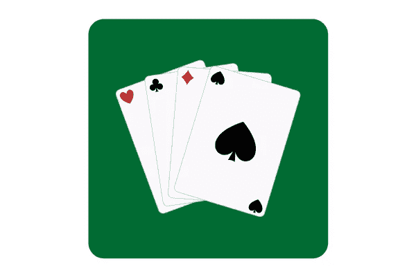
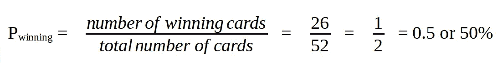
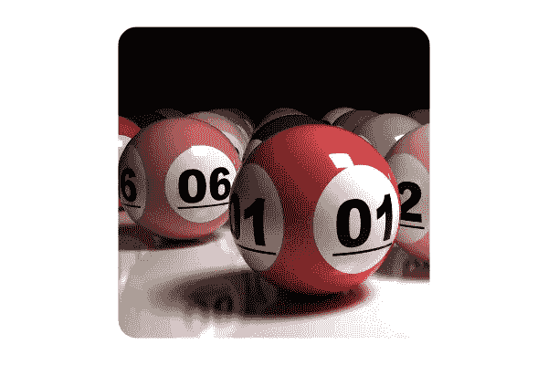
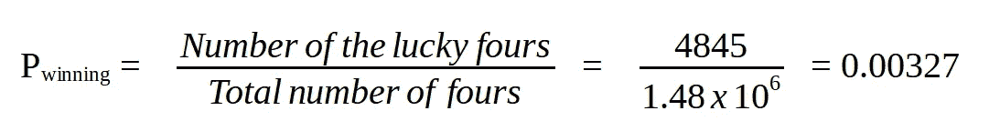
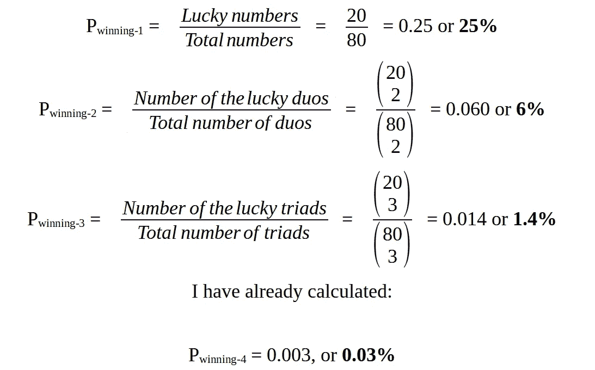

# 幸运游戏获胜的概率有多大？

> 原文：<https://medium.com/geekculture/what-is-the-probabilof-winning-a-lucky-game-2c38ed16b820?source=collection_archive---------64----------------------->

## 使用数学工具计算赢得任何幸运游戏的概率

Photo by [dylan nolte](https://unsplash.com/@dylan_nolte?utm_source=medium&utm_medium=referral) on [Unsplash](https://unsplash.com?utm_source=medium&utm_medium=referral)

幸运游戏的特点是不确定性和风险。我有时喜欢玩幸运游戏，我发现自己在游戏开始时会问这样一个问题:“我赢这一轮的可能性有多大？”

幸运的是，我们有工具来回答这个问题。利用概率论和组合学领域的几个基本数学公式，我们可以很简单地找到答案。

事实上，我们可以计算赢得幸运游戏的概率，如果:

*   我们知道概率的经典定义
*   我们能够计算一定数量的不同元素的组合数量。例如，我们可能想要计算不同数字或不同卡片的组合。

在我们的技能集中拥有这两种数学技能将帮助我们计算赢得幸运游戏的概率。在这篇文章中，我们将计算赢得两个不同的幸运游戏的概率。

# **第一局:黑卡和红卡**

Picture created by the author on [Canva](https://www.canva.com/).

在这个游戏中，玩家必须从隐藏的一副牌中选择一张牌。如果卡片是红色的，玩家获胜。

对于统计学家来说，每一轮幸运游戏都是一个随机实验:“我从一副隐藏的卡片中选择一张卡片，然后测试这张卡片的颜色是红色还是黑色。”

我们还可以注意到以下几点:

*   这副牌由 52 张不同的牌组成。所以我们感兴趣的随机实验有 52 个结果。这副牌是公平的，所以所有的结果都有可能发生。
*   赢得游戏的事件包括 26 张红色卡片，它们是该副卡片总共 52 张卡片的一部分。

现在很明显，我们正在寻找一个**事件**的概率，这个事件我们之前描述为赢得游戏的事件。

*根据概率的经典定义，一个事件的概率是对它有利的情况的数量与当这些情况同样可能时所有可能情况的数量之比。*

我们已经知道我们的随机实验的结果是同样可能的，所以我们可以使用概率的经典定义。所以，赢得游戏的概率计算如下:

这很有启发性，每次我玩这个游戏都有 50%的概率赢！

在我们的第一个幸运游戏中，很容易知道牌的总数和获胜牌的数量，这使得计算我们感兴趣的事件的可能性相当容易。虽然，在其他幸运游戏的情况下，计算总的和有利的结果可能更加困难。接下来我们将在文章中看到这样一个例子。

# **第二场:幸运四人组**

Image created by the author on [Canva](https://www.canva.com/).

我玩一个幸运游戏，从 80 个不同的数字中抽取 20 个幸运数字，而不考虑数字的顺序。每次我玩这个游戏，我都用同样的一组 80 个数字来选择其中的 4 个。如果我选的数字属于 20 个幸运数字，我就赢了。

这个幸运游戏的每一轮都是随机实验:“我从 80 个不同的数字中选择 4 个”。

我们已经确定了我们的随机实验。这意味着我们知道它的样本空间，我们准备识别赢得游戏的事件。

*   这个随机实验的样本空间由 80 个不同的数字组成的所有可能的四个数字组成。我们注意到，在每次重复的游戏中，所有四个数字都同样有可能出现。
*   赢得游戏的事件由 20 个不同的数字组成的所有四个数字组成(幸运四)。

使用经典定义，赢得游戏的概率必须等于:

我们将使用组合学计算比率的前因和后果。组合学帮助我们计算一组不同的元素可以产生多少种不同的结构，并且通常给那些以“有多少种方法可以……”开始的问题以答案。

在我们的例子中，组合学可以帮助我们回答以下问题:

*   **幸运四位数**:从 20 个数字中选择 4 个数字有多少种方法？

*   **总共四个**:从 80 个数字中选择 4 个数字有多少种方法？

现在我们已经计算了我们的兴趣(4845)和样本空间(1.48 x 106)的事件大小，我们可以返回到比率并计算赢得游戏的概率。

现在我知道每次我玩这个游戏都有 0.327%的概率赢！

**第二场**的临时演员

想象一下，第二个游戏的规则改变了一点，每次我玩这个游戏时，我都可以选择 1、2、3 或 4 个数字。哪种情况赢的可能性更大？

为了回答这个问题，我们需要计算另外三种可能性:

所以，当我选择 1 个数字(P=25%)时，赢得游戏的概率更高，当我选择更多的数字时，概率降低。

# 关于我的学习之旅

我的目标是在 21 天内每天学习一点统计学。我将学习基础知识，以巩固我的统计知识，并为更高级的数据科学概念打下坚实的基础。

这个挑战是更大挑战的一部分，即#66daysofdata 挑战！要了解更多关于#66daysofdata 挑战赛的信息，请点击[此处](https://www.youtube.com/watch?v=uXLnbdHMf8w)和[此处](https://www.youtube.com/watch?v=qV_AlRwhI3I)。

# 资源

*   [概率统计导论](https://www.dardanosnet.gr/product/isagogi-stis-pithanotites-ke-ti-statistiki/)，乔治·帕帕多普洛斯，古腾堡(希腊文)
*   [组合公式](https://www.khanacademy.org/math/precalculus/x9e81a4f98389efdf:prob-comb/x9e81a4f98389efdf:combinations/v/combination-formula)，可汗学院

感谢您的阅读！