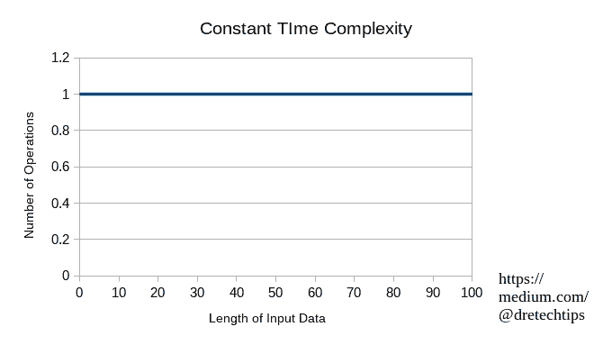
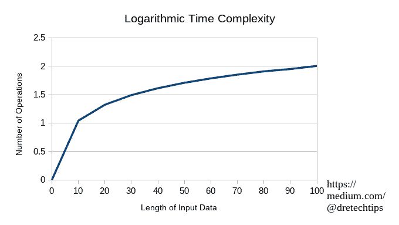
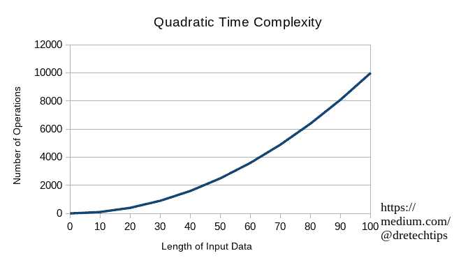

# 什么是计算机科学中的时间复杂度？

> 原文：<https://medium.com/geekculture/what-is-time-complexity-in-computer-science-d5f57f15b2f2?source=collection_archive---------7----------------------->

## 了解什么是时间复杂度？


Photo by [Ales Krivec](https://unsplash.com/@aleskrivec?utm_source=medium&utm_medium=referral) on [Unsplash](https://unsplash.com?utm_source=medium&utm_medium=referral)

作为一名软件工程师或计算机科学学生，你可能见过或听说过时间复杂性。这可能在面试问题中被问到。或者你需要为即将到来的考试学习试题。在没有实践这些概念的情况下回答这些问题可能会很有挑战性。在你开始练习解决这些问题之前。

下面是解释的时间复杂度。

## 什么是时间复杂度？

时间复杂度是一种分析算法完成所需时间的方法。大多数时候你会忽略算法开始时的时间复杂度。在代码重构过程中，您希望保持时间复杂度优化尽可能低。但是，您不希望牺牲可读性和花费在重构上的时间。否则，将来没有人能够阅读和使用这些代码。

## 时间复杂性的意义？

算法是一组指令，计算机将使用它们来执行以到达定义的端点。你的整个电脑都在运行某种算法。这可能是主板的固件芯片。或者在你的浏览器中执行的 JavaScript 正在运行某种算法。唯一的区别是，你的主板固件芯片运行的软件使用不那么臃肿的语言，如汇编或 c。而你的[浏览器使用的是](/@dretechtips/your-browser-the-least-private-way-to-surf-the-web-a528f919365e)臃肿的语言，如 JavaScript 。有了硬件知识和您使用的语言，您可以计算时间复杂度，粗略估计所需的时间。这就是为什么[许多科技公司面试时会将时间复杂性问题作为面试问题](https://www.interviewkickstart.com/learn/time-complexities-of-all-sorting-algorithms)的一部分。

## 你如何衡量时间复杂度？

最重要的问题之一是如何度量时间复杂度。做这件事的方法之一是通过所谓的大 O 概念。这允许您量化完成任务所需的执行步骤。

**O(1) —常数时间复杂度**



Figure 1 from Dre Tech Tips

恒定时间复杂度是指即时访问一个元素。只有当索引直接指向元素时，才会出现这种情况。然后代码使用该索引来获取元素。

**O(n) —线性时间复杂度**


Figure 2 from Dre Tech Tips

线性时间复杂度是遍历一个列表中的元素，直到到达你正在搜索的特定元素。假设您试图访问的数据在列表的末尾，那么这个例子中的操作数与输入数据的长度相同。

**O(log(n)) —对数时间复杂度**



Figure 3 from Dre Tech Tips

对数时间复杂度是从某种线性索引(如字母或数字)中所有元素的有序列表开始的。然后根据开始和结束范围切掉一半的元素，直到找到要搜索的元素。每次减少一半的元素。你拥有的元素列表越大，相对于操作的数量，你丢弃的元素就越多。

**O(n )-二次时间复杂度**



Figure 4 from Dre Tech Tips

二次时间复杂度的一个例子是每次执行一个操作的双 for 循环。

一旦你学会了排序算法，你会对时间复杂度有更好的理解。因为这些算法可以根据不同的条件具有动态的时间复杂度。这就把我们带到了下一点。

## 排序算法的时间复杂度？

下面是一些最流行的排序算法的时间复杂度。

**冒泡排序**

Video 1 from youtube.com

```
# bubble_sort.psuedocode
# SOURCE: tutorialpoint.combegin BubbleSort(list)

   for all elements of list
      if list[i] > list[i+1]
         swap(list[i], list[i+1])
      end if
   end for

   return list

end BubbleSort
```

*   最坏的情况:O(n)
*   一般情况:O(n)
*   最佳情况:O(n)

**插入排序**

Video 2 from youtube.com

```
# insertion_sort.psuedocode
# SOURCE: tutorialpoint.comprocedure insertionSort( A : array of items )
   int holePosition
   int valueToInsert

   for i = 1 to length(A) inclusive do:

      /* select value to be inserted */
      valueToInsert = A[i]
      holePosition = i

      /*locate hole position for the element to be inserted */

      while holePosition > 0 and A[holePosition-1] > valueToInsert do:
         A[holePosition] = A[holePosition-1]
         holePosition = holePosition -1
      end while

      /* insert the number at hole position */
      A[holePosition] = valueToInsert

   end for

end procedure
```

*   最坏的情况:O(n)
*   一般情况:O(n)
*   最佳情况:O(n)

**选择排序**

Video 3 from youtube.com

```
# selection_sort.py
# SOURCE: tutorialpoint.comprocedure selection sort 
   list  : array of items
   n     : size of list

   for i = 1 to n - 1
   /* set current element as minimum*/
      min = i    

      /* check the element to be minimum */

      for j = i+1 to n 
         if list[j] < list[min] then
            min = j;
         end if
      end for

      /* swap the minimum element with the current element*/
      if indexMin != i  then
         swap list[min] and list[i]
      end if
   end for

end procedure
```

*   最坏的情况:O(n)
*   一般情况:O(n)
*   最佳情况:O(n)

**合并排序**

Video 4 from youtube.com

```
# merge_sort.psuedocode
# SOURCE: tutorialpoint.comprocedure mergesort( var a as array )
   if ( n == 1 ) return a

   var l1 as array = a[0] ... a[n/2]
   var l2 as array = a[n/2+1] ... a[n]

   l1 = mergesort( l1 )
   l2 = mergesort( l2 )

   return merge( l1, l2 )
end procedure

procedure merge( var a as array, var b as array )

   var c as array
   while ( a and b have elements )
      if ( a[0] > b[0] )
         add b[0] to the end of c
         remove b[0] from b
      else
         add a[0] to the end of c
         remove a[0] from a
      end if
   end while

   while ( a has elements )
      add a[0] to the end of c
      remove a[0] from a
   end while

   while ( b has elements )
      add b[0] to the end of c
      remove b[0] from b
   end while

   return c

end procedure
```

*   最坏的情况:O(n log(n))
*   平均情况:O(n log(n))
*   最佳情况:O(n log(n))

**堆排序**

Video 5 from youtube.com

```
# heap_sort.psuedocode
# SOURCE: [fullyunderstood.com](https://fullyunderstood.com/)Heapify(A as array, n as int, i as int)
{
    max = i
    leftchild = 2i + 1
    rightchild = 2i + 2

    if (leftchild <= n) and (A[i] < A[leftchild])
        max = leftchild
    else 
        max = i

    if (rightchild <= n) and (A[max]  > A[rightchild])
        max = rightchild

    if (max != i)
        swap(A[i], A[max])
        Heapify(A, n, max)
}

Heapsort(A as array) 
{
   n = length(A)
   for i = n/2 downto 1   
     Heapify(A, n ,i)

   for i = n downto 2
     exchange A[1] with A[i]
     A.heapsize = A.heapsize - 1
     Heapify(A, i, 0)
}
```

*   最坏的情况:O(n log(n))
*   平均情况:O(n log(n))
*   最佳情况:O(n log(n))

**快速排序**

Video 6 from youtube.com

```
# quick_sort.psuedocode
# SOURCE: tutorialpoint.comfunction partitionFunc(left, right, pivot)
   leftPointer = left
   rightPointer = right - 1

   while True do
      while A[++leftPointer] < pivot do
         //do-nothing            
      end while

      while rightPointer > 0 && A[--rightPointer] > pivot do
         //do-nothing         
      end while

      if leftPointer >= rightPointer
         break
      else                
         swap leftPointer,rightPointer
      end if

   end while 

   swap leftPointer,right
   return leftPointer

end functionprocedure quickSort(left, right)

   if right-left <= 0
      return
   else     
      pivot = A[right]
      partition = partitionFunc(left, right, pivot)
      quickSort(left,partition-1)
      quickSort(partition+1,right)    
   end if		

end procedure
```

*   最坏的情况:O(n)
*   平均情况:O(n log(n))
*   最佳情况:O(n log(n))

## 这些知识有用吗？

大多数学生都在学习这些概念，并将信息反馈到考试中。如果你不是学生，那么你可能需要正确回答这些问题才能通过面试。但现实是，大部分关于排序算法的知识都是没用的，除非你是一个[有竞争力的程序员](https://www.geeksforgeeks.org/competitive-programming-a-complete-guide/)或者进入研究领域。或者让我换个说法，你学习排序算法和时间复杂度的原因并不是你会在工作中用到它们。因为这些算法中的大多数已经被先前的开发者抽象成代码。但是它们可以帮助您估计正在开发的新代码的算法时间。这对确定这种开发的可行性很重要。不仅如此，它们还能让你理解如何在重构过程中优化你的代码。

## 练习题

没有知识的应用，知识是无用的。这里有一些练习题。

[](https://www.geeksforgeeks.org/practice-questions-time-complexity-analysis/) [## 时间复杂性分析练习题

### 先决条件:算法分析 1。以下代码的时间、空间复杂度是多少:输出:3。O(N + M)…

www.geeksforgeeks.org](https://www.geeksforgeeks.org/practice-questions-time-complexity-analysis/) 

## 最后

IT 和工程领域是快速发展的领域。跟不上意味着你将被落在后面。跟上的最好方法是保持最新的新闻和教育内容。[订阅免费电子邮件列表，将您的职业生涯提升 10 倍。](/subscribe/@dretechtips)

**加入我们吧，有 100 多人想要快速提升他们的职业生涯和知识基础，他们已经注册了。**

达到这一点可能意味着你同意大部分已经写了。留下大量的掌声，让算法把它推荐给媒体上的其他人。

**相关内容:**

*   Linux 内核初学者指南
*   [如何安全地连接到您的 Linux 服务器](/geekculture/ssh-securely-connect-to-your-servers-8895faab7083)？
*   [开始使用 LDAP 所需的唯一指南](/geekculture/the-only-guide-you-need-to-get-started-with-ldap-6f526385934f)