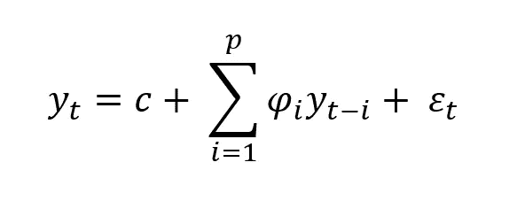
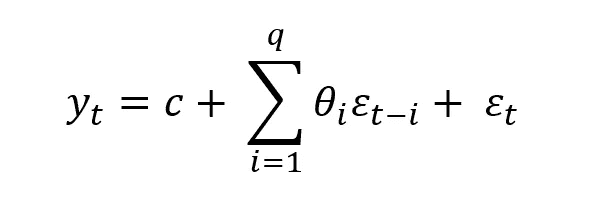

# 什么是时间序列分析？

> 原文：<https://medium.com/geekculture/what-is-time-series-analysis-dae22406d2b3?source=collection_archive---------17----------------------->

许多类型的[模型是从数据](https://www.megaputer.com/choosing-machine-learning-models/)的单个样本中创建的。我们可能已经进行了一项研究，收集了不同患者的生命体征，现在正在拟合一些预测模型。这些患者是独特而独立的病例，它们共同构成了一种趋势。然而，许多种类的系统不是单个数据点的集合；它们是一段时间内对一个概念的一系列观察。股票市场的波动、全球气温、石油销售、太阳耀斑的活动等等并不是一篮子不同的观测数据，而是同一物体在不同时间的序列。因此，我们希望对这个对象如何随时间变化进行建模。当我们考虑一个变量的时间和过去的观察来模拟它的行为并做出预测时，这被称为*时间序列分析*。

顾名思义，时间序列模型用于预测未来会发生什么。目标是从过去学习模式并用于预测。这些模型被用于许多应用中，例如为投资者预测天气和经济活动。时间序列分析有很多种，有些比其他的更复杂，但今天我们将研究一个相对简单而有力的方法:ARIMA。ARIMA，或自回归综合移动平均线，是由几个部分组成的。让我们首先处理自回归部分。

# 自回归

自回归的概念很简单:今天发生的事情与昨天发生的事情强相关，与上周发生的事情轻度相关，与上个月发生的事情弱相关，以此类推。本质上，我们希望使用变量的过去值来预测未来值。也就是说，在给定的时间， *t* ，我们当时的值被建模为一个常数， *c* ，加上回溯 *p* 时间戳的加权过去值之和，再加上一些高斯噪声(误差)。

这个等式可能看起来很熟悉。这只是一个线性回归[使用我们变量的过去值作为输入变量。这就是自回归的“自动”部分的来源。我们在回归一个变量本身。我们可以很容易地用普通的最小二乘法来拟合这个模型；我们只需要选择参数 *p* ，这是我们想要查看的多远的回溯。](https://www.megaputer.com/5-things-linear-regression-models/)

# **移动平均线**

自回归相当直观。然而，移动平均线有点难以理解。在移动平均模型中，我们不使用我们过去观察的实际值，而是使用它们累积的误差。更正式地说，移动平均线是另一种类型的线性回归，但我们不使用过去的数据观察，而是使用它们的误差。

移动平均线在概念上很简单，但是很复杂，因为它们很难建立有用的类比。一个很好的例子是考虑一个人试图把一块石头扔得尽可能远。他们首先投掷石头，并且与他们典型的投掷有一些偏差或“噪音”或“误差”。然后他们再扔。该第二次投掷可能与典型投掷有偏差，该偏差与他们前一次投掷的偏差有关。也许第一次扔得好会给他们信心，他们更有可能继续成功，或者也许扔得不好会让他们沮丧，更有可能再扔一次。有了均线，这些背离就有了动力。

# 完整的

我们可以将上述两种模型结合起来，形成一种称为 ARMA(自回归移动平均)甚至 ARIMA 的模型。不幸的是，ARIMA 的“集成”部分太过技术化，无法在这里深入讨论。基本上，它指的是这样一个事实，当我们取连续时间的差时，ARIMA 系统是一个 ARMA 系统。或者在连续时间序列的情况下，我们求导。这基本上意味着我们可以考虑是否应该直接对数据建模，或者是否应该对数据的变化率建模，然后累积这些变化。

# 季节性

ARIMA 模型很好，但当数据表现出季节性行为时，它们往往表现不佳。例如，考虑几年内的温度。

夏季比冬季更热，这是一个很强的循环模式。因此，数据可能与直接的过去密切相关，但也与某些固定的周期性间隔密切相关。今天的气温取决于上周的气温，很少取决于六个月前的气温，适度取决于一年前的气温。我们可以包括自回归和移动平均模型，它们不是回溯几个时间戳，而是回溯季节结构的几个时期。结合这种季节性模型的 ARIMA 被称为季节性 ARIMA 或萨里玛。

# 使用 ARIMA 模型

训练一个 ARIMA 模型既快又容易。问题是选择你希望回顾多远的超参数，以及是否存在季节性。然而，像传统的线性回归，有几个统计工具来帮助作出决定。我们可以使用自相关和部分自相关相关图来帮助可视化何时进行这些截止。当拟合一个模型时，我们可以查看试探法，如我们的误差分布，以及像 AIC 和 BIC 这样的度量来比较性能。一旦我们选择了一个模型，我们可以用它来做预测，或者通过一些统计计算或模拟，然后我们可以创建一个带的可能性。像任何回归一样，我们的预测几乎不可能完全正确。我们不太可能得到一只股票准确的价格或准确的温度。然而，我们可以创建置信区间，即我们 95%(或其他值)确信未来将进入的区域。所有这些都是通过查看我们想要的变量的过去值来实现的。此外，通过在回归中使用独立的输入变量，时间序列可以变得更加强大。

ARIMA 模型是统计学优秀应用的另一个例子，因为它们是:

*   形式化的
*   容易理解
*   可预言的
*   可解释的
*   产生好结果