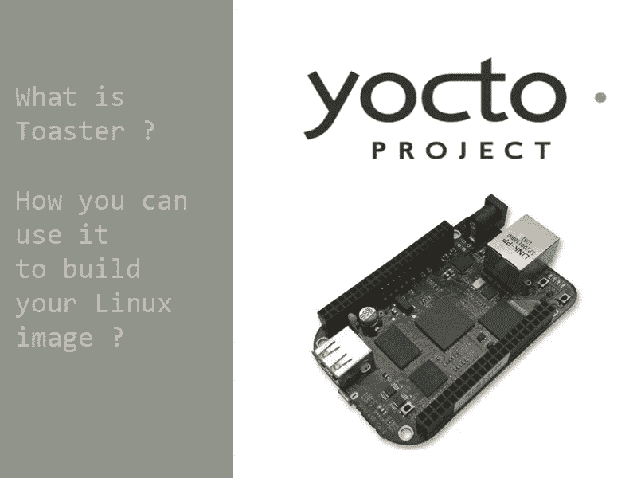

# 什么是 Toaster 以及如何用它来构建你的定制 Linux 镜像

> 原文：<https://medium.com/geekculture/what-is-toaster-and-how-to-use-it-to-build-your-custom-linux-image-with-yocto-project-9ef2c2e8902e?source=collection_archive---------0----------------------->

# 介绍

**Toaster** 是一个 **web 界面**，可以用来**配置和运行****[**Yocto 项目**](https://www.yoctoproject.org/) 构建活动。换句话说，对于你们这些新来的还不习惯与机器进行命令行式交互的人来说，它使事情变得更简单。**