# 推特感谢什么？利用 TigerGraph 和自然语言处理找出答案

> 原文：<https://medium.com/geekculture/what-is-twitter-thankful-for-leverage-tigergraph-and-natural-language-processing-to-find-out-19ca7e69d4f9?source=collection_archive---------13----------------------->

## 使用 TweePy、TigerGraph、SpaCy 的命名实体识别和 NLTK 的情感分析来分析关于感恩的推文


Image from [Pixabay](https://pixabay.com/photos/thank-you-feedback-letters-5077738/)

# 概观

## 目标

作为感恩节特别博文，我们将分析 Twitter 上的推文，看看 Twitter 上的人们最感谢的是什么。这是一堂有趣的课，通过这个博客，你将学习如何抓取推文，用 Twitter 数据创建图形数据库，使用一些自然语言处理算法，并在图形数据库上运行查询来回答我们的主要问题:Twitter 上的人们这个月主要感谢什么？

## 工具

*   Twitter: [Twitter 开发者门户](https://developer.twitter.com/en)和 [TweePy](https://www.tweepy.org/)
*   tiger graph:[tiger graph Cloud](https://tgcloud.io/)和 [pyTigerGraph](https://pytigergraph.github.io/pyTigerGraph/GettingStarted/)
*   NLP: [斯帕西的 NER](https://spacy.io/) 和 [NLTK 的维德](https://www.nltk.org/howto/sentiment.html)

## 旅程

*   概观
*   建立一个 Twitter 开发者账户
*   用 TweePy 抓取数据
*   用 NLTK 的 Vader 进行情感分析
*   创建免费的 TigerGraph 解决方案
*   在 TigerGraph 中创建图形
*   上传推文
*   查询数据 Twitter 用户感谢什么？
*   结论和下一步措施

# 第一部分:建立一个 Twitter 开发者账户

首先，我们需要一个 Twitter 开发者账户来获取推文。导航到 Twitter 创建一个帐户，然后在 Twitter 的开发者门户[上注册。](https://developer.twitter.com/en)

[](https://developer.twitter.com/en) [## 用例、教程和文档

### 发布和分析推文，优化广告，并利用 Twitter API、Twitter Ads API 创建独特的客户体验

developer.twitter.com](https://developer.twitter.com/en) 

> 请注意，您将需要一个经过验证的电话号码来创建一个开发者帐户！

在门户中，我们将立即被提示创建一个应用程序，实质上，您将被提示创建一个项目。输入一个唯一的项目名称，然后按“获取密钥”

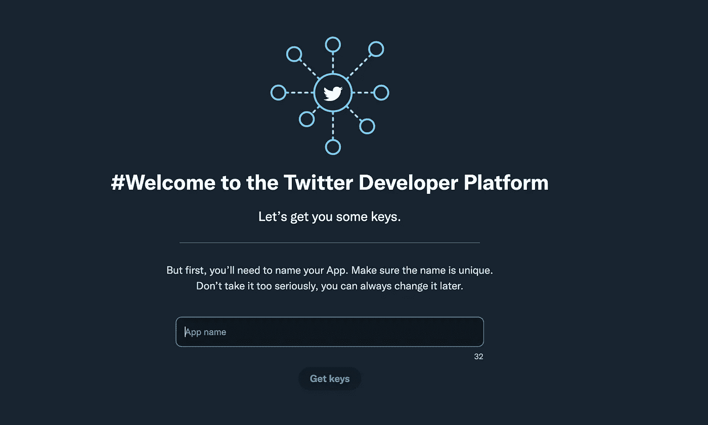

Enter an app name

创建应用程序后，我们将可以访问总共四个令牌:

*   API 密钥
*   API 密钥机密
*   访问令牌
*   访问令牌秘密

将所有这四个值复制到 Colab 笔记本中，以便使用 TweePy 轻松抓取数据。最后，要使用这个博客中的功能，我们需要注册[提升的 Twitter API 访问权限](https://developer.twitter.com/en/docs/twitter-api/getting-started/about-twitter-api)，这要求我们在收集数据之前回答一些关于我们项目的问题。您可以在[开发者门户仪表盘](https://developer.twitter.com/en/portal/dashboard)内申请提升权限。

[](https://developer.twitter.com/en/portal/dashboard) [## Twitter 开发者门户仪表板

### 点击此处访问关于提升权限的调查问卷

developer.twitter.com](https://developer.twitter.com/en/portal/dashboard) 

一旦拥有了所有四个键和提升的访问权限，就可以用 TweePy 抓取数据了。

# 第二部分:用 TweePy 收集数据

用你的代币打开 Colab 笔记本。我们现在将使用一个名为 [TweePy](https://docs.tweepy.org/en/stable/index.html) 的 Python 库来过滤和抓取数据。

 [## Tweepy 文档- tweepy 4.4.0 文档

### tweepy . Asynchronous . async Stream-异步流引用

docs.tweepy.org](https://docs.tweepy.org/en/stable/index.html) 

从导入库开始。

```
pip install tweepy
```

接下来，使用之前存储的常量创建 API。

```
auth = tweepy.OAuthHandler(API_KEY, API_KEY_SECRET)
auth.set_access_token(ACCESS_TOKEN, ACCESS_TOKEN_SECRET)api = tweepy.API(auth)
```

完美！我们现在将使用光标功能抓取 Twitter 引用，抓取自 11 月初(11/01/21)以来所有带有“thank”一词的英语推文，并从中提取文本。

```
for status in tweepy.Cursor(api.search, q="thank", lang="en", wait_on_rate_limit=True, since="2021-11-01", until="2021-11-25", tweet_mode='extended').items(): try: print(status.retweeted_status.full_text) except AttributeError: print(status.full_text)
```

如果您运行上面的代码，您的输出应该会被 tweets 淹没。如果是这样，完美！接下来，让我们对数据运行一些 NLP 算法。

# 第三部分:用 SpaCy 提取实体

让我们首先使用 [SpaCy 的命名实体识别](https://spacy.io/)从文本中提取实体。

[](https://spacy.io/) [## Python 中的 spaCy 工业级自然语言处理

### spaCy 是 Python 中自然语言处理的免费开源库。它的特点是 NER，词性标注，依赖性…

空间. io](https://spacy.io/) 

有了这个，我们就拉关键词和它们的标签。例如，数字将被标记为“基数”，组织和个人将被分别标记，等等。

首先，我们需要导入 SpaCy 并加载它的 NLP 模型。

```
import spacynlp = spacy.load("en_core_web_sm")
```

接下来，我们可以在现有代码中使用它的特性。

```
for status in tweepy.Cursor(api.search, q="thank", lang="en", wait_on_rate_limit=True, since="2021-11-01", until="2021-11-25", tweet_mode='extended').items(): try: text = status.retweeted_status.full_text
    print(text)
    doc = nlp(text)
    for entity in doc.ents:
      print(entity.text, entity.label_) except AttributeError: text = status.full_text
    print(text)
    doc = nlp(text)
    for entity in doc.ents:
      print(entity.text, entity.label_)
```

上面的代码遍历每条 tweet 的所有实体，并打印实体及其类型。

接下来，让我们利用情绪分析来检测一条推文到底有多感谢。

# 第三部分:用 NLTK 的 Vader 进行情感分析

为了检测一首歌的正面、负面或中性程度，我们将使用 [NLTK 的维达情绪分析](https://www.nltk.org/_modules/nltk/sentiment/vader.html)。Vader 的酷之处在于，它是专门为社交媒体打造的，甚至在检测情绪时考虑到了表情符号，因此它应该非常适合我们的用例。

 [## NLTK

### docs] def 被否定(self，input_words，include_nt = True):" " "确定输入是否包含否定词" " "…

www.nltk.org](https://www.nltk.org/_modules/nltk/sentiment/vader.html) 

首先，我们将导入库并下载 Vader。

```
import nltk
nltk.download('vader_lexicon')from nltk.sentiment.vader import SentimentIntensityAnalyzer
sid = SentimentIntensityAnalyzer()
```

当对一个句子运行 Vader 时，我们可以找到净情绪以及具体的负面、正面和中性得分。

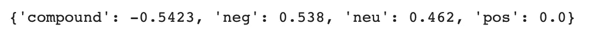

Sample Result from Vader

让我们把它纳入我们的循环。

```
for status in tweepy.Cursor(api.search, q="thank", lang="en", wait_on_rate_limit=True, since="2021-11-01", until="2021-11-25", tweet_mode='extended').items(): try: text = status.retweeted_status.full_text
    print(text) sentiment = sid.polarity_scores(text)
    print(sentiment) doc = nlp(text)
    for entity in doc.ents:
      print(entity.text, entity.label_) except AttributeError: text = status.full_text
    print(text) sentiment = sid.polarity_scores(text)
    print(sentiment) doc = nlp(text)
    for entity in doc.ents:
      print(entity.text, entity.label_)
```

太棒了。所有的 NLP 算法都准备好了，接下来让我们创建图形数据库本身。

# 第四部分:创建免费的 TigerGraph 解决方案

为了托管我们的图表并与之交互，让我们在 [TigerGraph Cloud](https://tgcloud.io/) 上创建一个免费的 TigerGraph 解决方案，方法是导航到【https://tgcloud.io/】的[并创建一个免费账户。](https://tgcloud.io/)

 [## TigerGraph 云门户

### 免费建立 TigerGraph 图形数据库的好地方

tgcloud.io](https://tgcloud.io/) 

登录后，导航至“我的解决方案”选项卡，然后按蓝色的“创建解决方案”按钮。


Click on the “My Solutions” tab then the blue “Create Solution” button.

在创建解决方案时的第一页上，选择“空白”以创建没有任何预先存在的架构或数据的新解决方案。

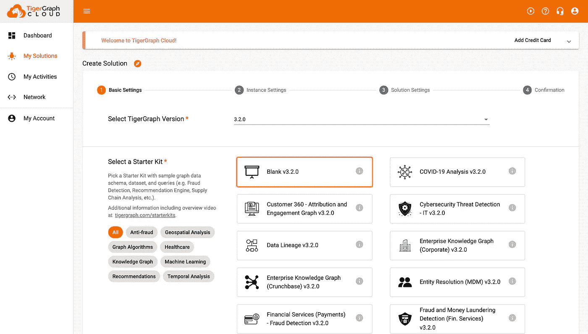

Select “Blank” then press next.

不要担心改变第二页上的任何内容。(它本质上会为你创造一个免费的解决方案。)按下一步。

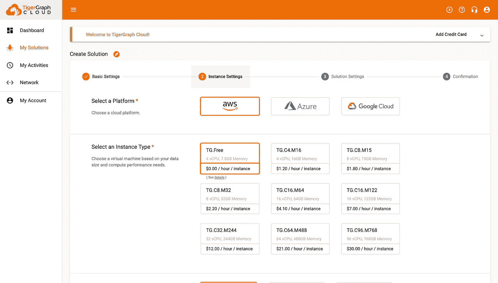

Don’t change anything on this page and press next.

根据您的具体解决方案定制第三页，然后按下一步。

> 注意:一定要写好自己的子域和密码！

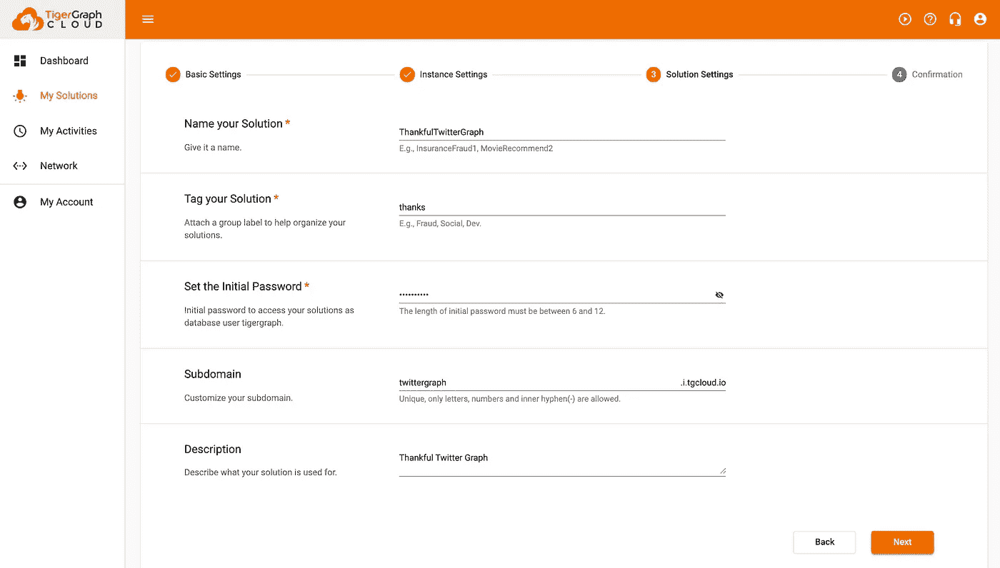

Change this to your solution

最后，在最后一页，确保一切正常，然后点击“提交”解决方案的安装可能需要几分钟时间。

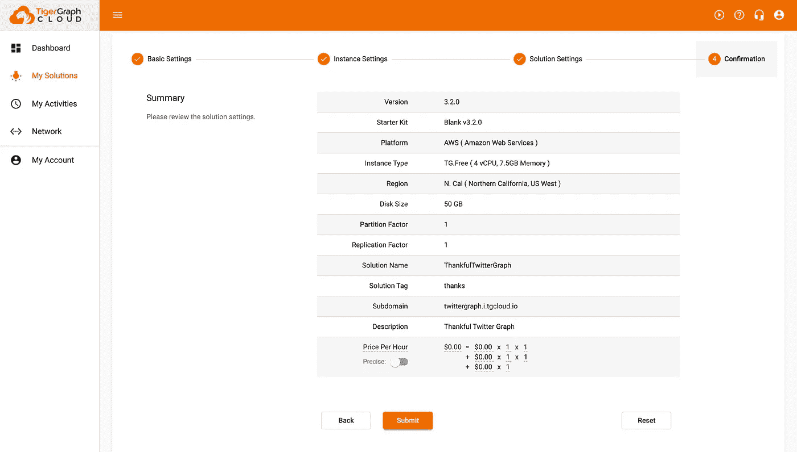

一旦它准备就绪，状态为绿色，您就可以将所有东西组合在一起了！创建解决方案的更彻底的演练和 GraphStudio 的概述(我们将在博客的后面使用)可以在[这里](https://www.tigergraph.com/blog/getting-started-with-tigergraph-3-0/)找到。

[](https://www.tigergraph.com/blog/getting-started-with-tigergraph-3-0/) [## TigerGraph 3.0 入门- TigerGraph

### 使用 TigerGraph 的 GraphStudio 创建您的第一个图形数据库所需要知道的一切什么是 GraphStudio…

www.tigergraph.com](https://www.tigergraph.com/blog/getting-started-with-tigergraph-3-0/) 

# 第五部分:在 TigerGraph 中创建图形

为了与 TigerGraph 交互，我们将使用 [pyTigerGraph](https://pytigergraph.github.io/pyTigerGraph/) 。

 [## pyTigerGraph

### pyTigerGraph 是一个用于连接 TigerGraph 数据库的 Python 包。

pytigergraph.github.io](https://pytigergraph.github.io/pyTigerGraph/) 

首先，安装并导入 pyTigerGraph。

```
!pip install pyTigerGraphimport pyTigerGraph as tg
```

接下来，使用您保存的凭据，建立与解决方案的连接。

```
conn = tg.TigerGraphConnection(host = "https://twittergraph.i.tgcloud.io/", password = "tigergraph")
```

一旦连接上，就在 GSQL 中创建模式。对于这个图，将有两个顶点:Tweet 和 Entity。推文将只是推文本身，实体将包含来自 SpaCy 的 NER 的信息。连接两者的将是 TWEET_ENTITY edge，它具有 TWEET 的情感属性。我们将一起把这些放到 TwitterGraph 中。

```
conn.gsql('''CREATE VERTEX Tweet(PRIMARY_ID tweet STRING) WITH PRIMARY_ID_AS_ATTRIBUTE = "true"CREATE VERTEX Entity(PRIMARY_ID entity_name STRING, entity STRING) WITH PRIMARY_ID_AS_ATTRIBUTE = "true"CREATE UNDIRECTED EDGE TWEET_ENTITY(FROM Tweet, TO Entity, overall_sentiment DOUBLE, pos_score DOUBLE, neg_score DOUBLE, neu_score DOUBLE)CREATE GRAPH TwitterGraph(Tweet, Entity, TWEET_ENTITY)''')
```

通过打开 GraphStudio，您可以图形化地查看您的模式。

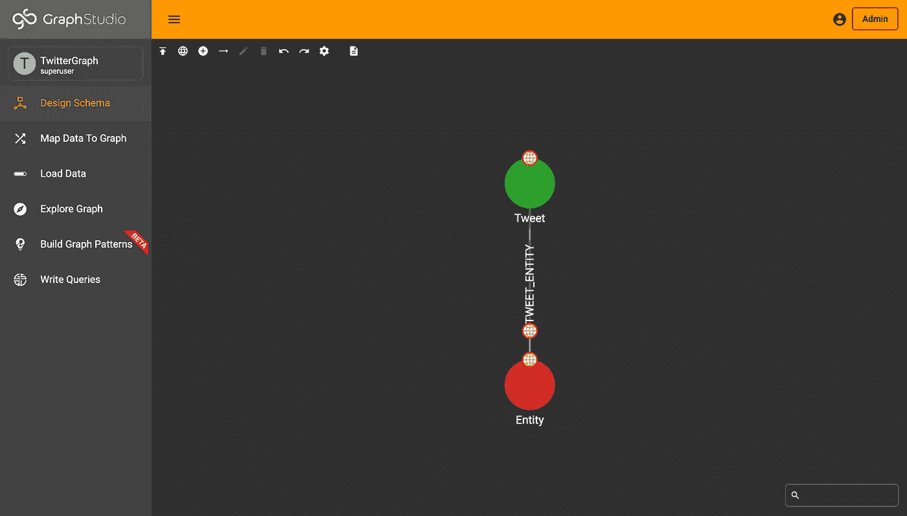

Schema in GraphStudio

最后，在上传数据之前，我们需要用图名和 API 令牌更新我们的连接细节。

```
conn.graphname = "TwitterGraph"conn.apiToken = conn.getToken(conn.createSecret())
```

这样，我们就可以将数据插入到图表中了。

# 第六部分:上插推文

为了向上插入数据，我们使用相同的循环。这一次，我们将使用数据向上插入顶点和边，而不是打印值。

```
for status in tweepy.Cursor(api.search, q="thank", lang="en", wait_on_rate_limit=True, since="2021-11-01", until="2021-11-25", tweet_mode='extended').items(): try: text = status.retweeted_status.full_text
    conn.upsertVertex("Tweet", text, attributes = {"tweet": text}) sentiment = sid.polarity_scores(text)
    doc = nlp(text) for entity in doc.ents:
      conn.upsertVertex("Entity", entity.text, {"entity_name": entity.text, "entity": entity.label_})
      conn.upsertEdge("Tweet", text, "TWEET_ENTITY", "Entity", entity.text, {"overall_sentiment": sentiment["compound"], "pos_score": sentiment["pos"], "neg_score": sentiment["neg"], "neu_score": sentiment["neu"]}) except AttributeError: text = status.retweeted_status.full_text
    conn.upsertVertex("Tweet", text, attributes = {"tweet": text}) sentiment = sid.polarity_scores(text)
    doc = nlp(text) for entity in doc.ents:
      conn.upsertVertex("Entity", entity.text, {"entity_name": entity.text, "entity": entity.label_})
      conn.upsertEdge("Tweet", text, "TWEET_ENTITY", "Entity", entity.text, {"overall_sentiment": sentiment["compound"], "pos_score": sentiment["pos"], "neg_score": sentiment["neg"], "neu_score": sentiment["neu"]})
```

你可以在这里阅读更多关于顶点[和](https://pytigergraph.github.io/pyTigerGraph/VertexFunctions/#upsertvertex)[边](https://pytigergraph.github.io/pyTigerGraph/EdgeFunctions/#upsertedge)的升级文档。

 [## 顶点函数

### getVertexTypes()返回图形的顶点类型名称列表。getVertexType(vertexType)返回…的详细信息

pytigergraph.github.io](https://pytigergraph.github.io/pyTigerGraph/VertexFunctions/#upsertvertex)  [## 边缘函数

### getEdgeTypes()返回图形的边类型名称列表。getEdgeType(typeName)返回顶点的细节…

pytigergraph.github.io](https://pytigergraph.github.io/pyTigerGraph/EdgeFunctions/#upsertedge) 

为了添加更多的数据，我还在推文中添加了“谢谢”和“感恩节”

```
for status in tweepy.Cursor(api.search, q="thanks", lang="en", wait_on_rate_limit=True, since="2021-11-01", until="2021-11-25", tweet_mode='extended').items(): try: text = status.retweeted_status.full_text
    conn.upsertVertex("Tweet", text, attributes = {"tweet": text}) sentiment = sid.polarity_scores(text)
    doc = nlp(text) for entity in doc.ents:
      conn.upsertVertex("Entity", entity.text, {"entity_name": entity.text, "entity": entity.label_})
      conn.upsertEdge("Tweet", text, "TWEET_ENTITY", "Entity", entity.text, {"overall_sentiment": sentiment["compound"], "pos_score": sentiment["pos"], "neg_score": sentiment["neg"], "neu_score": sentiment["neu"]}) except AttributeError: text = status.retweeted_status.full_text
    conn.upsertVertex("Tweet", text, attributes = {"tweet": text}) sentiment = sid.polarity_scores(text)
    doc = nlp(text) for entity in doc.ents:
      conn.upsertVertex("Entity", entity.text, {"entity_name": entity.text, "entity": entity.label_})
      conn.upsertEdge("Tweet", text, "TWEET_ENTITY", "Entity", entity.text, {"overall_sentiment": sentiment["compound"], "pos_score": sentiment["pos"], "neg_score": sentiment["neg"], "neu_score": sentiment["neu"]})
```

一旦加载到您的图表中，您将准备好利用 graph 的力量并查询数据，以最终了解 Twitter 用户感谢什么。

# 第七部分:查询数据——推特用户感谢什么*？*

让我们从一个简单的查询开始我们的调查:哪些实体拥有最多的连接？为了解决这个问题，我们将向实体顶点添加一个简单的局部 SumAccum，并按从大到小的顺序排列它们。对于这个例子，让我们抓住前十名。

```
conn.gsql('''CREATE QUERY mostPopularEntity() FOR GRAPH TwitterGraph { 

  SumAccum<INT> [@num_connections](http://twitter.com/num_connections);

  Seed = {Tweet.*};

  Res = SELECT tgt FROM Seed:s - (TWEET_ENTITY:e) - Entity:tgt
        ACCUM tgt.[@num_connections](http://twitter.com/num_connections) += 1
        ORDER BY tgt.[@num_connections](http://twitter.com/num_connections) DESC
        LIMIT 10;

  PRINT Res; 

}INSTALL QUERY mostPopularEntity''')
```

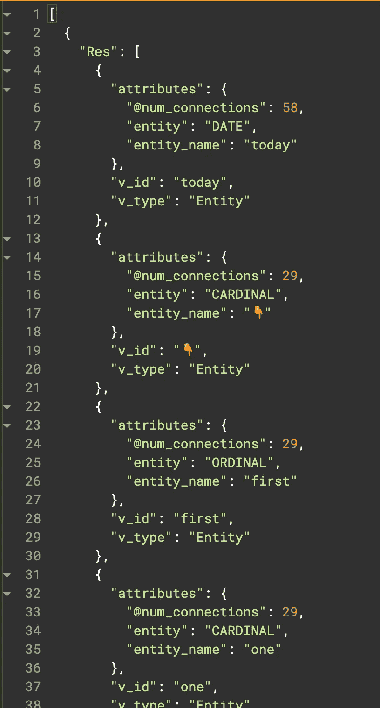

JSON Results

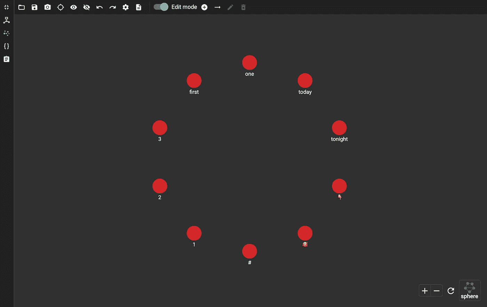

Graphical Results

酷！大多数结果似乎是数字、日期或表情符号，这是有道理的，因为它们可能是最常用的。

现在让我们进一步分析一下。让我们利用情感分析来积累具有最佳情感的实体，而不是仅仅计算连接的数量。

```
conn.gsql('''CREATE QUERY weightedMostPopularEntities() FOR GRAPH TwitterGraph { 

  SumAccum<DOUBLE> [@total_sentiment](http://twitter.com/total_sentiment);

  Seed = {Tweet.*};

  Res = SELECT tgt FROM Seed:s - (TWEET_ENTITY:e) - Entity:tgt
        ACCUM tgt.[@total_sentiment](http://twitter.com/total_sentiment) += e.overall_sentiment
        ORDER BY tgt.[@total_sentiment](http://twitter.com/total_sentiment) DESC
        LIMIT 10;

  PRINT Res; 

}INSTALL QUERY weightedMostPopularEntities''')
```

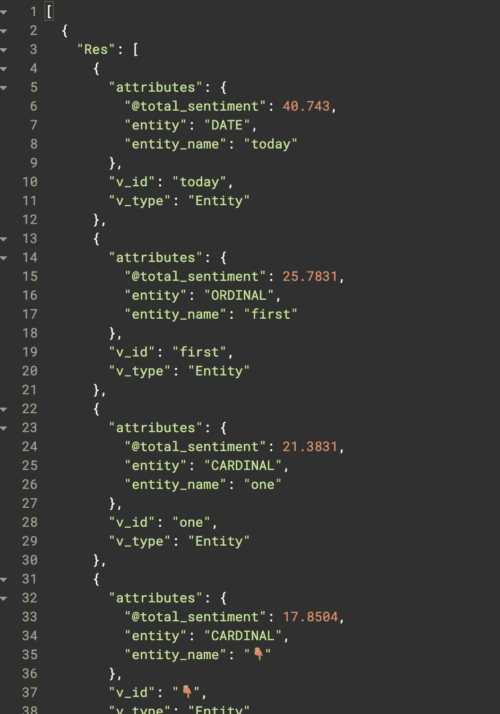

JSON Results

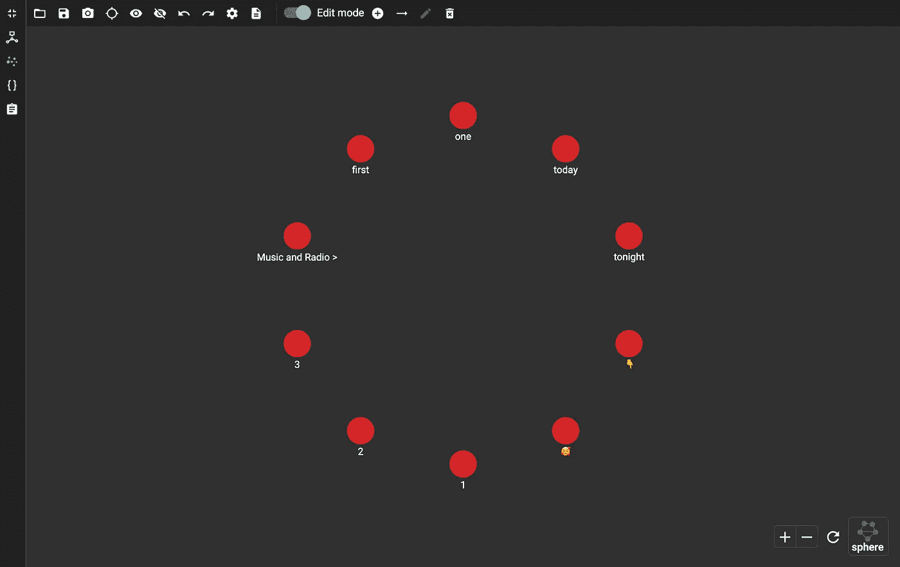

Graphical Results

它看起来大致相同，只有一些变化，这仍然是有意义的。为了进一步优化结果，让我们创建最后一个查询，以额外按实体过滤结果。

```
conn.gsql('''CREATE QUERY weightedEntitiesFiltered(STRING entity) FOR GRAPH TwitterGraph { 

  SumAccum<DOUBLE> [@total_sentiment](http://twitter.com/total_sentiment);

  Seed = {Tweet.*};

  Res = SELECT tgt FROM Seed:s - (TWEET_ENTITY:e) - Entity:tgt
        WHERE tgt.entity == entity
        ACCUM tgt.[@total_sentiment](http://twitter.com/total_sentiment) += e.overall_sentiment
        ORDER BY tgt.[@total_sentiment](http://twitter.com/total_sentiment) DESC
        LIMIT 10;

  PRINT Res; 

}INSTALL QUERY weightedEntitiesFiltered''')
```

例如，如果我只想要 ORG(组织)实体，这将是结果。

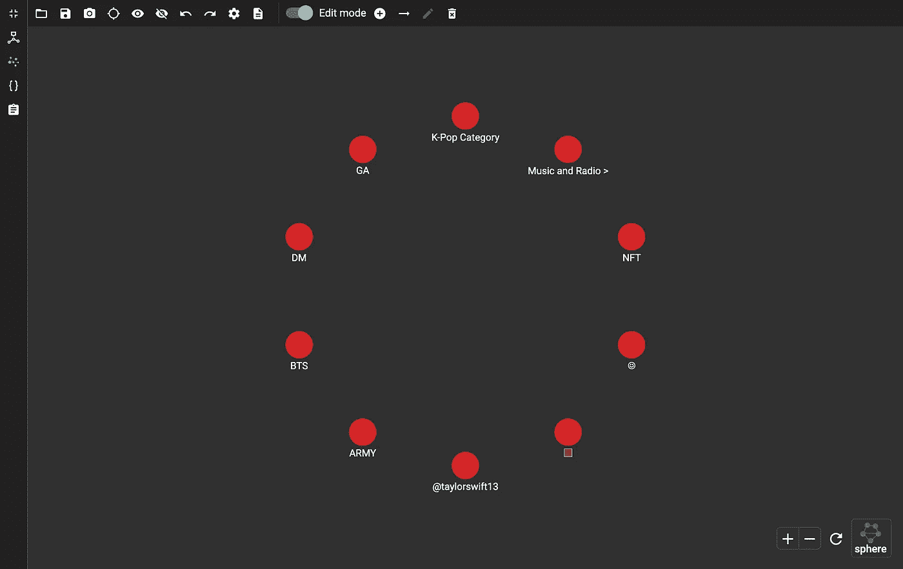

Results of ORG Filtered Search

我们可以继续按人(人)、产品(产品)等等来过滤实体！通过这一点，我们可以更具体地了解 Twitter 在多个领域感谢什么。

# 结论和下一步措施

恭喜你通过了这个博客！在阅读过程中，你用 TweePy 抓取了 Twitter，用 TigerGraph 创建了 Twitter 图，用 SpaCy 和 NLTK 利用 NLP 算法，甚至编写了 GSQL 查询来回答我们的问题。接下来你能完成什么？好吧，首先，过一个美妙的感恩节，列一个你真心感谢的事情的清单(看看它们是否和 Twitter 匹配！).你可以通过创建一个仪表板来扩展这个项目(也许是未来的博客？)还有更多！

如果您有任何问题，请随时在社区论坛上提问:

[](https://community.tigergraph.com/) [## 老虎图

### 话题回复浏览量活动 11 月 22 日-26 日每周更新:Graph+AI 纽约视频，AMC 股票和情绪…

community.tigergraph.com](https://community.tigergraph.com/) 

再者，要和你这样的开发者交流，加入 TigerGraph 开发者不和谐！

[](https://discord.gg/gRHWBZNpxW) [## 加入 TigerGraph Discord 服务器！

### 查看 Discord 上的 TigerGraph 社区-与 726 名其他成员一起玩，享受免费的语音和文本聊天。

不和谐. gg](https://discord.gg/gRHWBZNpxW) 

感恩节快乐！