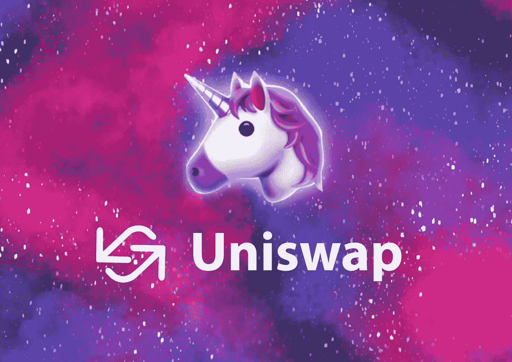

# 什么是 Uniswap，你如何从中获利？

> 原文：<https://medium.com/geekculture/what-is-uniswap-and-how-do-you-profit-from-it-df7ba25f5e43?source=collection_archive---------6----------------------->

除了用于交易加密货币的传统交易所和经纪商之外，分散式替代品也已站稳脚跟。加密货币最大的分散交易所(DEX 或分散交易所)之一是 Uniswap。

与集中交易所(CEX 或集中交易所)相比，有许多优点，但也有缺点。用户必须…