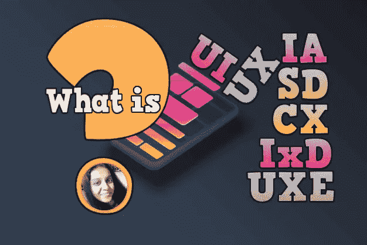
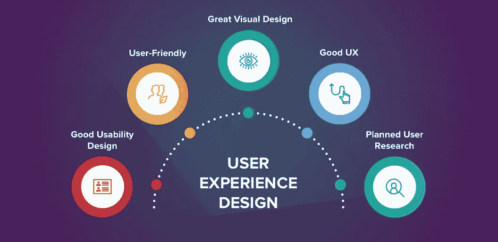
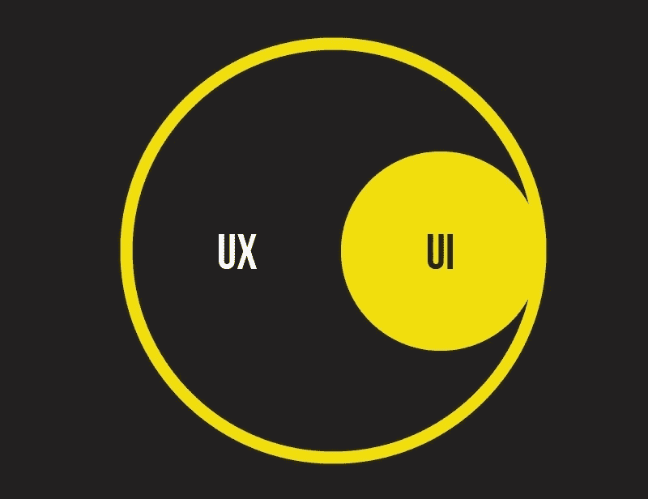
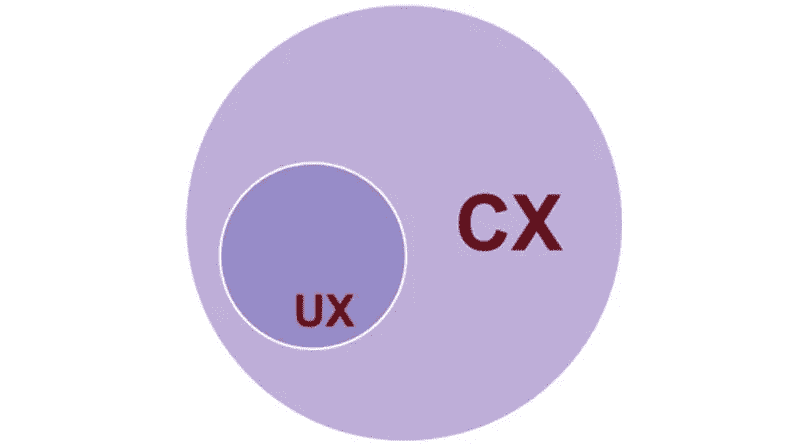
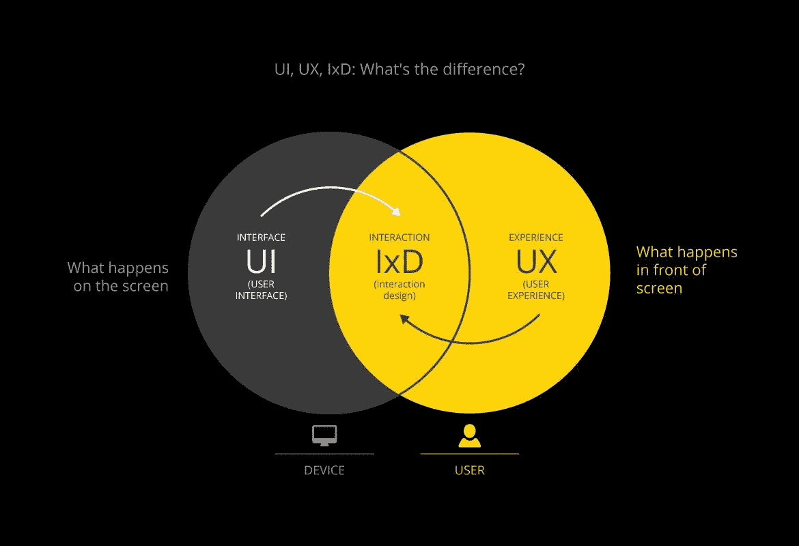
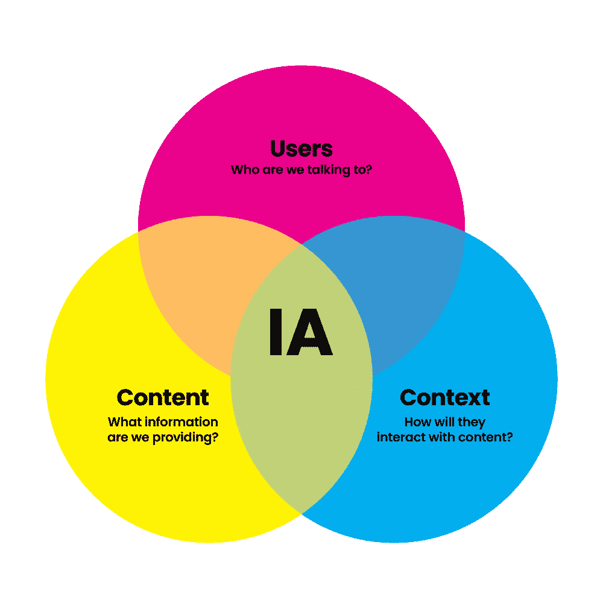
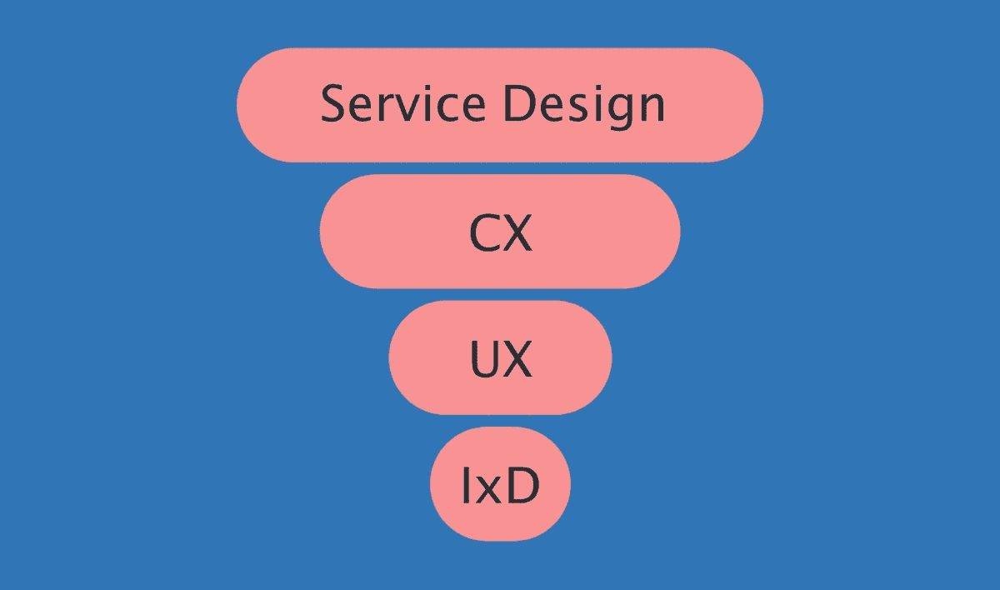

# 什么是 UX，XD，UXD，UED，UI，CX，IxD，UXE，IA，SD，有什么区别？

> 原文：<https://medium.com/geekculture/what-is-ux-xd-uxd-ued-ui-cx-ixd-uxe-ia-sd-and-whats-the-difference-eb425bb789e4?source=collection_archive---------11----------------------->

> 如今，一个不争的事实是，投资用户体验对产品的成功至关重要。几乎每个人都听说过 UX、UXD、CX、UI、IxD、UXE、IA、SD 这些词，但似乎不知道所有这些术语之间的区别。

在这里，我们建议找出这些词之间的区别。用户体验生态系统(UXE)和服务设计(SD)的含义是什么，如何明智地使用这些术语？

让我们从最常用的术语 UX(用户体验)和 UI(用户界面)开始。

# **1。UX 或用户体验**

这里发生的是一个定义用户问题，在用户理解之前解决问题的过程。

良好的 UX 设计允许客户轻松快速地找到他们需要的信息，并在最短的时间内完成期望的任务，而不会出现额外的问题。

如果产品界面清晰，运行流畅，UX 设计师就会非常成功。然而，存在用户不知道如何在产品界面中解决他们的问题的情况，这是低 UX 质量的直接指示。

有些人用术语 **UXD** 或者**UED**——用户体验设计而不是 UX。还可能遇到 **XD** —体验设计。实际上，所有这些缩写形式的意思都是一样的。

# **2。UI 或用户界面**

Jesse Garrett 是这个术语的合著者之一，也是 Adaptive Path 的创始人之一，他将这个术语定义为界面元素的一个区域。界面颜色代码、按钮、文本、字体都是这个区域的组成部分。

UI 的主要功能是使界面在视觉上吸引人，用户友好，和用户友好。用户界面是用户和设备之间的某种媒介，也负责交互。

UX 更注重科学，而 UI 更注重艺术

UI 设计师负责视觉产品的用户感知。优质的排版，明智选择的颜色，良好的纹理，设计中的空间帮助用户轻松达到最终目标。

# **3。CX 或客户体验**

这是一组与客户相关的因素，包括销售流程阶段和未来的产品使用。
这可以解释为客户在与公司合作时的总体感受。

CX 由许多因素组成，从第一次接触和购买的真实性开始，在一段时间内使用的产品，以及合作关系的结束。

CX 设计以许多因素为导向，如用户友好性、客户反馈、净推广得分(NPS)等。

# **4。IxD 或交互设计**

这就是所谓的产品和用户之间的交互设计。用户和产品如何相互响应。通常，此应用程序用于软件产品，如应用程序或网站。IxD 的主要目的是为用户创造一个有趣的产品。这个产品总是帮助用户以最简单、最有效和最吸引人的方式实现他们的目标。它最大化了声音、运动、美学、空间等等。

Crampton Smith 描述了交互设计的四个方面:

***文字，
视觉表象，
实物或空间
时间。***

后来白银强化榜上有了第五名，而且是
***行为。***

# **5。UXE 或用户体验生态系统**

达夫·琼斯将 UX 生态系统定义为信息环境中组件之间的一组相互依赖的关系。

在“组件”下，他指的是人、他们的目标、他们用于交换信息和通信目的的数字技术，当然还有他们共享的信息。

UX 生态系统让设计师着眼于更大的图景，换句话说，产品在用户操作的“世界”中有多舒适。

UX 设计师的目标是以简单明了的方式跨平台设计一个以用户为中心的设备、服务和对象的生态系统。

# **6。IA 或信息架构**

它包括两个主要部分。它们是内容和功能识别，以及产品层次结构。这个层次结构代表了产品内容和功能之间的联系。

IA 可能非常简单，但却非常复杂(对于大规模项目而言)。

信息架构(IA)不是用户界面可见屏幕的一部分。IA 指定了用户界面选项的外观和设置。

# **7。SD 或服务设计**

建立沟通、人员组织、计划和其他行动的过程，旨在提高产品质量和服务提供商及其客户之间的互动。

服务设计(SD)的主要目的是根据消费者和产品用户的期望改进公司服务。服务应该 100%满足客户的期望，快速，愉快，有竞争力。

**参考:-**

[https://OSS mium . com/journal/what-is-UX-xd-uxdued-ui-CX-ixd-uxe-ia-SD-and-what-the-dif/](https://ossmium.com/journal/what-is-ux-xd-uxdued-ui-cx-ixd-uxe-ia-sd-and-whats-the-dif/)