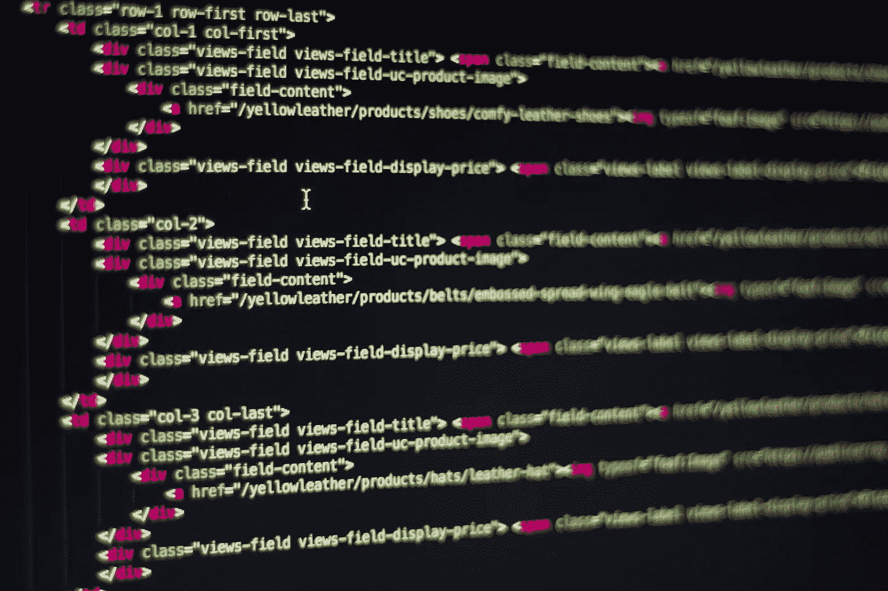

# 什么是 Web 3.0？

> 原文：<https://medium.com/geekculture/what-is-web-3-0-716f0f2272b9?source=collection_archive---------1----------------------->

如果你关注商业或金融新闻，或者更关注科技新闻，或者在科技 Twitter 上闲逛，几乎不可能不听说 Web 3.0。

但是“Web 3.0”到底是什么意思呢？

我们先来分解一下 Web 1.0、Web 2.0 和 Web 3.0 的历史和区别: