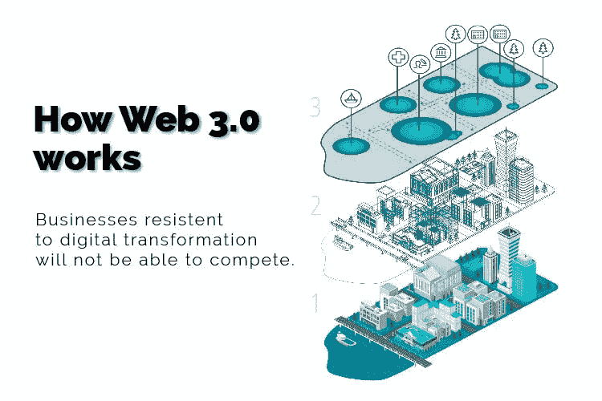

# 什么是 Web 3.0，它将如何影响您的业务？

> 原文：<https://medium.com/geekculture/what-is-web-3-0-and-how-it-will-impact-your-business-b6c3b0263629?source=collection_archive---------20----------------------->

image provided by Deloitte Analysis

如果你像大多数阅读这篇文章的人一样，你只使用了三分之一的互联网。我们很多人一生都在互联网上浏览不同形式的数字通讯。电子邮件、社交媒体平台、内容创作，以及视频、文字、音频或图片形式的消费。