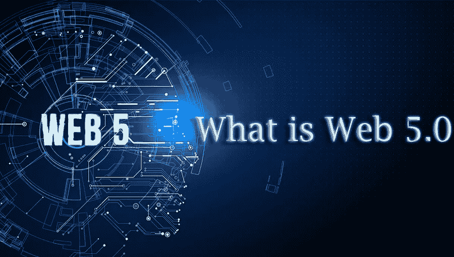
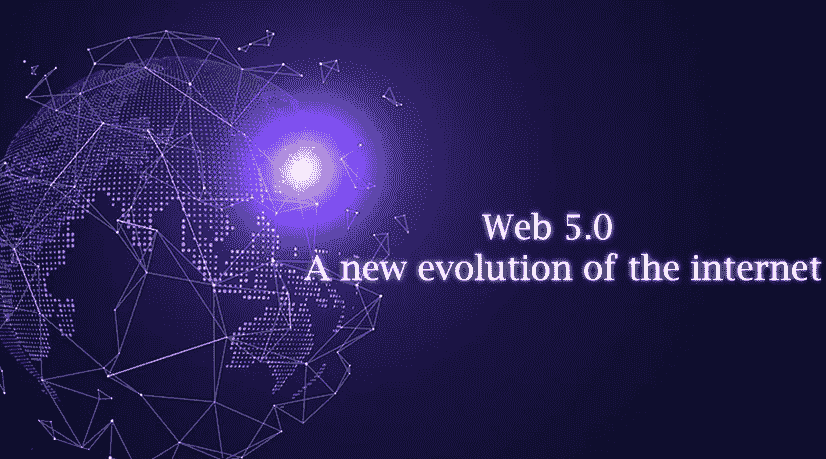
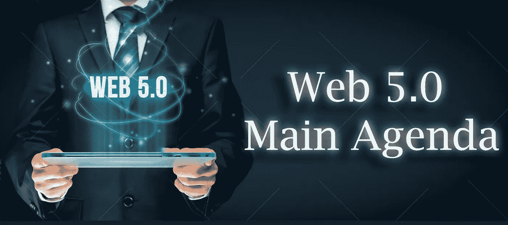
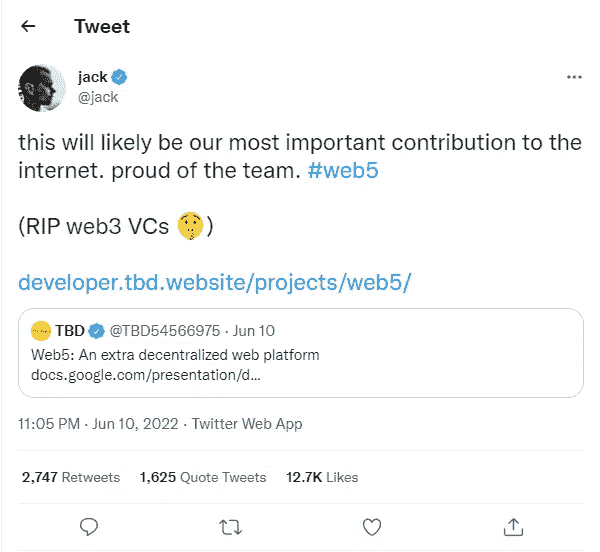

# Web 5.0 的未来？

> 原文：<https://medium.com/geekculture/what-is-web-5-0-f67cb71d07b6?source=collection_archive---------3----------------------->

## Web 5.0 是否会战胜或扼杀现有的 Web 3.0？

**What is Web 5.0**

嘿伙计们！在长时间的会议后，我很高兴见到大家，有点忙于我的日常工作。今天我要写一篇关于热门话题“除了 Web 5.0 什么都不是”的短文。

最近，Twitter 的前首席执行官杰克·多西在 Twitter 上发布了关于 Web 5.0 这个新术语的消息，他称之为 Web 3 技术的杀手。

> 一旦新技术碾过你，如果你不是压路机的一部分，你就是道路的一部分。— **斯图尔特·布兰德**

真的什么是 Web 5.0？你们都猜对了，这是互联网的又一次升级。

**Web 5.0——互联网的新发展:**

Web 5.0 是 Web2.0 和 Web 3.0 融合而成的新兴平台。它完全建立在比特币区块链账本上。web 5.0 平台的主要意义在于存储和维护安全的个人数据。在这个技术世界里，每家公司都在努力保护其客户的数据免受网络黑客的攻击。想象一下，有时我们可能很难记住我们自己的 Instagram 凭证，那么一个平台将如何努力提醒我们所有数百个密码。在当前的 web 策略中，身份和个人数据被归类到第三方属性下。

**Web 5.0 — A new evolution of the internet**

无可挑剔的 Web5 由多尔西广场区块的比特币业务部门之一 Block Head (TBH)提供支持。该平台完全基于去中心化运行，其去中心化身份将所有个性化数据存储到其应用程序中。它使软件开发人员能够专注于开发有吸引力的用户界面和体验，同时为相应的个人提供数据和身份的适当所有权。

**Web 5.0 如何比现有的 Web 3.0 更加去中心化？**

众所周知，术语“去中心化”是 web 3 平台的关键口号，但最近许多 Web 3 爱好者在他们的论文中提到了单点故障系统，他们在整合以太坊、索拉诺的去中心化区块链账本时遇到了问题，它最终会影响所有者的真正所有权。因此，真正的所有者无法控制或修改他们在 web 3 生态系统中的私人数据。

> Web 3 并没有真正“去中心化”或被用户所拥有，而是被各种风险投资家和有限合伙人所拥有——前 Twitter 首席执行官杰克·多西

**Web 5.0—主要议程**

Web 5.0 平台的主要格言是为其客户提供两种核心用途。用户将具有修改其数据的完全访问控制，并且其数据的完全所有权属于特定的个人。这些分散的用例将被内置钱包认可，内置钱包具有集成的 DWNS 分散网络节点和 DWAS 分散网络应用。

如前所述，Web5 的核心议程是分散所有权。每个人都应该有能力拥有自己特定的私人数据。

**Web 5.0 — Agenda**

例如，Stella 使用一个数字钱包来安全地管理她的私人数据，如她的身份以及外部应用程序和其他个人连接的许可。她可能会用钱包登录任何社交媒体平台。由于这种数据同步，斯特拉的个性化数据面临着巨大的风险，它可以被黑暗世界中的任何黑客窃取。但是用无懈可击的 web 5 平台是做不到的。在 Web 5.0 技术的帮助下，Stella 通过其分散身份与应用程序的连接将验证他的所有权，她不需要创建新的个人资料，她朋友的所有连接、个人关系和她通过应用程序发布的帖子都存储在她的分散 Web 节点中。

> RIP web3 风投— **前 Twitter CEO 杰克·多西的推文**

**杰克·多西关于 Web 5.0 的解释:**

这场风暴新闻背后的主要原因是杰克·多西的推文。许多网络爱好者向前 Twitter 首席执行官多尔西提出了各种问题，多尔西在他自己位于广场街区的业务部门 TBD 的演示中回答了这些问题。这个演示听起来非常像万维网联盟 W3C 一段时间以来一直致力于推动这一新兴网络发展的标准方法。他们的论点有点类似于 Avast (Evernym)团队的哲学解释:分散标识符的两个支柱(也称为 DID)是用户控制的、基本上保护隐私的、自主的数字身份解决方案的要求。

**Jack Dorsey’s Tweet**

**Web 5.0 与众不同:**

Web 5.0 的独特性依赖于其个性化的所有权特征。其中一个新颖之处是，Web 5.0 平台确保了个人身份的可移植性。在关于数字身份的各种见解中，最受关注的是身份所有权的重新融合。这将最终增加用户的便利性，因此更新后的平台需要使用许多有吸引力的实用程序来保存默认钱包和其他钱包中的每个特定数字身份。它们主要帮助每个人获得所有权，以便随时访问他们的个性化数据。

> 对于任何新技术，总会有争议，总会有一些恐惧与之相关。我想这就是有时候第一的代价。— **休·格兰特**

web 5.0 给予用户拥有隐私的充分权利，这是 Web 5.0 从竞争对手中脱颖而出的主要原因，这增加了人们对 Web 5.0 在数字领域的期望！让我们拭目以待，见证互联网的进化！