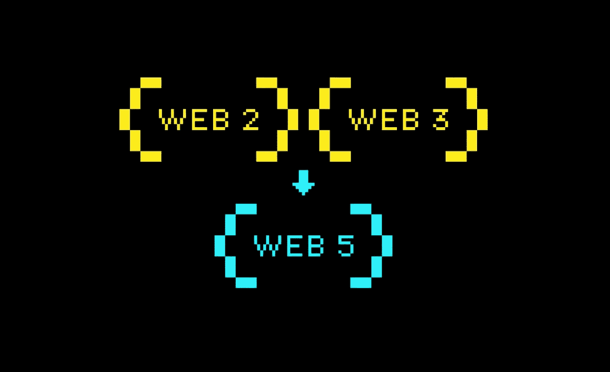

# 杰克·多西的最新想法是什么？

> 原文：<https://medium.com/geekculture/what-is-web5-jack-dorseys-latest-idea-d40d3a2e4973?source=collection_archive---------0----------------------->

## 我看了一遍企业家的陈述，这样你就不用看了

我几乎不认识叶。杰克·多西的新公司 [TBD](https://developer.tbd.website/projects/web5/) ，最近宣布了其创建“web5”的意图。它将其解释为“*一种支持去中心化应用和协议的网络新进化*