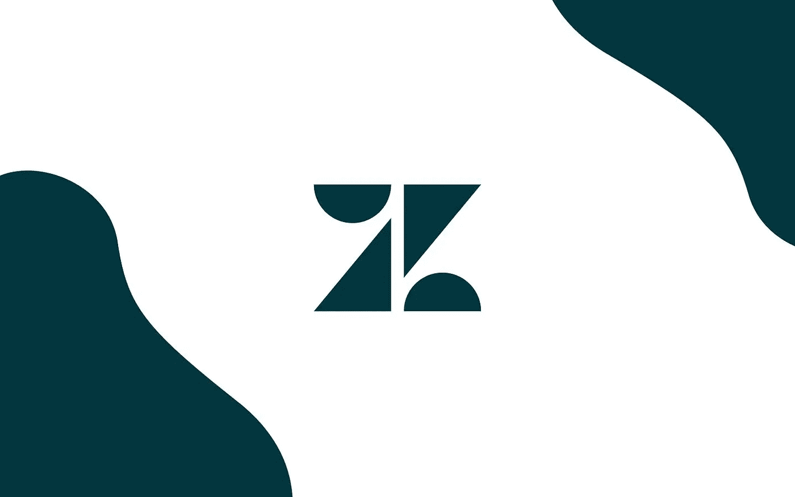

# Zendesk 是什么？了解客户支持自动化

> 原文：<https://medium.com/geekculture/what-is-zendesk-learn-about-customer-support-automation-4a014a829818?source=collection_archive---------24----------------------->

# 什么是 Zendesk 软件？

Zendesk 是一个受欢迎的客户服务平台。其基于云的软件是各种规模的企业为其客户提供卓越支持的绝佳解决方案。通过创建自动化的支持体验，Zendesk 允许企业专注于他们的客户和产品，而不是单调的管理工作。

这是一个强大的客户服务解决方案，适用于各种规模的组织。它最令人印象深刻的特性之一是它提供的帮助台工具。该平台旨在让帮助客户变得更有回报和个性化，鼓励公司在与客户的互动中变得更主动，并采用自助服务方法。

作为一种一体化的客户服务解决方案，Zendesk 非常适合任何企业，无论是中小型企业、零售商、人力资源团队、企业、教育机构还是 it 团队。

# Zendesk 产品

Zendesk 提供 9 种不同的产品，Zendesk Support、Zendesk Support Suite、Zendesk Chat、Zendesk Explore、Zendesk Guide、Zendesk Talk、Zendesk Sell、Zendesk Gather 和 Zendesk Sales Suite。

每个产品都有自己的价格选项，以及门票管理功能。

# Zendesk 功能

Zendesk 的核心是一个快速、直观的客户支持平台，作为管理客户和代理的中心枢纽。它提供了一系列功能，允许企业解决问题，降低客户服务成本，并提高客户满意度。

下面是 Zendesk 提供的三个主要工具，让你的生活变得更轻松:

**服务台:**

Zendesk 是一个功能齐全的票务系统。一些人甚至称它为“帮助台工具的教父”,因为它有大量的功能。

1.  将通过电话、聊天、电子邮件和社交媒体收到的请求转换为票证。
2.  将断开的渠道中的所有票证整合到一个位置。
3.  管理和回复客户服务单。
4.  制作您的个人票证视图。
5.  支持条件和自定义票证字段。
6.  查看活动日志以及负责该日志的代理的姓名。
7.  支持报告和仪表板。

**实时聊天:**

Zendesk 使你能够将实时聊天整合到你的网站中，并与消费者实时交谈。

1.  使用实时聊天引导消费者完成结账过程。
2.  聊天前表格可用于收集联系信息。
3.  聊天机器人可以帮助你自动化简单的活动。
4.  支持创建性能仪表板。

**知识库:**

像许多其他帮助台解决方案一样，Zendesk 包括用于创建自助服务支持系统的工具，例如 FAQ 和社区论坛。

1.  文章可以写，可以组织，可以分享。
2.  支持预制模板。
3.  有 40 多种语言可供选择。

# Zendesk 集成

1.  **Typeform:** 根据新的 Typeform 条目创建 Zendesk 票证。
2.  **Asana:** 添加新的 Zendesk 门票到 Asana 作为任务。
3.  **Google Form** :根据新的 Google Form 响应创建 Zendesk 票证。
4.  **Slack** :为新的 Zendesk 门票发送 Slack 通知。
5.  Wrike :从 Zendesk 票证创建新的 Wrike 任务。
6.  Trello :用新的 Zendesk 门票制作 Trello 卡。

# Zendesk 评论

总之，Zendesk 是一个多方面的客户服务平台。从简单的票证跟踪模块到复杂的预配置自动化规则，该服务台系统可以节省时间和资金，同时确保更高的客户满意度。

**要了解更多关于在 Quickwork 上集成 Zendesk 的信息，请点击** [**此处**](https://quickwork.co/apps/zendesk/integrations)