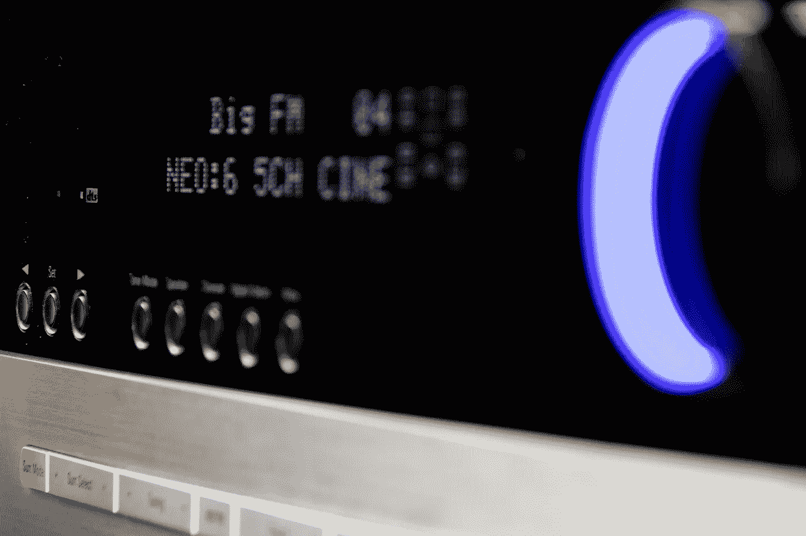

# Hifi 里新的不一定更好

> 原文：<https://medium.com/geekculture/what-it-feels-like-to-upgrade-to-the-denon-avr-x3600h-from-onkyo-tx-nr656-686-70fa8cf2a38a?source=collection_archive---------5----------------------->

因此，我从 2005 年开始使用安桥接收器，当时我以 699 美元(而不是 899 美元的实际价格)或类似的价格获得了第一台翻新的接收器。这个接收器持续到大约两年前，那时我的试听室有一个 TX-NR656，家里的主家庭影院有一个 TX-NR686，两个都是 7.2 声道接收器。