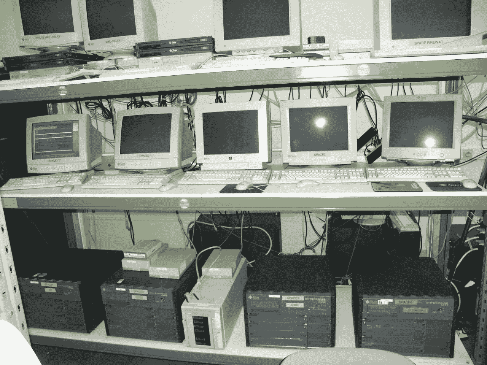

# 在联发科公司工作需要什么

> 原文：<https://medium.com/geekculture/what-it-takes-to-work-at-a-mediatech-company-9b06715619ac?source=collection_archive---------12----------------------->

## 来自 DPG 媒体技术公司的 6 个不那么秘密的秘密

申请工作时，知道自己将会面临什么总是好的。但要想很好地了解在一家公司工作的真实感受，可能是一个挑战。那么，今天是你的幸运日:我们的六位同事将让你知道一些来自 DPG 媒体技术公司的秘密。

Photo by [Christian Velitchkov](https://unsplash.com/@cvelitchkov?utm_source=medium&utm_medium=referral) on [Unsplash](https://unsplash.com?utm_source=medium&utm_medium=referral)

# 伪装的科技公司

曾几何时，DPG 传媒“只是”一家媒体公司。我们制作杂志，出版报纸，播放电视节目。这很简单；生活是可以理解的，生活是美好的。

然后，生活被打乱了。互联网和信息技术彻底改变了媒体行业——变得更好。在世纪之交，我们的网站 Autozone.be 每天有大约 5000 名访客。这在当时是一个令人震惊的数字，但由于 2001 年 12 月的媒体宣传，这个数字变得更高了。我们的游客数量增加了一倍！

该网站使用 Oracle WebDB 构建，只有一台服务器。这里展示了整个基础设施。这在今天几乎是不可理解的，因为我们现在通过我们的品牌服务于 90%的荷兰人口和 80%的佛兰德人。

随着技术、客户服务和客户需求的不断发展，DPG 媒体正在积极探索并为数字空间做出贡献。技术是我们为消费者、广告商和同事所做一切的核心。

一步一步，一点一点，我们正在成为一家联发科公司。例如，想想 Streamz、VTM Go 和 Volkskrant 杂志。为了在快速变化的环境中取得成功，我们需要[的技术人才](https://www.dpgmedia.nl/werkenbij/blog)来实现这一切。

“那么，”你可能会问，“这对我意味着什么？”。

好问题！

我们想让你知道，在 DPG 媒体工作需要一套特定的技能和心态。所以在申请技术工作之前——这是我们非常希望你做的！—听取我们同事的一些建议。

# 1.捋起袖子

> *“我们有一个非常务实的工作环境，为那些想卷起袖子大干一场的人提供了许多机会。这一直是这家公司的精神和动力。”*
> [rem melt Beckers——敏捷投资组合经理](https://www.dpgmedia.nl/werkenbij/blog/agile-portfolio-manager-remmelt-beckers)

我们是一群务实的人，一起完成数字化转型。我们不会坐等事情发生。如果一个想法是好的，就不需要没完没了的幻灯片和提案。去工作吧。最好是一起，因为我们作为一个团队更强大。我们努力工作——不是因为我们必须这样做，而是因为我们对我们所做的事情充满热情。

# 2.敢于直言

> “你必须让它发生——有点自信；没有人会牵着你的手帮你做。”
> [西尔维·范·纽伯格——产品负责人](https://www.dpgmedia.nl/werkenbij/blog/product-owner-sylvie-van-nieuwerburgh)

DPG 媒体是一家大公司。我们拥有 6000 多名员工，通过我们的品牌覆盖了 90%的荷兰人口和 80%的佛兰德人。由于我们的规模，有无限的发展机会——专业的和个人的——以及合作。但这取决于你自己。所以，在你的日常生活中大声说出来，在博客上写下你的学习，向同事寻求建议，给出你的观点。我们都是这样成长的。

# 3.自由运作

> *“我喜欢 DPG 媒体对创业方式的重视。我有一个愿景，DPG 媒体给了我一张免费通行证，让我完全按照我的要求设置数据区。”*
> [Wannes Rosiers —区域经理数据](https://www.dpgmedia.nl/werkenbij/blog/area-manager-data-wannes-rosiers)

DPG 媒体工作场所给你很大的空间，让你完全按照自己的意愿来组织工作。你可以依靠领导团队通过愿景和业务优先级来提供方向，但不会有一套工作说明或操作指南等着你。我们灵活的工作方式允许您自由操作、开发解决方案和进行试验。

# 4.掌控所有权

> *“你可以做决策，找到解决方案；没有人盯着你或命令你该做什么。有真正的信任。但当然，你必须能够应对伴随自由而来的责任。”*
> [Petra van Veen—Scrum Master](https://www.dpgmedia.nl/werkenbij/blog/scrum-master-petra-van-veen)

老生常谈但却是事实:自由伴随着责任。技术团队自始至终负责他们的解决方案和基础设施:您构建它，您运行它。我们相信您会做出正确的决定，并对您所做和创造的一切拥有所有权。所有权、责任和问责不会随着你的限制而结束，也不会随着你的团队的限制而结束。我们都解决问题，不仅仅是我们自己的问题。主动改进、尝试、帮助和分享是交易的一部分。

# 5.塑造你的职业生涯

> 开发人员可以成为架构师，但也可以选择成长为 Scrum 大师。虽然我们确实想写一些职业道路来获得灵感，但没有固定的职业道路。有时候，你会被要求尝试一个新的角色。但最后还是要看你的急切程度。”
> 英格·弗米尔施——敏捷教练

当家作主不仅仅适用于你的日常工作；这也关系到你的事业。你走的是哪条路？DPG 传媒提供了大量的发展机会，但能否抓住这些机会取决于你。想获得认证吗？没问题，随便问。想参与一个项目吗？自愿帮忙。你是司机，所以确保你知道你要去哪里——不要害怕问路。

# 6.接受变化

> “我喜欢总是有新的挑战出现。在这里不太可能感到无聊。”
> [马丁·维特曼——广告区域经理](https://www.dpgmedia.nl/werkenbij/blog/area-manager-maarten-witteman)

DPG 传媒是一家充满活力的公司，变化是必然的。有时候是组织结构的变化，有时候，你会换团队，有时候意味着采用新技术。我们喜欢采取新的举措，如果它们不起作用，我们不怕把它们扔掉。所以，准备好改变，拥抱它。这可能意味着你需要学习一项新技能或者寻找不同的合作方式。这需要灵活性、积极的思维和企业家精神。

*声音好听吗？那么我们很乐意为您申请我们的* [*职位*](https://vacatures.dpgmedia.nl/) *！*

*原发布于*[*https://www . DPG media . nl*](https://www.dpgmedia.nl/werkenbij/blog/work-mediatech-company)*。*