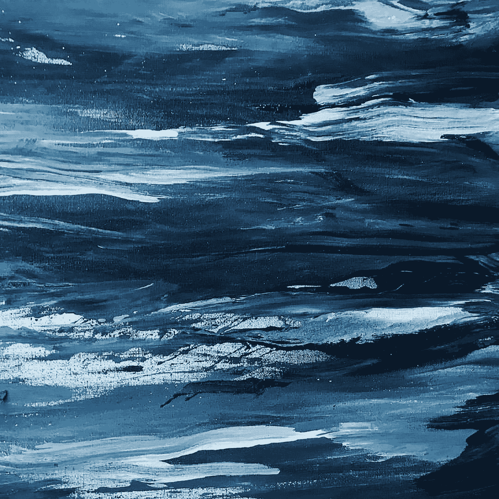
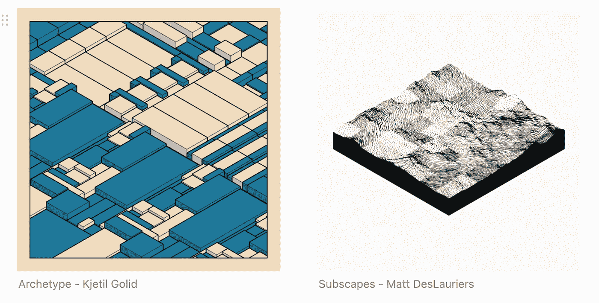
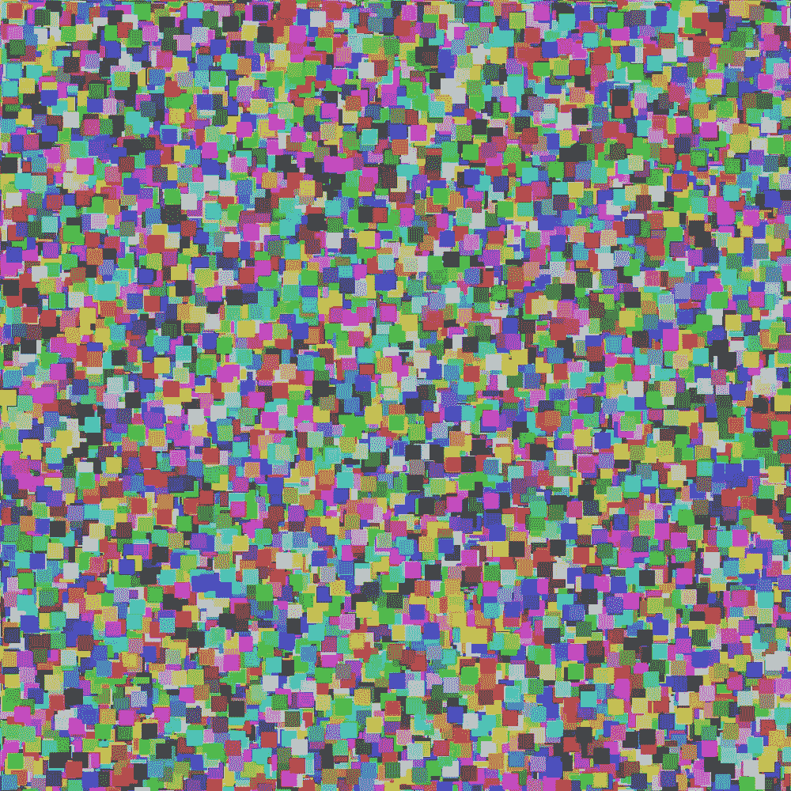
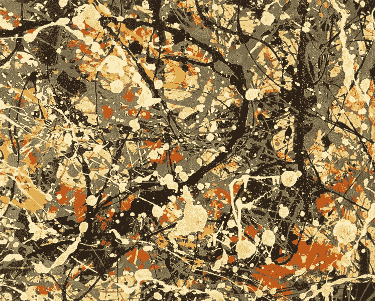
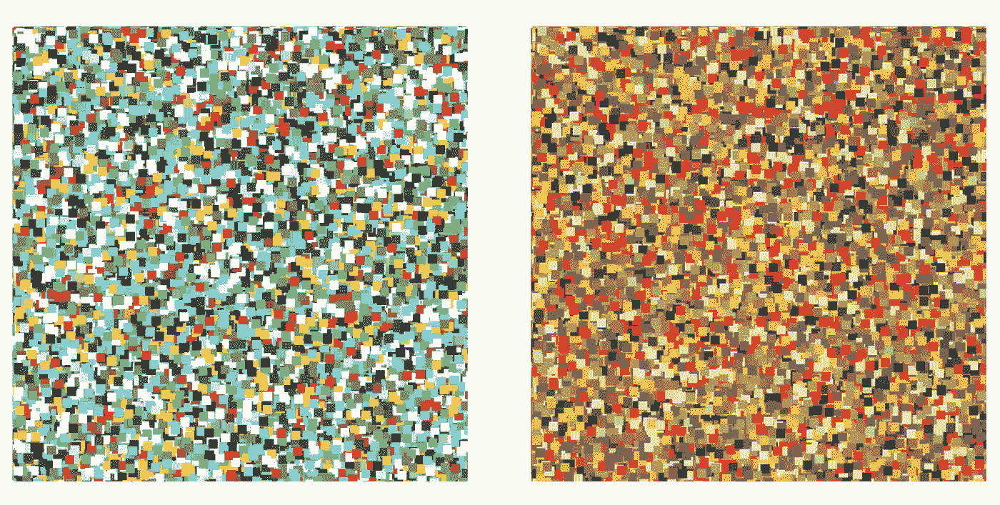
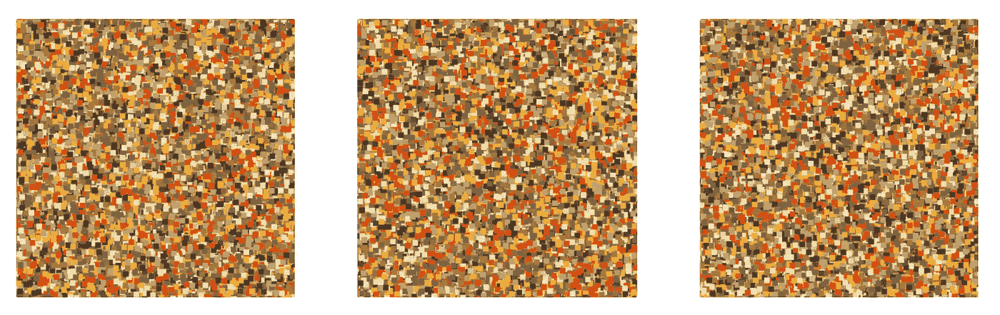
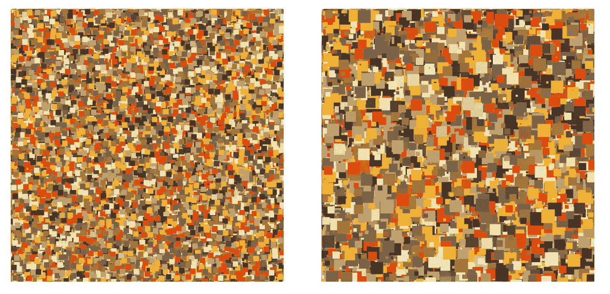
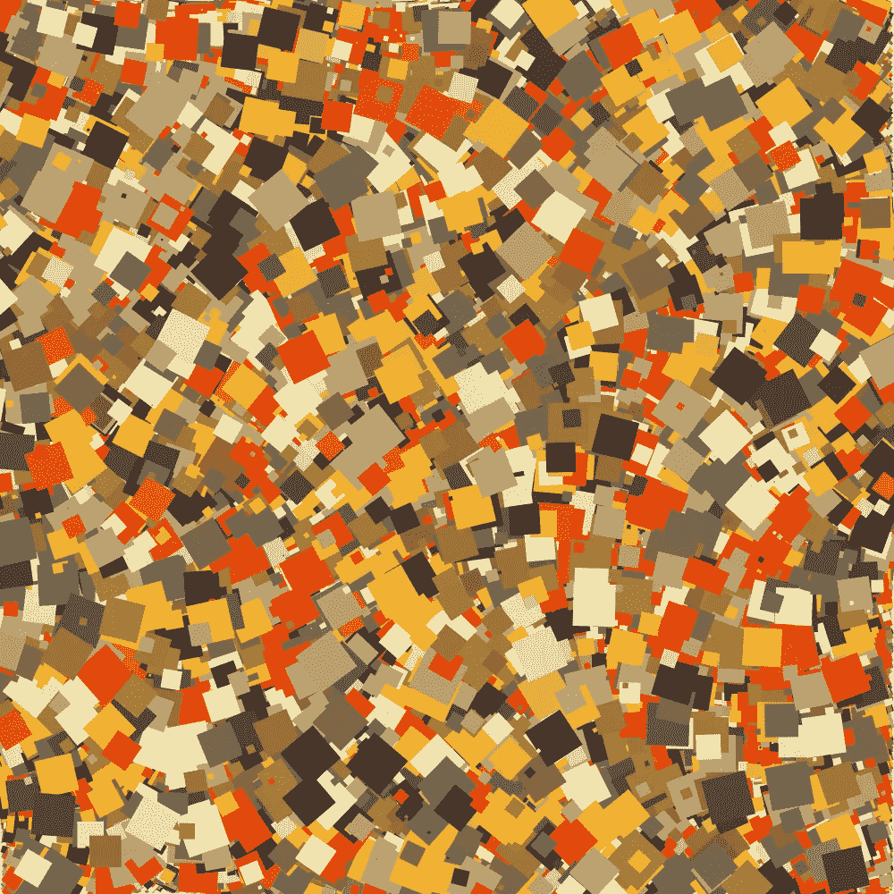
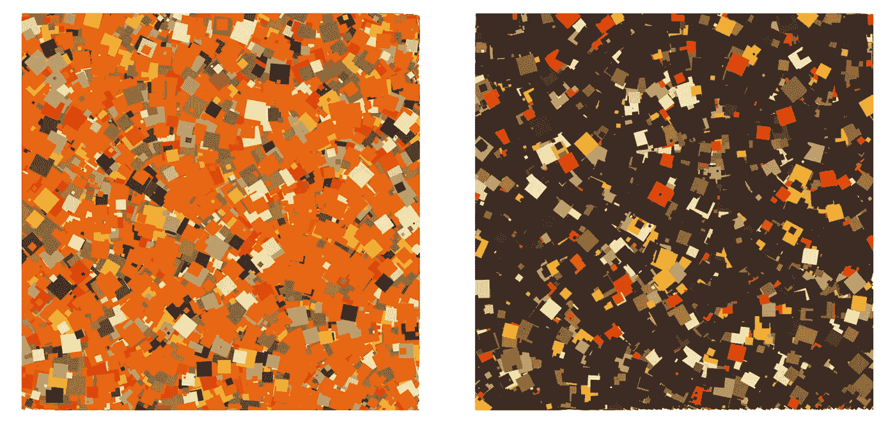
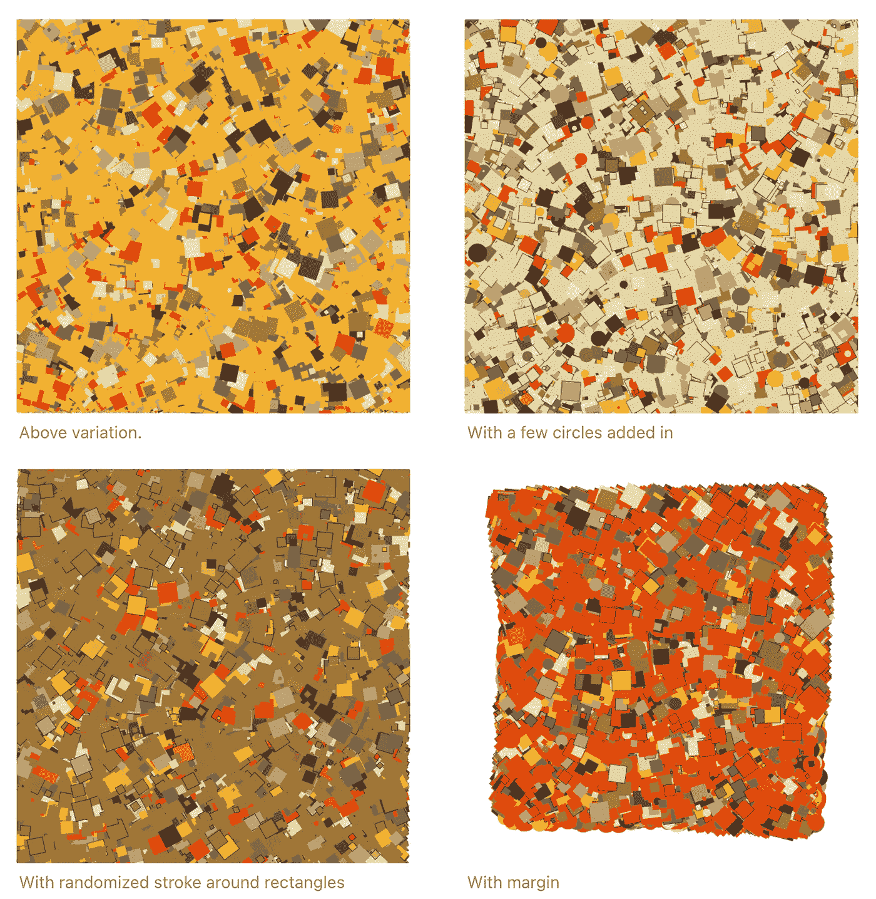

# 什么是好的生殖代理？

> 原文：<https://medium.com/geekculture/what-makes-a-good-generative-agent-a7d36e5543ab?source=collection_archive---------56----------------------->



Photo by [Henrik Dønnestad](https://unsplash.com/@spaceboy?utm_source=medium&utm_medium=referral) on [Unsplash](https://unsplash.com?utm_source=medium&utm_medium=referral)

> 艺术家的眼里总是有大师拉尔夫·瓦尔多·爱默生

这是一个值得考虑的有趣问题，我的目标是在我们考虑如何成为一名优秀的特工时，收集一些思考的金块。

# 美女？

据说“情人眼里出西施”，这话很有道理。然而问题是，是什么让事物变得美丽？

*   是当一件作品引起的共鸣超过了当下的社会吗？
*   当它被卖出几次后
*   当它在卢浮宫着陆时

可能以上都有，但这些问题中的许多都在西方思想的语境中。美学或美的公理可能存在吗？我要问的另一个问题是，什么是“好”的艺术？好的艺术是漂亮的还是美的？

在生成系统中，有两种主要方式可以让大多数作品变得生动:

*   离散数学
*   基于网格的系统、布尔代数等。
*   复制自然现象
*   成群结队、蜂拥而至、柏林噪音等

有趣的是，这两者都是在模仿自然现象，也许我们周围的自然世界在数字作品中被重新加工，最终成为我们对“好艺术”的定义。



来自 artblocks . io[Kjetil Golid](https://www.instagram.com/kgolid/)/[马特·德斯劳里斯](https://www.instagram.com/mattdesl_art/)

归根结底，我认为很难定义艺术的好坏。根据评论家 A 的观点，你可能喜欢“糟糕的艺术”,但是评论家 b 却喜欢它。所以，要给美下定义是不可能的。

# 灵活性

当你创建一个生成代理时，你必须给代码一个自己的思想。它必须决定它应该画的形状、位置、颜色、厚度和频率等等。这些都将为一件作品带来生命，但没有参数或其输出的“物理学”，它只是创造了一个原始的随机汤。



这是一个很好的起点，但它并没有创造多少。你的大脑可能正在寻找某种模式。既然伪随机算法已经产生了这个，那么可能有一种模式量子计算机能够识别，或者可能有一种迭代，在进化过程中蒙娜丽莎会突然出现。然而，如果我们等待进化，我们将会看到一个漫长的等待，等待它的出现。

# 微妙的模式

正如我提到的“系统的物理学”，我认为物理学是可能性的参数。例如，重力对地球有吸引力；然而，它并没有带领我们穿越这个星球，因此对于什么是可能的，有一个明确的参数。同样，我们给一个系统的参数可以帮助产生一些东西，这些东西不是机械的，而是有流动性的。

举个例子，这个波洛克。虽然有很多随机性在起作用，但还是有一些事情需要注意，我们可以称之为他的作品的模式:

*   颜色(这将是我的下一个重点)
*   分配
*   滴水模式

波洛克选择利用颜料的粘性，轻轻地将颜色覆盖在画布上。他可以用刷子或水桶和绳子来制作这些东西。他也不只是把颜料滴到画布上；相反，他使用淡黄色的背景，然后将颜色层层叠加。每种颜色都有它的位置；红色似乎只在某些区域出现以示强调。

虽然你可能会觉得这太随意了，不符合你的喜好，但它确实有一个微妙的模式需要研究。如果没有仔细考虑，我们可以回顾一下在创建第 8 个选项时所做的选择。



# 颜色

颜色的选择对于图像的情绪和特征至关重要。即使是几个颜色的照片中的随机像素也可以创建赏心悦目的图像。下面，我有一些我在工作中用过的颜色(左)..它在混合的调色板中有一点激发能量。



让我们看看波洛克的形象；我们将提取图像的主色。我将通过拔出我的叫做 [Mathematica](https://reference.wolfram.com/language/guide/ColorProcessing.html) 的瑞士军刀来做一点欺骗。它是数学中的一种符号表示语言，有许多优秀的功能，可以做很多事情。

```
DominantColors[img, 7] // Add "HexRGBColor" to get hex colors
```


Wolfram 语言代码提供了最主要的颜色；你可以看到，我们使用了相同的随机方格方法和调色板，但是产生了非常不同的能量。它是非常深情和诱人的黄色暖色调(右图)。但是，相同大小的形状可以是系统的。

# 变化

当您的代码输出生成相同的图像时，它几乎没有生成性。例如，如果颜色是唯一变化的东西，那就可能有尽头。



这些图像中的每一个都是不同的，但是，它们不会提供令人难以置信的不同。那么，当我们开始改变正在生成的方块的尺寸时，会发生什么呢？



区别很大。只是增加了一个额外的随机性参数，可以帮助为系统提供更多的美感。

# 复杂中的简单

简单的美可以被烘焙成更复杂的作品。



我们做了一些相对简单的事情；我们根据柏林噪声算法(给出一个数值域)将方块旋转了一点，为图片提供了更多的变化。同样是简单的旋转，但是旋转背后的复杂性对于照片的观看者来说是隐藏的。因此，柏林噪声产生的模式很有趣。当我们开始添加不同数量的颜色时，我们继续创建各种图像，如下所示。



正如您所看到的，至少可以说，您可以快速地将许多有趣的小元素引入系统，以生成令人兴奋的模式。这些都只是基本的元素，可以根据你的使用创意，移动到几个令人兴奋的空间。我想到的几件事是:

*   给每种颜色加权
*   创建边距，将随机性限制在空间内。
*   局限在一个圈子里
*   圆形包装
*   其他形状
*   中风等。



# 有什么故事？

最后一个要素(虽然还有很多)是故事。我认为，关于场景背后的背景或“为什么”有很多可以说的。它不需要是一个精心制作的故事，但是是什么让一个人把另一件艺术品放在一起。

*   创造或发现的纯粹动力
*   追求卓越——创造不同于以前或比以前更好的东西
*   来自其他艺术品的灵感
*   受经历或情感驱使——分手或灾难
*   抗议作品(又名达达运动)

故事驱动我们产生共鸣和联系的能力，即使故事只是激情的产物。作为人类，我们可以理解为什么有人充满激情。我们赞美像毕加索这样的人，因为他是新媒体的锻造者和探索者。甚至当我想到十年来每天都在创造新内容的热情。有一种想为他加油的感觉。

# 好特工？

当我通过这样的作品思考时，我知道它给了我磨练创造技能的能力，并把一个生殖代理的机制与创造力结合起来。我不认为一个成功的公式是关于如何成为一个伟大的代理人。这一切都是为了创造你的故事，让它过自己的生活。

有时候会造成很大的水花，有时候艺术不会被听到。珍惜过程和释放创造力总是比被倾听或推销 NFT，或被认可更重要。