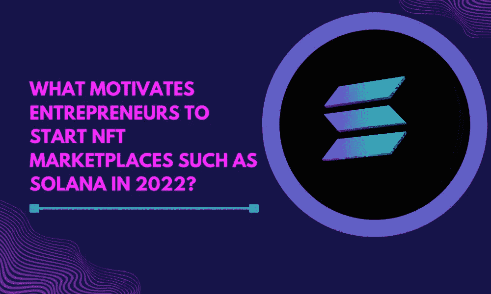

# 索拉纳 NFT 市场——是什么促使企业家在 2022 年创建像索拉纳这样的 NFT 市场？

> 原文：<https://medium.com/geekculture/what-motivates-entrepreneurs-to-start-nft-marketplaces-such-as-solana-in-2022-499223e3840f?source=collection_archive---------13----------------------->

What Motivates Entrepreneurs to Start NFT Marketplaces such as Solana in 2022?

在现代，每个人都在进入区块链的 NFT 市场业务，因为未来有巨大的空间。NFT 在 NFT 市场的买卖中扮演着重要的角色。NFT 市场的高影响力吸引了名人进入这一数字化市场业务。

许多企业家和商人不断注意到近来日益繁荣的 NFT 市场发展公司的有效增长。

如果你是在 NFT 市场创业的企业家之一。有许多受欢迎的 NFT 市场开发公司，与基于以太坊的 NFT 市场相比，位于索拉纳的 NFT 市场开发公司据说是非常值得推荐的，对于初创公司来说，这是一个更好的选择，他们可以在索拉纳上轻松开发 NFT 市场。

索拉纳:

Solana 是一个成立于 2017 年的区块链平台，它可以为 NFT 市场提供分散、安全的功能、高交易速度和可扩展的应用程序。SOL 是 sola native 和 utility token，它为赌注和转移价值提供了高度安全的区块链。

**总部位于索拉纳的 NFT 市场发展公司是什么？**

索拉纳为基础的 NFT 市场开发公司可以很容易地访问，数字艺术家和创作者不需要了解智能合同的工作。如今，由于以太坊区块链的大量使用，基于以太坊的 NFT 市场受到数字创作者的普遍使用，这降低了速度，并且燃气费的交易已经上升。基于以太坊的 NFT 市场中出现的问题在基于索拉纳的 NFT 市场开发平台中得以消除。

**NFT 一些受欢迎的索拉纳市场:**

**1。魔法伊甸园:**

Magic Eden 是 NFT 最受欢迎的 Solana 市场之一，在这里你可以创建、购买和出售 NFT。在这个平台上，没有铸造费，但他们收取 2%的交易费。它支持几乎所有的 Solana 钱包，目前只接受有限数量的项目。

**2。索拉纳特:**

索拉纳是一个成熟的索拉纳为基础的 NFT 市场建立在索拉纳区块链。Solanart 为创作者和艺术家提供买卖他们基于 Solana 的 NFT 的服务。在 solart NFT 市场，用户只能使用 SOL 购买 NFT，并接受这些货币不被接受。

**3。数字眼睛:**

DigitalEyes 是第一个开放的索拉纳 NFT 市场，在这里任何人都可以轻松地创建自己的 NFT。在这个 NFT 市场中，NFT 由一个专家团队进行验证和确认，并删除不需要的 NFT。

**4。索尔西:**

Solsea 在 Solana 网络上运行，允许用户轻松地创建他们的 NFT，并在创建 NFT 时嵌入许可证。这些东西有助于创作者和收藏者了解自己在买卖什么。

**5。元丛:**

MetaPlex 是一个基于 Solana 的开源 NFT 市场。在这个 NFT 市场中，用户不依赖任何第三方来销售他们的 NFT。

位于索拉纳的 NFT 市场的特色:

**1。互操作性:**

NFT 市场能够在不同的虚拟平台上发起交易，以发起数据安全存储和顺利交易的方式。

**2。稀缺性:**

在这个平台中，开发人员以良好的方式编写智能合同，NFT 的有限产量使他们更有价值。

**3。可组合性:**

基于 Solana 的 NFT 市场为用户提供投标、交易和与 NFTs 集成的功能，允许用户高度控制和组合。

**4。流动性:**

在这个 NFT 市场中，即时交易为用户提供了高流动性，而非期货交易也保持着平行的高流动性。

**5。低交易费:**

在这个区块链网络中，由于网络拥塞程度低，交易成本非常低。

**6。可扩展性:**

这种区块链是高度可伸缩的，因为大量的事务同时发生。

**索拉纳 NFT 市场的优势:**

1.  高度安全且可扩展
2.  完全分散
3.  高速交易
4.  没有中间人
5.  低成本
6.  靠跑马圈地赚钱。

**在 Solana 上创建 NFT 市场的最佳方式:**

我们可以通过两种方式在索拉纳建立 NFT 市场:

1.  从零开始建立一个以索拉纳为基础的 NFT 市场。
2.  索拉纳为基础的 NFT 市场克隆脚本。

**1。从零开始建立一个以索拉纳为基础的 NFT 市场:**

这是建立一个基于索拉纳的 NFT 市场平台的最佳方式之一。从头开始建立一个 NFT 市场需要大量的时间、金钱和资源。如果你擅长编码，那么你可以强烈进入建立自己的索拉纳 NFT 市场。在其他情况下，你必须选择专业的区块链开发商或 NFT 市场开发公司。

专家团队的区块链开发人员将建立一个高度安全的索拉纳为基础的 NFT 市场根据您的要求。它可能需要财政支持，并需要更多的时间来取得成果。

**2。索拉纳的 NFT 市场克隆脚本:**

基于[索拉纳 NFT 市场](https://www.alwin.io/blog/sorare-clone-script)有不同的克隆脚本功能，这有助于在短时间内根据您的额外需求启动您的业务。

现在正是创业的好时机，利用索拉纳·区块链网络来启动你自己的 NFT 市场。它提供了一个低交易气费和高速交易。然而，你对创建你的 NFT 市场有任何疑问吗？有很多解决方案提供商和 NFT 市场开发公司满足您的要求。