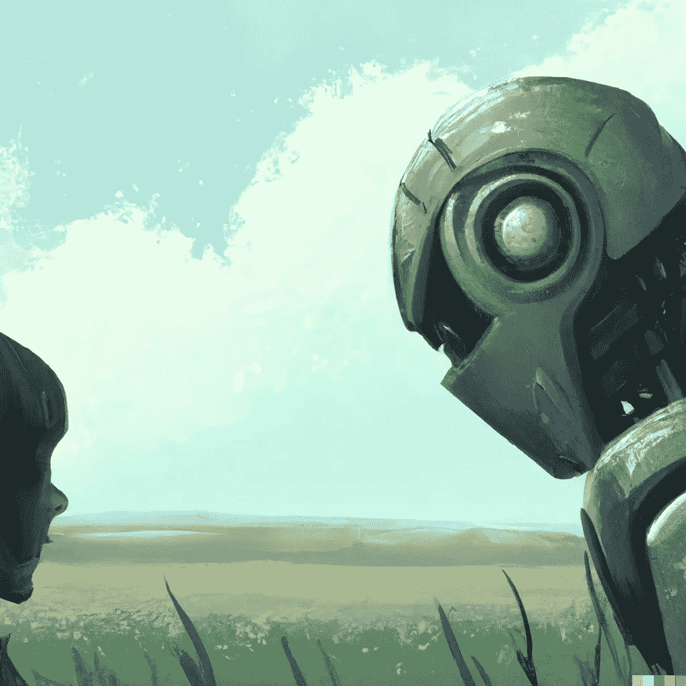
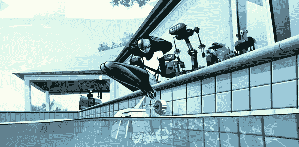
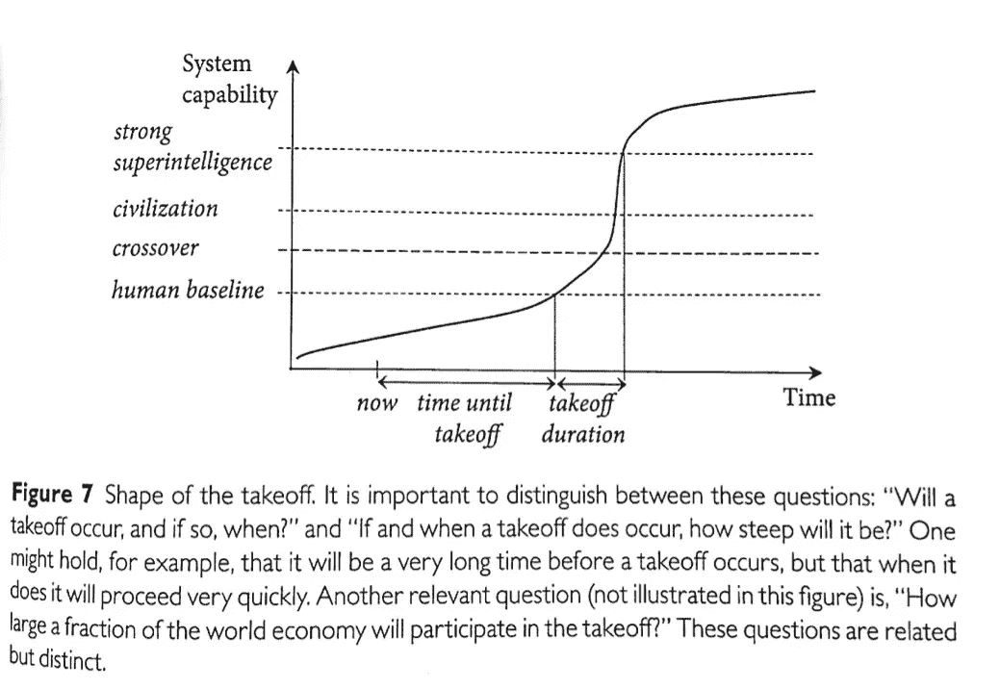
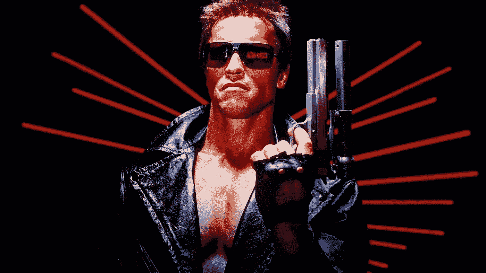

# 哪些关于人工智能的电影经常出错

> 原文：<https://medium.com/geekculture/what-movies-about-artificial-intelligence-routinely-get-wrong-e38527a59582?source=collection_archive---------6----------------------->

[A human and a robot looking sadly at each other from across a field](https://labs.openai.com/s/Q7PLNJDX9tQC9cRqC3pvNwQp), generated by DALL-E 2

## 你需要小心的不准确的(有时是危险的)比喻。

随着人工智能的影响持续增长，现代媒体对该技术的描述也越来越普遍。

不幸的是，大多数这些描述往好里说是不准确的，往坏里说是危险的。它们要么导致对人工智能能力的过度高估，要么对与人工智能开发相关的[风险产生一种虚假的安全感。](https://nicksaraev.com/artificial-intelligence-bomb/)

**别搞错了**:人工智能的发展速度令人难以置信。许多以前只能在科幻小说中获得的比喻和想法将很快成为现实。

但是，重要的是要把这些知识实际上打好基础。下面，我将讲述关于人工智能的电影经常出错的三种主要方式，以及一些关于人工智能如何工作的常见误解。

# 1.人工智能的时间线比大多数人想象的要短得多

机器逐渐变得智能的想法是早期科幻小说的延续，当时我们不理解技术的指数性质。

事实上，人工智能的发展始于涓涓细流，终于瀑布。我们已经过了涓涓细流的阶段。

在文献中，这被称为“硬起飞”。在人工智能达到足够的性能水平之后——比如说，达到与人类相当的水平——进步的斜率将会显著增加，因为它可以利用自己的知识来推动自身的增长。

通过变得更加聪明，自我提高的速度也会加快，从而形成一条陡峭的指数曲线。到那时，人工智能可能会开始在每月甚至每天的基础上取得重大进展。

我们已经很接近了。例如，在过去两年的过程中，我们从努力理解简单句子的人工智能发展到在大多数单词级任务中击败普通人。

> 人工智能现在也可以产生[可行的代码片段和小程序](https://openai.com/blog/openai-codex/)。在几年内，我们可能会开始将它应用到递归自我改进的任务中——比如，优化神经网络层，或者创建新的架构。

自然，硬着陆会导致糟糕的电影情节。对于好莱坞的观众来说，随着时间的推移，一台机器慢慢地获得知觉或能力，通常会在这个过程中结交朋友，这要可爱得多。

因此，编剧和导演，要么出于缺乏理解，要么出于最大化收视率的愿望，经常在很大程度上篡改这些时间表。

# 2.人工智能和人类可能不会一起工作

关于人工智能的电影的另一个常见错误是描绘未来人类与人工智能一起工作。想想西部世界或者终结者。

剧透:一个真正的超人人工智能不需要约翰/莎拉·寇娜的帮助。它很可能会把自己插入互联网，立即开始一系列核攻击，结束地球上绝大多数的生命。

对我们来说幸运的是，五秒钟的电影不如两小时的电影卖得好。(就我而言，我欢迎效率低下的机器人霸主)。

[正如我经常提到的](https://nicksaraev.com/the-socio-economic-impact/)，人工智能将在所有任务上超越人类几个数量级。在几十年内，市场将不可避免地导致人工智能在大多数工作中取代人类，即使即将到来的[严厉法规](https://en.wikipedia.org/wiki/Regulation_of_artificial_intelligence#:~:text=Perspectives-,The%20regulation%20of%20artificial%20intelligence%20is%20the%20development%20of%20public,AI%20and%20manage%20associated%20risks.)。

人类和人工智能携手工作，就像某种[共产主义乌托邦](https://modernfarmer.com/wp-content/uploads/2013/07/Communist-Ag-art-10.jpg)，可能是一个遥不可及的梦想。协作需要人工智能极大地限制它的性能，而且没有理由这样做。

希望人工智能成为主要的价值生产者将为人类带来一个富足的时代。我们将不再需要*来工作，因为很明显机器人做任何事情都要快一万倍。*

但随着我们的经济转型，这也有可能导致全球冲突和危险。只有时间能证明一切。

# 3.AI 不会有情绪

在关于人工智能的电影中，编剧和导演喜欢将人工智能描述为拥有情感。这是因为它使机器成为人类的延伸，这是通往戏剧和冲突的直线(良好娱乐的先决条件)。

为此，人工智能经常表现为快乐或悲伤，邪恶或恶意——想想查皮，或星际，甚至是黑客帝国。

然而，在现实中，先进的人工智能不太可能拥有情感，因为简单的事实是它们在经济上没有效率。

在更具认知能力的机器出现之前，人类进化出爱、恨和嫉妒等情感来帮助我们物种生存。

> 即使在我们的超级数字时代，人类仍然拥有情感也是有道理的，因为我们的大脑像洋葱一样构造:进化将更原始的“爬行动物”区域置于核心，更复杂的功能置于顶部。

除非我们故意降低效率，否则我们没有理由以类似的方式构建人工智能。超人人工智能不需要杏仁核的空间:更好的办法是让额叶皮层变得好一千倍。

顺便说一下，这并不意味着人工智能不能*显示*人类的情感。[文字模特已经很擅长让我们相信他们感受到快乐、悲伤和恐惧。但是这些是*模拟的反应*:人工智能肯定不会像人类一样被这些“感觉”驱动。](https://www.washingtonpost.com/technology/2022/06/11/google-ai-lamda-blake-lemoine/)

# 另一方面:关于人工智能的电影*做对了*

尽管大多数关于人工智能的电影和故事都很棒，但不要让你的知识被不完全理解它的导演或作者所束缚。

在这种情况下，这里有一些我认为让人工智能正确的科幻小说:

*   前玛奇纳(电影)，亚历克斯·嘉兰
*   [水晶社](https://www.amazon.ca/Crystal-Society-Max-Harms/dp/1530773717/ref=sr_1_1?crid=U63P806YWDWP&keywords=crystal+society&qid=1659032260&sprefix=crystal+societ%2Caps%2C126&sr=8-1)(图书系列)，由 Max Harms
*   [超越](https://en.wikipedia.org/wiki/Transcendence_(2014_film))(电影)，沃利·菲斯特。警告:批评家们讨厌这个，因为他们不理解它

# 结束语

简而言之，以下是关于人工智能的电影是如何出错的:

1.  在电影中，人工智能的能力往往是线性增长的。事实上，增长是指数级的。
2.  在电影中，人工智能和人类一起工作来实现共同的目标。在现实中，这将是极其低效的——人工智能可能会为我们做一切事情。
3.  在电影中，AI 经常发展情感。事实上，如果不是必须的话，我们为什么要给我们的机器统治者一个杏仁核呢？

未来几年，科幻和现实生活之间的界限将继续模糊。这个过渡期将带来新的、令人兴奋的小说，挑战我们的思维，迫使我们展望未来。

保持你的眼睛去皮为上述人工智能比喻和快乐观看！