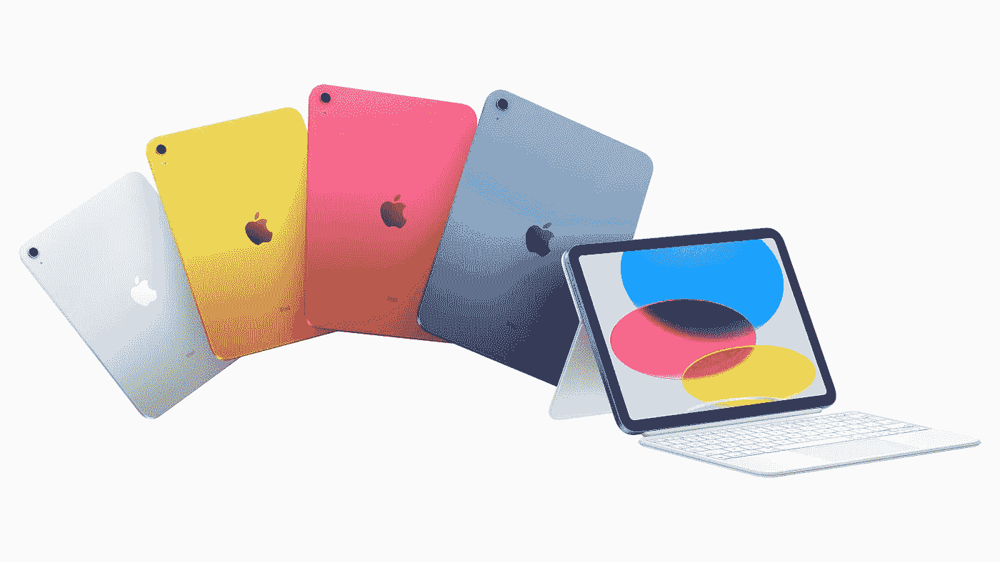
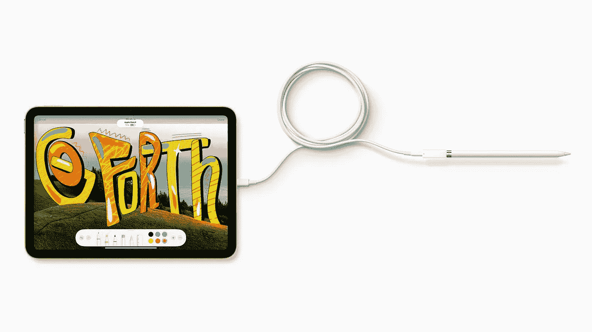
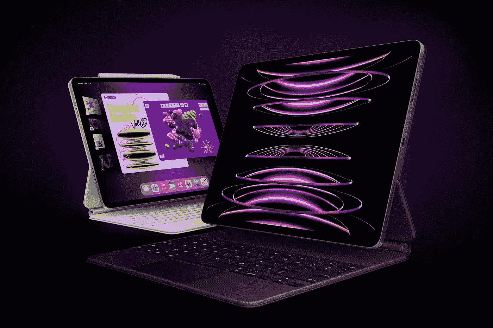
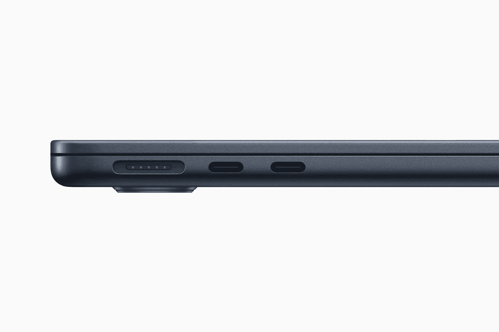
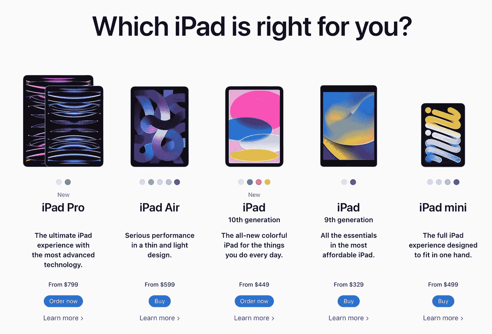
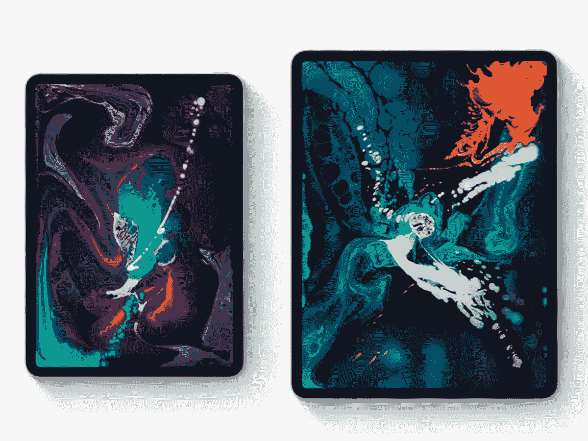

# iPad 的下一步是什么？

> 原文：<https://medium.com/geekculture/what-next-for-the-ipad-b932f5b655f3?source=collection_archive---------9----------------------->

在平淡无奇的 2022 年发布之后，苹果将何去何从？

苹果最近宣布了新的 iPad(第十代)和 iPad Pro 11 英寸和 12.9 英寸型号，老实说，它们非常令人失望和疲软。

我将从基本的第十代 iPad 开始，它现在的起价为 449 美元/ 499 美元，并且进行了完全的重新设计，与 iPad Air 和 Mini 相匹配。设计变化不是问题，价格上涨才是问题，还有一个糟糕的决定，那就是只允许 Apple pencil 1 在使用适配器的情况下使用它。

除了这两个主要的令人沮丧的因素，它实际上是基本型号的一个不错的升级，将前置摄像头移动到横向是一个巨大的改进，**应该是所有型号的标准。**

iPad 10th Gen with Apple Pencil and adapter.

至于令人失望的 iPads Pro 型号，除了用 M2 芯片替换已经过于强大的 M1 芯片和一些使用 Apple Pencil 2 悬停的无用软件功能外，没有添加任何主要功能，iPadOS 只是没有利用 M2 的能力，但希望在未来我们可以得到一个合并的 MacOS/iPadOS 混合，让 Pro 型号完全推动它。

2022 iPad Pro

这是我今年升级的问题，它们在任何情况下都不值得。无论你现在是需要一个新的 iPad 来上学还是工作，新的 iPad 都没有比以前的型号更便宜的了。

所以，只要抓住以前的模式，把多余的钱花在别的东西上。

但是苹果为什么要这么做呢？，为什么要发布这样一个毫无新意的更新，对 iPad 产品线造成这样的碎片化。

其中一个主要原因是近年来困扰所有科技公司的生产问题，芯片短缺和 covid 关闭已经推迟了这几年。不久前，有传言称 iPad Pro 型号将改用有机发光二极管显示屏，但这种情况从未发生过，更大的 12.9 英寸显示屏改为迷你 LED 显示屏，作为一种权宜之计，这种情况似乎很快就会结束。

谣言和泄漏表明，有机发光二极管终于在 2023/24 年到达专业模型，这些最近的版本只是到那时的填充物。

所以有机发光二极管为专业模特展示，但是他们可能会收到什么其他的变化？

新的尺寸，11 英寸的 Pro 已经过时，11 英寸的 Air 完全没有意义，所以预计当前的将是最后一款，12.9 英寸将成为基本尺寸的 Pro 型号，14 英寸/15 英寸的型号将成为该系列中新的更大型号，并提供更大的画布。

显然 MagSafe 已经在 iPad Pro 上测试了一段时间，但玻璃背被认为在这样一个大的手持设备上不耐用。我们可能会在未来看到一些新形式的塑料 iPad 来帮助解决这个问题，或者苹果的标志被用作 MagSafe 连接。

整体设计应该会发生变化，2018 年，iPad Pro 是第一款获得当前大多数产品中的平边工业设计的设备。我期待一种新的混合设计，具有圆形和扁平的边缘，类似于当前的 MacBook Air 和 Pro，它们采用了扁平的边缘设计，并给了它更圆的下半部分，而不是两端都是扁平的。

Current MacBook Air and Pro design, possibly the future of iPad.

接下来，由于使用有机发光二极管显示屏，边框可能会缩小，但不会像 iPhone 14 Pro 那么小，因为你仍然需要空间来放置摄像头和实际放置大型设备。说到相机，我确实希望前置风景相机也能有一个新的地方给铅笔充电。

因此，剩下的相机，目前的设计非常陈旧，已经在 iPads 和 iPhones 上使用了 4 年，需要彻底改革。也许换成一个酒吧，而不是一个有额外空间的正方形，或者换成一个没有摄像头的更厚的设备！最后一个是痴心妄想。

至于内部，肯定它最有可能由 M3 驱动，并被 iPadOS 实际能做的事情所压倒，但有希望更多的专业桌面应用程序不断出现在 iPad 上，并为那些想用它工作的人提供更多的用途。

Current iPad line up.

我还有一个愿望，请给我们更多的颜色选择，而不仅仅是银色和太空灰。明显是老男人高管的颜色，非常无聊和无趣。

iPad、iPad Air 和 iPad mini 当然会随后进行设计变更，但我预计有机发光二极管显示器至少会在一段时间内只属于专业型号。

在经历了黯淡的 2022 年后，iPad 的未来看起来非常有希望，但这只是一个耐心等待 iPad 下一个大的超级周期变化的问题。

iPad Pro 2018 models are still amazing.

2018 年 iPad Pro 可能是他们有史以来发布的最好的 iPad，仍然是一个野兽，但下一个重大变化将有望成为新的主人，并引领 iPad 未来 5 年的发展。

*所有图片均来自苹果。*