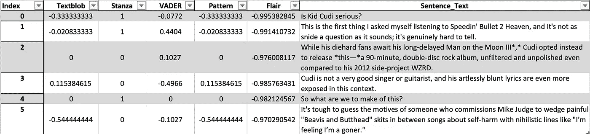
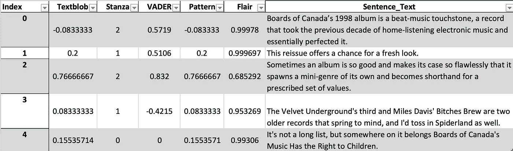

# 你应该为你的情感分析项目使用什么 NLP 库

> 原文：<https://medium.com/geekculture/what-nlp-library-you-should-use-for-your-sentimental-analysis-project-bef6b357a6db?source=collection_archive---------9----------------------->

## Python 流行的 NLP 库中的情感分析工具的横截面


Photo by [Giorgio Trovato](https://unsplash.com/@giorgiotrovato?utm_source=medium&utm_medium=referral) on [Unsplash](https://unsplash.com?utm_source=medium&utm_medium=referral)

有这么多自然语言处理(NLP)库，很难选择一个或者确信你的选择最适合你的目的。本文旨在专门研究最流行的 NLP 库的情感分析工具，为您的下一个 Python 情感分析项目选择合适的工具提供实用的指导。

到本文结束时，您将会有以下问题的答案:

***社交媒体最好的情绪分析工具是什么？多语言情感分析应该用什么库？如果我想训练自己的模型，哪个库最好？***

为了不带(太多)偏见地评估这些库，我开始对两篇短文本执行一个简单的情感分析任务。对于每个 NLP 库，我编写了一个函数来解析一篇绝对负面文章和一篇绝对正面文章的摘录，并返回样本文本中每个句子的情感分数。

正反样文摘自 [Pitchfork](http://pitchfork.com/) 专辑评论文章。正面文字摘自加拿大董事会对专辑*的 10/10 评论，这是现代最受欢迎的电子专辑之一。负面文本来自对卡迪小子的独立摇滚专辑*speed in‘Bullet to Heaven*的难以置信的苛刻评论，该专辑因其平庸而臭名昭著(创纪录的 4/10)。*

# 概观

对于所选的五个 NLP 库中的每一个，我都编写了一个函数来标记给定的段落文本和***为每个句子(正面或负面情绪)和各自的索引(引用的是哪个句子)生成情绪极性*。然后 **(3)** *结合结果，比较*。我们的调查包括以下 5 个 Python 的 NLP 库，但绝不是全面的:**

1.  **文本 Blob**
2.  **场**
3.  **VADER(通过 NLTK)**
4.  **模式**
5.  **天资**

## **进口**

```
*import* time  # optional, to time the function calls
*from* nltk.sentiment.vader *import* SentimentIntensityAnalyzer
*import* stanza
*import* pandas *as* pd
*from* nltk *import* tokenize
*from* textblob *import* TextBlob
*from* pattern.en *import* sentiment, Sentence
*import* flair
```

**loading sample texts from Pitchfork.com**

## **1.文本 Blob**

**一个更容易使用的情感分析工具， *TextBlob* 情感对象返回一个带有主观性和给定文本极性的命名元组。对于本教程，我只是引用极性。作为旁注，我使用的是 TextBlob 库 ***而不是****text blob via spaCy 库。我假设他们会给出相似的结果。***

***使用 pip 安装 TextBlob:***

```
*$ pip install -U textblob
$ python -m textblob.download_corpora*
```

***[](https://textblob.readthedocs.io/en/dev/quickstart.html) [## 教程:快速入门- TextBlob 0.16.0 文档

### TextBlob 旨在通过一个熟悉的界面提供对常见文本处理操作的访问。你可以治疗…

textblob.readthedocs.io](https://textblob.readthedocs.io/en/dev/quickstart.html) 

## 2.Stanza(通过 CoreNLP)

斯坦福大学的 CoreNLP 客户端 *Stanza* 是一个用 66 种不同语言标记积极或消极情绪的有效工具，但是如果你正在寻找更高的粒度，那么这个库不适合你。它的。情感方法返回值 0、1、2，分别表示消极、中立和积极的情感。由于返回值是离散的分类，因此不存在“轻微负面”情绪或“过度正面”情绪评级。

Stanza 可以通过以下方式安装:

```
$ pip install stanza
```

[](https://stanfordnlp.github.io/stanza/) [## 概观

### Stanza 是在一个地方为许多人类语言收集的准确而有效的工具。从原始文本开始到…

stanfordnlp.github.io](https://stanfordnlp.github.io/stanza/) 

## 3.VADER(化合价感知词典情感推理器)

这个列表中最好的图书馆之一， *VADER* 专门针对社交媒体文本。它甚至被训练来解码表情符号的情绪。这使得它在解密和正确标记来自今天使用的最大和最冗长的平台:Twitter 和脸书的内容方面非常有效。据我所知，VADER 不支持在非英语文本上使用。

安装 VADER:

```
$ pip install vader-sentiment
```

 [## 情感分析

### “vader 聪明、英俊、风趣。”, #…

www.nltk.org](http://www.nltk.org/howto/sentiment.html) 

## 4.模式

*模式*是一个文本数据挖掘工具(网页抓取、解析等)。)具有文本处理组件。它的情感()函数返回一个元组，分别带有给定文本的极性和主观性，其中极性是介于-1.0 和+1.0 之间的值，主观性是介于 0.0 和 1.0 之间的值。

它可以与以下设备一起安装:

```
$ pip install pattern
```

[](https://textminingonline.com/getting-started-with-pattern) [## 模式入门

### 我们已经讨论了 NLTK 和 TextBlob，现在是时候“开始使用模式”了。关于模式根据…

textminingonline.com](https://textminingonline.com/getting-started-with-pattern) 

## 5.天资

建立在 PyTorch 基础上的 *Flair* 是另一个强大的 NLP 库，具有命名实体识别(NER)、演讲点(POS)标记和对生物医学数据的特殊支持。它是高度可配置的，并且支持训练你自己的文本分析模型。

安装 Flair:

```
$ pip install flair
```

然而，它开箱即用的可访问性稍差。需要第一个函数 senti_score 来返回极性得分。这是一个快速的步骤，但是其他情感分析工具并不需要这样做。

[](https://github.com/flairNLP/flair) [## flairNLP/flair

### 最先进的自然语言处理的一个非常简单的框架。由柏林洪堡大学和朋友开发。天赋是:一个…

github.com](https://github.com/flairNLP/flair) 

## 情感分析器结果比较

从结果中我注意到的第一件事是 TextBlob 和 Pattern 使用了相同的情感分析算法，因为它们对两个文本中的每个句子都给出了相同的分数。我不得不返回到我的函数中进行三次检查，以确保我没有对这两个函数使用相同的函数/方法。这并不奇怪，因为 TextBlob 是在 Pattern 和 NLTK 之后构建的，并且很可能借鉴了它们的很多东西。

我有点惊讶的是，Pattern 和 TextBlob 的情感分析器*完全*相同。



Figure 1: negative sentiment table

如前所述，Stanza 只给每个句子一个 neg、neu 或 positive (0，1，2)评分；Flair 似乎也在回报一幅类似的画面——无论是正面还是负面的。两者都是准确的，似乎提供了相同水平的精度，尽管天赋产生了连续的，而不是离散的分数。



Figure 2: positive sentiment table

> 从这些粗略的测试来看，VADER 在准确性、精确度和易用性方面遥遥领先。

# 速度比较

我在每个函数调用上添加了一个计时器装饰器，以大致了解它们的速度。下面的打印速度结果清楚地表明，文本斑点，VADER 和模式是最快的，VADER 是最一致的。

```
func:'textblob_analyzer' took: 0.0602 sec
func:'textblob_analyzer' took: 0.0109 secfunc:'stanza_analyzer' took: 0.4384 sec
func:'stanza_analyzer' took: 0.3161 secfunc:'vader_analyzer' took: 0.0419 sec
func:'vader_analyzer' took: 0.0201 secfunc:'pattern_analyzer' took: 0.0534 sec
func:'pattern_analyzer' took: 0.0044 secfunc:'flair_analyzer' took: 0.5243 sec
func:'flair_analyzer' took: 0.3798 sec
```

# 关键要点

总的来说，VADER 是至高无上的。由于它是专门为处理社交媒体文本而调优的，它在我们的样本文本上产生了最准确和最精确的情感评分，并可能在社交媒体上下文中的任何(英语)文本上给出类似的有希望的结果。如果你正在寻找一个情感分析库来分析现代口语文本，VADER 很可能会做得最好。

其他 4 个(实际上是 3 个，因为 Pattern 和 TextBlob 在情感分析器方面是相同的)也有它们的用途。如果您希望分析生物医学数据，或者如果您希望在自定义语料库上训练一个独特的模型，请选择 ***Flair*** 。如果您想检测比较级与最高级和/或事实与观点，请选择 ***模式*** 。如果您希望分析多种语言的情感和/或想要离散化的情感输出，请选择**节**。选择 **TextBlob** 因为它快速简单，会给你和模式一样的情感结果。

# TLDR；

如果你想分析互联网上的表情符号情感和有趣的模因，选择 **VADER** (实际用例)。

## *另外，欣赏一下我的猫的这张照片:*


Louis the cat, on film

# 资源:

[](https://textblob.readthedocs.io/en/dev/quickstart.html) [## 教程:快速入门- TextBlob 0.16.0 文档

### TextBlob 旨在通过一个熟悉的界面提供对常见文本处理操作的访问。你可以治疗…

textblob.readthedocs.io](https://textblob.readthedocs.io/en/dev/quickstart.html) [](https://stanfordnlp.github.io/stanza/) [## 概观

### Stanza 是在一个地方为许多人类语言收集的准确而有效的工具。从原始文本开始到…

stanfordnlp.github.io](https://stanfordnlp.github.io/stanza/)  [## 情感分析

### “vader 聪明、英俊、风趣。”, #…

www.nltk.org](http://www.nltk.org/howto/sentiment.html) [](https://textminingonline.com/getting-started-with-pattern) [## 模式入门

### 我们已经讨论了 NLTK 和 TextBlob，现在是时候“开始使用模式”了。关于模式根据…

textminingonline.com](https://textminingonline.com/getting-started-with-pattern) [](https://github.com/flairNLP/flair) [## flairNLP/flair

### 最先进的自然语言处理的一个非常简单的框架。由柏林洪堡大学和朋友开发。天赋是:一个…

github.com](https://github.com/flairNLP/flair) [](https://towardsdatascience.com/python-libraries-for-natural-language-processing-be0e5a35dd64) [## 用于自然语言处理的 Python 库

### 用于自然语言处理的流行 python 库概述

towardsdatascience.com](https://towardsdatascience.com/python-libraries-for-natural-language-processing-be0e5a35dd64)  [## flair——一个预训练的自然语言处理情感分析工具

### NLP(自然语言处理)包括情感分析。训练有素的情感分析包括机器学习…

christineeeeee.com](https://christineeeeee.com/posts/nlp_sentiment_tool/)***