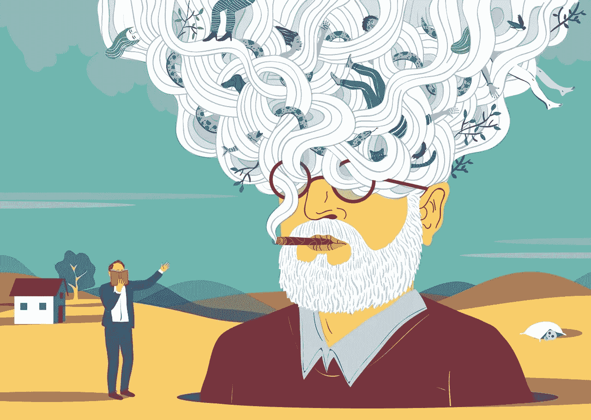
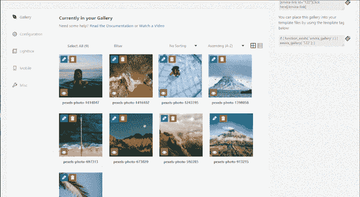

# 关于使用 WordPress 插件，西格蒙德·弗洛伊德能教你什么

> 原文：<https://medium.com/geekculture/what-sigmund-freud-can-teach-you-about-using-wordpress-plugins-8767c18b743e?source=collection_archive---------6----------------------->

## 如果弗洛伊德先生现在还活着，从他的孩子，心理分析，在互联网上得到的所有欺凌，他可能会心脏病发作，再次死亡。

by [Federica Bordoni](https://federicabordoni.com/)

然而，有几个精神分析的原则，我们可以在日常生活中应用，甚至是现在，甚至是在网站开发中。

弗洛伊德将人的心理分为三个部分:本我、自我和超我。无意识的欲望和本能存在于 Id: *我希望我的网站赚更多的钱，这样我就可以买更多的东西*。理性和逻辑活在自我:*为了吸引新的长期用户，* *我应该考虑创建一个有吸引力的稳定平台*。社会规范、道德、规则活在超我里:*我要把我的网站* [*做成包容性的*](https://shakuro.com/blog/human-centered-design-what-it-is-and-how-is-it-different-from-other-design-approaches) *，让任何人在使用的同时都能得到满足*。

让我们想象 WordPress 插件在弗洛伊德的世界体系中为自我服务。WP 提供的大量附加组件、扩展、模板和有用、简洁的功能是你赚取利润的“动物欲望”和帮助世界的强烈愿望之间的中介。WP 插件只是工具，却连接了本我和超我。它们只是代码。他们冷酷而有逻辑。让我们来发现什么是 WP 插件，以及它们与弗洛伊德还有哪些共同之处。

If WP plugins were a movie character. Image via Giphy

# 什么是 WordPress 插件？

WordPress 插件是“嵌入”到你的 [WordPress 站点](https://shakuro.com/wordpress)中的一段代码。简单地说，它是你的站点的扩展，修改和增强了 WordPress 的核心功能。

不要编辑原始代码，使用插件是扩展 WordPress 功能的最好方法。下载和安装插件比设置一长串代码更容易。编写代码是一项艰巨的任务。我们的后端开发人员最近解释了[为什么](https://shakuro.com/blog/interview-with-a-back-end-developer-what-makes-a-good-code)。

有了插件，你只需要打开额外的代码来改变原来的代码。当不再需要更改时，您可以通过禁用插件来关闭它们。

有数千个预先设计好的插件可用于 [WordPress](https://wordpress.com/) 真是太棒了。正确使用插件不仅会增加网站的功能和可用性，还会改善你的工作流程。

# WordPress 插件能做什么？

插件是将一个普通的博客变成任何形式和功能的网站的修改器。只需几个简单的步骤，插件就会把你的网站变成一个[电子商店](https://shakuro.com/blog/online-store-on-wordpress-pros-and-cons)、杂志、作品集、学习管理系统。任何你能想到的，真的。

例如，如果你正在建立一个网上商店，WooCommerce 就是你新的最好的朋友。你想做一个订票系统的网站吗？图书借阅:

也许你是一名摄影师，想在你的网站上展示你的作品？ [Envira Gallery](http://wordpress.org/plugins/envira-gallery-lite/) 插件是个完美的选择:

虽然有些插件会彻底改变你的网站，但其他的只是在幕后做些简单的改变。你可能看不到它的变化，但插件优化了网站。例如，您可以添加 [WPSmush](http://wordpress.org/plugins/wp-smushit/) 来压缩您的图像。 [W3 总缓存](http://wordpress.org/plugins/w3-total-cache/)会提高你网站的性能。像[可视电话](https://www.wordfence.com/)这样的插件增加了你网站的安全性。

# WordPress 中的快乐和痛苦原则

Family Guy via Giphy

西格蒙德·弗洛伊德教给我们的最酷的事情之一是快乐-痛苦原则:

*快乐原则努力满足我们最基本、最原始的欲望……当这些需求得不到满足时，结果就是一种焦虑或紧张的状态。*

WP 插件和这个原则有很大的关系。因为有时候，尤其是当你独自创作时，你无法让它们工作。沮丧、焦虑和紧张是描述你感受的最温和的词语。

# 以下是最常见的 WP 插件问题以及解决方法(战胜痛苦):

**不再支持该插件。怎么办？**

插件是人写的，你理解的人，都是不一样的。

他们的生活环境也可能大不相同。甚至流行的插件也会突然停止更新。作者不回复信件、请求等。作为一个规则，如果插件在一年内没有更新，这已经是一个严重的暗示，是时候寻找替代品了。即使这个插件看起来运行良好，它也会给 WordPress 的新版本带来安全风险。这里只能有一条建议——慢慢寻找功能替代。也看看付费插件。作为最后的手段，你可以试着在论坛上搜索一个自由程序员来完成这个插件。然而，这可能会让你损失一大笔钱，而且仍然只是一个临时的解决方案。如果您联系外包公司，维护通常包含在开发包中。

**死亡的白色屏幕。该网站不再工作。**

White screen of death

增加 PHP 内存限制。为此，在你的 WordPress 站点上编辑 wp-config.php 的**文件(在 WordPress 站点的根文件夹中)。在虚拟主机控制面板中使用 FTP 客户端或文件管理器。粘贴[这个](https://www.wpbeginner.com/wp-tutorials/fix-wordpress-memory-exhausted-error-increase-php-memory/)代码，然后 WABAM，内存增加。**

**插件出现了一些反复出现的问题，但是我停不了网站，我丢不起用户！**

如果你不想让用户注意到什么，使用一个插件，可以帮助你在不停止你的网站的情况下排除故障。安装并激活[健康检查](https://wordpress.org/plugins/health-check/)和故障排除插件。

**插件运行良好，然后突然停止。**

让我们想想你在它停止工作之前更新了什么。什么插件？你什么时候注意到这个问题的？或者他们只是换了个话题？不同的插件在不同的主题下很容易“淘气”，但单独或与其他主题一起，“感觉”很棒。

我不能在我的 WordPress 添加插件。

一些初学者不知道 WordPress 有两个版本:WordPress.com 和 WordPress.org。而**。org** 版本给你使用任何你想要的插件的自由。com 版本没有。只有购买了 WordPress.com 商业计划的用户才能在他们的网站上添加插件。但是，可供安装的插件数量有限。

# 哪里可以找到 WordPress 的插件？

有几个地方可以找到 WordPress 插件。但是，在选择下载插件的位置时要小心。不可靠的开发者发布的插件会损害你的网站。

WordPress [目录](http://wordpress.org/plugins/)是寻找插件的最好地方。你可以从 50，000 多个插件中选择。你也可以投资购买高级插件。有些 WordPress 插件市场提供高级插件，如[代码峡谷](https://codecanyon.net/)、 [MOJO 市场](https://www.mojomarketplace.com/)或[创意市场](https://creativemarket.com/)。

要从 WordPress 目录安装插件，你可以在管理面板中进入插件>添加新插件。

# 在 WordPress 安装插件之前

在安装任何插件之前，你需要考虑一些事情。

首先，你需要知道你的网站真正需要什么。不要在不知道你需要什么和安装你喜欢的任何东西的情况下来到 WordPress 知识库。这是低效且耗时的。

第二，研究互联网上的插件推荐。如果你已经知道你需要什么，但不知道哪些插件将帮助你实现你的目标，这一步是有帮助的。

最后，你需要检查插件与你的 WordPress 版本和主题的[兼容性。一些插件可能不支持旧版本或新版本的 WordPress。如果你的主题不支持你选择的插件，安装它会导致严重的问题。](https://wordpress.org/plugins/better-plugin-compatibility-control/)

# WordPress 是弗洛伊德式的遗风吗？

精神分析是一个非常有效的心理学流派，但是弗洛伊德的许多观点已经随着时间的推移而消亡。WordPress 已经存在了 18 年了！

尽管 WordPress CMS 有很多优点，但是这个平台有几个缺点:

*   页面和图像的复制，
*   大量未验证的扩展和主题有错误，
*   一组有限的基本功能，
*   网页性能下降(由于安装了大量插件)。

WordPress 的优势使得 web 开发变得更加容易和快捷。对于许多企业主来说，在定制 web 开发和现成的解决方案(WordPress 是可用的选项之一)之间做出选择并不是一件容易的事情。我们从经验中得知，绝大多数网站都是为中小型企业创建的，WordPress 非常适合数字经济的这一大众市场，因为:

*   它让企业最大限度地缩短进入市场所需的时间。
*   它不贵。
*   它很受欢迎，所以网站所有者永远不会没有支持。

每种方法都有自己的缺点、优点和案例。

*这篇文章的灵感来自* [*杰罗德·莫里斯*](https://copyblogger.com/wordpress-plugins/) *。*

[丽塔写的*善良-羡慕*](https://shakuro.com/blog/)