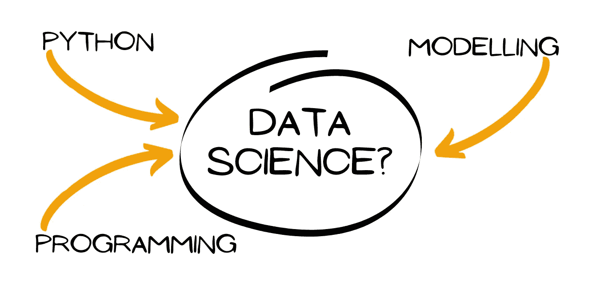
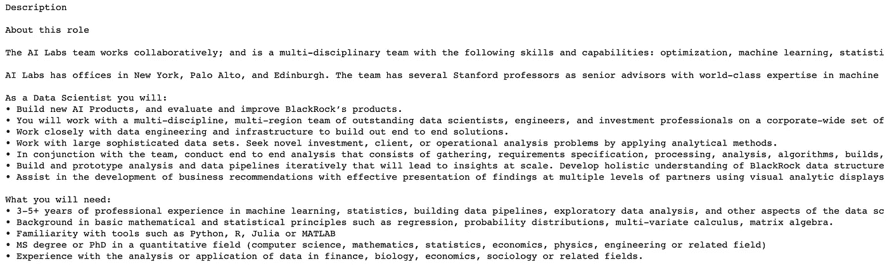
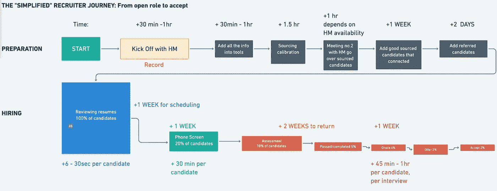

# 成为一名数据科学家需要具备哪 20 项技能？

> 原文：<https://medium.com/geekculture/what-skills-do-you-need-to-become-a-data-scientist-76217e9e62a1?source=collection_archive---------34----------------------->

## 使用 Python、API 和 NLP 关键字分析来理解数据科学职位描述中列出的技能



*Image by author*

我们都听说过，数据是新的石油。但是，对于什么是数据科学家有这么多的定义，你如何为自己从事数据科学的职业做准备呢？

一种方法是从数据科学职位描述中了解所需的技能。我就是这么做的。使用通过 [SerpAPI](https://serpapi.com/) 获得的 Google jobs API，我提取了超过 100 个数据科学角色的工作描述。然后，我使用了 [Spacy](https://spacy.io/) 、 [NLTK](https://www.nltk.org/) 和 [Gensim](https://radimrehurek.com/gensim/) 的组合来清洗数据和提取关键词，以识别职位描述中列出的顶级硬技能和软技能。

## 步骤 1:获取数据

从 Linkedin 和 Glassdoor 获取职位描述很复杂。好消息是我找到了另一个解决方案！通过使用 SerpAPI，我能够访问谷歌工作的职位描述，并利用免费试用！

```
# Install Google search results package!pip install google-search-results
```

**专业提示:**使用交互式浏览器创建定制请求。我想包含上周唯一的搜索结果，为此我转到 google 搜索页面，提取 date_posted 的类型参数，并将其输入到 chips 文件中

使用 API 默认得到 10 个结果，这对于有意义的分析来说几乎不够。为了避免这个问题，我创建了一个名为“start”的列表，然后创建了一个函数来遍历 start 列表中的项目，为每个页面调用 API。结果，我能够从每个职位名称中提取 100 个结果

```
*# Call API
from serpapi import GoogleSearch
import pandas as pd# Define the pagination
start = [0,10,20,30,40,50,60,70,80,100]# I used 1 job title as a test
#job_title = 'analytics manager'# The I pulled a list of job titles I was interested in searching
job_titles = ['data scientist', 'sales','software engineer','UX researcher','product designer','analytics manager','product manager','product marketing manager','data engineer','business development']def get_jobs(start, job_title):
 #Create an empty dataframe
final = pd.DataFrame()for j in job_titles:
  for i in start:
    num = i
    params = {
      "engine": "google_jobs",
      "google_domain": "google.com",
      "q": f"{j}",
      "gl": "us",
      "hl": "en",
      "chips": "date_posted;week",
      "location": "New York, New York, United States",
      "api_key":"<YOUR SECRET>",
      "start":f"{num}"
}search = GoogleSearch(params)
results = search.get_dict()# Put results into dataframe
jobs = pd.DataFrame.from_dict(results['jobs_results'])# Append values to dictionary
final = final.append(jobs,ignore_index=True) return final*
```

## *第二步:拆分文本以确定技能*

*大多数职位描述大致分为 3 类:*

1.  *公司介绍*
2.  *角色的职责和*
3.  *特定技能列表*

*有点像这样:*

**

*大多数技能信息都列在**项目符号类别**中。为了简单起见，获取我们想要的数据的最简单的方法是从每个职位描述中提取所有要点。好消息是，这将删除我们不需要的公司信息，但留给我们的是责任(软技能)和资格:*

```
*import reds["all_bullets_string"] = [' '.join(map(str, re.findall('•(.+)',ds.description[i]))) for i, _ in enumerate(ds.description)]*
```

## *步骤 3:清理数据*

*我决定使用 spacy 平台来标记我的工作描述。Spacy 的 tokenizer 允许你选择特定类型的单词。因为我对技能感兴趣，所以我选择了名词(这些可能会给我带来像 Python 这样的硬技能)和动词，这些动词表达了像“交流”这样的软技能。此外，我把这些单词字母化，把它们都变成小写，然后乐趣就开始了！*

```
*# Start comparing the topics together
# Import our language packagesimport gensim
import nltk
import spacyfrom gensim.utils import simple_preprocess
from gensim.parsing.preprocessing import STOPWORDS
from nltk.stem import WordNetLemmatizer, SnowballStemmer
from nltk.stem.porter import *# Spacy lemmatizer
# Load core modelsp = spacy.load('en_core_web_sm')# Remove stopwords
all_stopwords = sp.Defaults.stop_wordsdef lemmatize_words(job_description):
  result = []
  # tokenize each job description
  document = sp(job_description)
  # Remove punctuation and stop words, also remove high frequency but uninformative words like 'data'
  for word in document:
    if not word.is_punct and not word.like_num and not word.is_stop  and not word.is_space and (word.pos_ in ('NOUN','PROPN','VERB')) and word.lemma_ !='datum':
      result.append(word.lemma_.lower())result = [word for word in result if not word in all_stopwords]
return result# Other tokenizer
def noun_chunks(job_description):
  result = []
  # tokenize the job description text
  document = sp(job_description)
  # Would be interesting to see if it makes any difference if we
  # Look at sentences first
  # list(document.sents)[0]
  for word in document.noun_chunks:
    result.append(word)
  return result*
```

## *步骤 4:词频分析*

*清理数据后，我开始进行经典的 TF 分析*。以这种方式来看数据，这些是 89 项中列出的顶级技能(有些值被删除，因为它们不具备突出的资格条件)数据科学职位描述:*

**

**Image by author**

```
*lemmatize_docs = []
# Lists for other tokenizer, did not use
noun_docs = []
processed_docs = []for doc in ds.all_bullets_string:
  processed_docs.append(preprocess(doc))
  lemmatize_docs.append(lemmatize_words(doc))
  noun_docs.append(noun_chunks(doc))# This creates a dictionary that counts the number of time a word occurs
dictionary2= gensim.corpora.Dictionary(lemmatize_docs)# Do a simple plot of word frequencies 
# Sourced from William Scott [1]df = {}for i in range(len(lemmatize_docs)):
  tokens = lemmatize_docs[i]
  for w in tokens:
    try:
      df[w].add(i)
    except:
      df[w] = {i}# Replace values with length of values that represents frequency
for k,v in df.items():
  df[k] = len(v)# Sort the dictionary
import operatorsorted_d = dict( sorted(df.items(), key=operator.itemgetter(1),reverse=True))print(sorted_d)import seaborn as sns
import matplotlib.pyplot as plt
import matplotlib.ticker as mtick# Setup plot
a4_dims = (20, 9)
fig, ax = plt.subplots(figsize=a4_dims)
sns.set_theme(style="whitegrid")
sns.set(font_scale=1.4)# Create values
keys = list(sorted_d.keys())[:20]
# get values in the same order as keys, and parse percentage values
vals = list(sorted_d.values())[:20]
#Create a percentage variable
perc = [(i/89)*100 for i in vals]
pal = sns.color_palette("Spectral", len(vals))# Format y axis as percent
fmt = '%.0f%%' # Format you want the ticks, e.g. '40%'
yticks = mtick.FormatStrFormatter(fmt)
ax.yaxis.set_major_formatter(yticks)
ax.set(xlabel='% of Job Descriptions', ylabel='Skill')
ax.set_xticklabels(keys,rotation=30)
ax = sns.barplot(x=keys, y=perc,palette=pal)# Add title
plt.title('The most frequently mentioned nouns in data science job descriptions')
plt.show()*
```

***我也进行了 LDA 分析，但得到的结果没有任何意义。我发现这个简单的分析更有帮助。**

## *结果:你如何应用这个？*

***Python** 在 68%的职位描述中排在第二位。也许这并不奇怪，但我认为奇怪的是 **SQL** ，它是前 20 名中列出的下一个工具。对我来说，这意味着需要**通才数据科学专家，**不专注于任何特定技能(这里没有列出 pytorch 或 NLTK ),而是查询数据的一般能力。*

*这也体现在其他一些技能上。业务功能高度突出，反映了数据科学家的关键需求，他们需要记住始终将他们的**工作与业务成果**联系起来；一个很好的例子是展示基于数据洞察可以做出的产品改变。*

## *但是，职位描述是否反映了成为一名真正的数据科学家所需的条件？*

*一如既往，答案是视情况而定。如果你正在找工作，并有兴趣最大限度地通过初步筛选的机会，那么这是给你的分析。通常，大约 80% — 90% [2]的简历会在筛选阶段被过滤掉:*

**

*The candidate hiring funnel ([Source](https://www.youtube.com/watch?v=GFfoz8NEFGk&t=3s)) [3] | *Image by author**

*这一阶段包括招聘人员和/或 ATS 筛选，关键字对于通过考试至关重要。在简历中加入更多关键词的一个好方法是使用职位描述。所以，你越是在你的简历中加入上述词语，你就越有可能通过大多数的筛选。*

*也就是说，你也可以使用相反的策略。鉴于大多数职位描述没有列出具体的技能，你可以专门关注那些列出的技能。例如，如果你是 Pytorch 专家，而这正是工作规范所要求的，你很容易将自己与其他候选人区分开来。*

**根据您自己的经验，您对数据科学技能的印象与我们在这里看到的有何不同？你还希望看到其他哪些职位描述被分析？**

*[1] William Scott， [TF-IDF 在真实世界数据集上用 python 从头开始](https://towardsdatascience.com/tf-idf-for-document-ranking-from-scratch-in-python-on-real-world-dataset-796d339a4089)。(2018)，2019 走向数据科学*

*[2] Jobvite，[招聘漏斗，解构](https://www.jobvite.com/the-recruiting-funnel-deconstructed/)，(2015 年)*

*[3] Diamond lister 产品演示， [Diamond listers:利用 NLP 的能力快速招聘，通过候选人的声音筛选候选人](https://www.youtube.com/watch?v=GFfoz8NEFGk&t=3s)，(2020 年)*