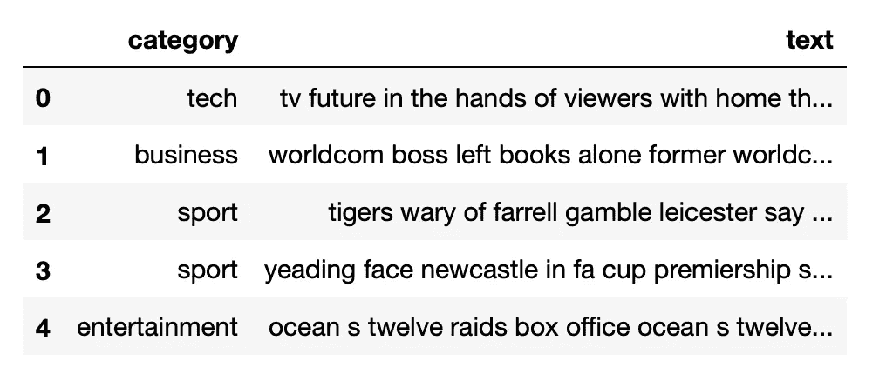
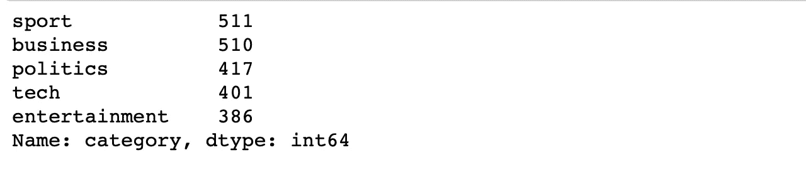
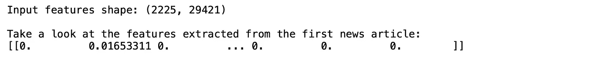
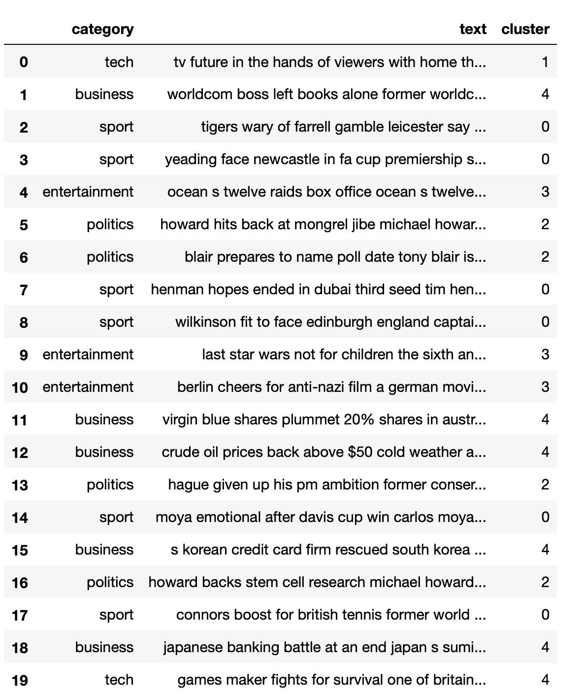
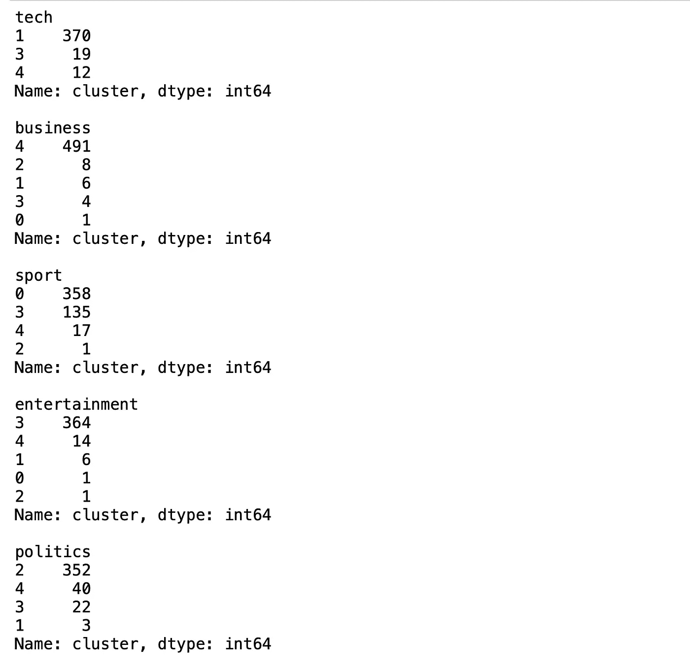
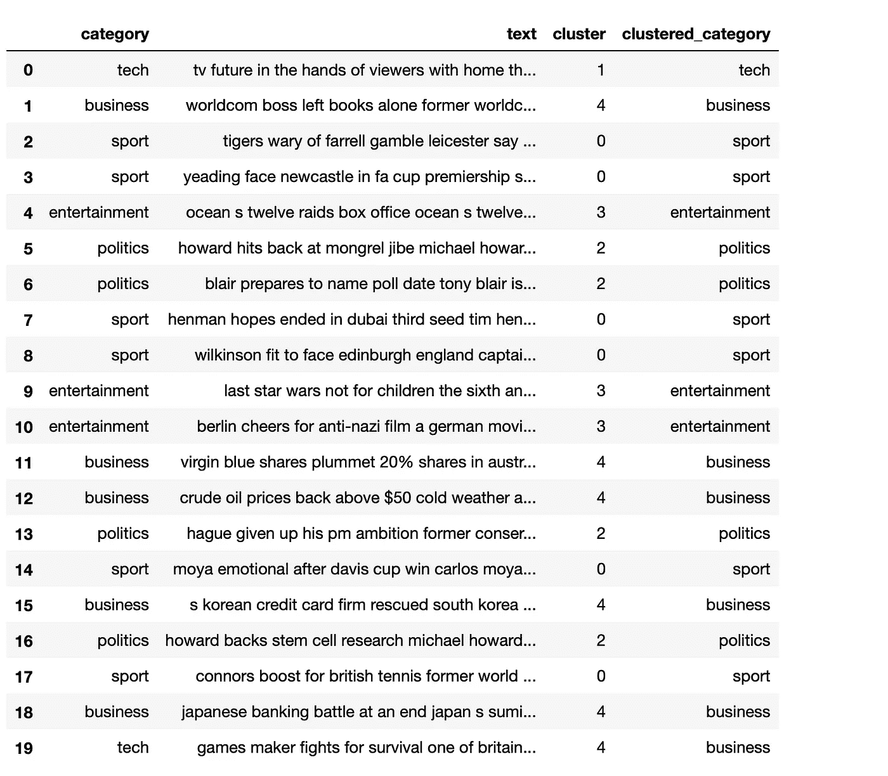
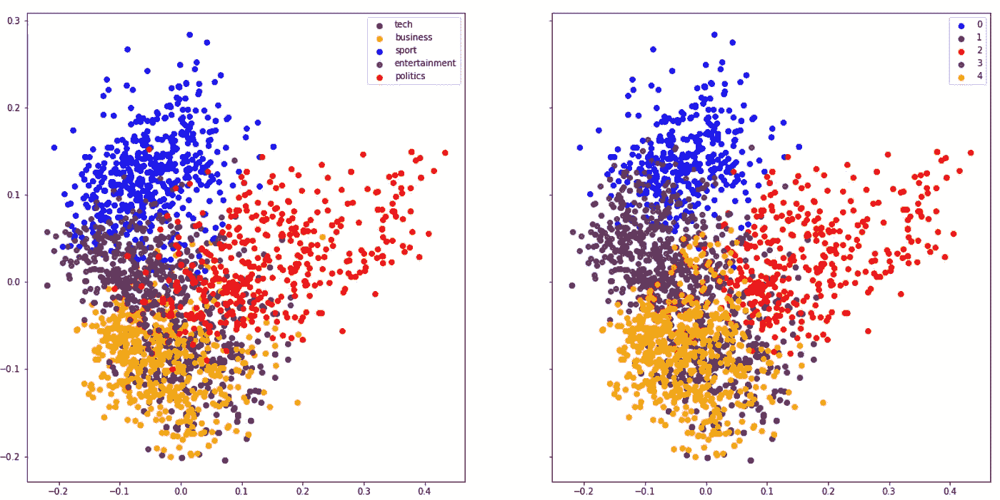

# 关于文本分类，文本聚类能告诉我们什么

> 原文：<https://medium.com/geekculture/what-text-clustering-can-tell-us-about-text-classification-248ce1d5d1e3?source=collection_archive---------13----------------------->


之前，我使用监督学习在 BBC 新闻数据上训练多类[文本分类](/swlh/text-classification-using-scikit-learn-pytorch-and-tensorflow-a3350808f9f7)模型，并针对测试数据实现了 98%的准确率。根据训练数据的质量，当训练我们自己的文本分类数据时，我们可能会也可能不会用我们的测试数据集达到 98%的准确率。我发现在分析训练数据时可能有帮助的一种方法是使用无监督学习将数据集聚类到不同的簇中(簇的数量等于类别的数量)，并比较来自不同类别的数据点如何被分配到不同的簇中。

在这里，我再次使用 BBC 新闻数据，来看看这些数据如何根据它们的类别进行分组。

首先，我读取训练数据，并使用 Scikit Learn 的 TfidfVectorizor 将文本转换成数字表示。该步骤与之前描述的相同，因此请参考[文章](/swlh/text-classification-using-scikit-learn-pytorch-and-tensorflow-a3350808f9f7)获取详细解释。

> 源代码可从[https://github . com/陈东林/text _ classification/blob/master/text _ clustering _ and _ visualization . ipynb](https://github.com/donglinchen/text_classification/blob/master/text_clustering_and_visualization.ipynb)获得

# 收集数据

```
df = pd.read_csv('bbc-text.csv')
print(df.shape, df['category'].nunique())
df.head()
```

下面显示了 BBC 新闻数据集中的 5 条记录:



检查新闻类别和每个类别的新闻文章数量

```
df['category'].value_counts()
```



现在使用 TfidfVectorizer 将文本提取到 TFIDF 数字要素中:

```
vec = TfidfVectorizer()
features= vec.fit_transform(df['text'])
print("Input features shape:", features.shape)
print(f"\nTake a look at the features extracted from the first news article:\n{features[0].toarray()}")
```



我们看到 TfidfVectorizer 将文本中的特征提取到 29421 个特征维度中

# k 均值聚类

现在我们可以在特征向量上运行 K-Means 聚类算法。这里我选择 5 个聚类，因为我们知道文本有 5 个类别。

```
from sklearn.cluster import KMeans
kmeans = KMeans(5, n_init=10, random_state=42)
kmeans.fit(features)
```

聚类后，向数据帧添加一个包含指定聚类标签的列，并将该列命名为“cluster”

```
df[‘cluster’] = kmeans.labels_
```

“聚类”列具有从 0 到 4 值，代表 5 个不同的聚类



# 根据大多数数据点被分配到的类别，将分类映射到类别

通过检查 20 个样本，我们可以看到每个聚类都可以很好地映射到一个类别，除了索引 19 映射到聚类 4，它应该是“商业”，而不是“技术”。检查每个类别的数据是如何分类的，可以让我们找到每个类别最合适的分类编号:

```
for cat in df['category'].unique():
    mark = df['category'] == cat
    print(f"{cat}\n{df[mark]['cluster'].value_counts()}\n")
```



从上面所有属于“技术”类别的新闻文章中，有 327 篇被分配到第一组，只有 19 篇和 12 篇被分配到第三组和第四组，所以我们可以很确定第一组是属于“技术”类别的。同样，我们知道群集群集 4 是用于“业务”的。聚类 3 用于“体育”，然而对于体育，有 135 个样本被分配给聚类 3，其应该对应于“娱乐”。我们可以创建一个字典来将分类映射到类别，如下所示:

```
{1: 'tech', 4: 'business', 0: 'sport', 3: 'entertainment', 2: 'politics'}
```

使用上面的映射，我可以创建一个 clustered_category 列，如下所示:

```
df['clustered_category'] = df['cluster'].map(cluster_to_category)
df.head(20)
```



现在，我可以计算出新闻数据可以正确归类的程度:

```
print('Overall accuracy of clustered categories:', np.mean(df['category'] == df['clustered_category']))
```


因此，如果仅使用 K-Means 聚类将新闻数据分组到类别组中，已经可以达到 87%的正确率将新闻文章分配到相关类别中。

# 将主成分分析应用于数据可视化

在应用 PCA(主成分分析)将特征从 29421 维空间减少到仅 2 维空间，同时尽可能多地保留数据的变化之后，我们可以将数据如何分组到二维空间中进行可视化。我将制作两个图表，分别基于类别和集群来可视化数据:

```
from sklearn.decomposition import PCA
pca = PCA(n_components=2)
x_pca = pca.fit_transform(encoded_x.toarray())
```

上面的代码将生成一个形状为(2225，2)的 2D 数组，代表 2225 篇新闻文章，每篇文章有 2 个主成分。我将把 2225 条新闻数据投射到与 2 个主成分相对应的 2D 空间上。然后并排比较两个用类别 v.s .聚类着色的图

```
fig, axes = plt.subplots(1, 2, sharey=True)
fig.set_size_inches(20, 10)
categories = df['category'].unique()
colors = ['green','orange', 'blue', 'purple', 'red']
for i, e in enumerate(categories):
    mark = df['category'] == e
    axes[0].scatter(x_pca[:, 0][mark], x_pca[:, 1][mark], color=colors[i], label=e, alpha=0.9)
axes[0].legend();# use the same set of colors as above to compare side to side of the two graphs
colors = ['blue', 'green', 'red', 'purple', 'orange']
for e in set(kmeans.labels_):
    mark = kmeans.labels_ == e
    axes[1].scatter(x_pca[:, 0][mark], x_pca[:, 1][mark], color=colors[e], label=e, alpha=0.9)
axes[1].legend()
```



正如我所看到的，这两个图表是相似的，数据点按彩色类别 v.s .集群分组。黄点(商业)和绿点(科技)彼此有一些重叠，这意味着它们可能具有相似的单词标记，而红点(政治)可以更容易地与其他类别/聚类区分开来。我们还可以看到，在右图中，许多紫色点属于左图中的蓝色(体育)类别，这表明许多体育新闻文章被聚集到紫色(娱乐)簇中，从上面的数据可以明显看出，358 篇新闻文章被聚集到簇号 0，135 篇新闻文章被聚集到簇号 3。总的来说，对于每个类别，大多数新闻文章都可以正确地归类到相应的类别中。

# 摘要

对新闻文章数据集应用 K-Means 聚类导致每篇新闻文章以 87%的准确度被分配到相对类别。这意味着数据集非常干净，质量很好。使用干净和高质量的数据集训练模型通常可以实现高模型预测精度，正如我们看到的，当[训练 BBC 新闻分类模型](/swlh/text-classification-using-scikit-learn-pytorch-and-tensorflow-a3350808f9f7)时，我们实现了超过 98%的模型测试精度。

另一方面，我多次看到，我们的训练数据不太理想，数据不容易聚类和映射到相应的类别，属于相同类别的数据可能会非常均匀地分布到多个聚类中。用这些数据集训练分类模型可能导致相对较低准确度，如 70%或 80%，且可能难以达到 90%以上的高准确度。