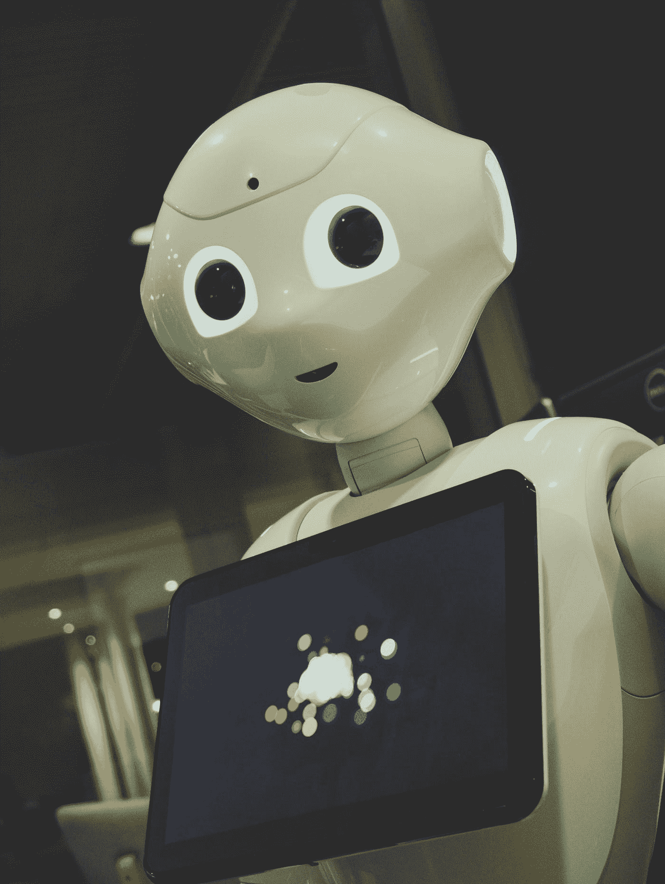
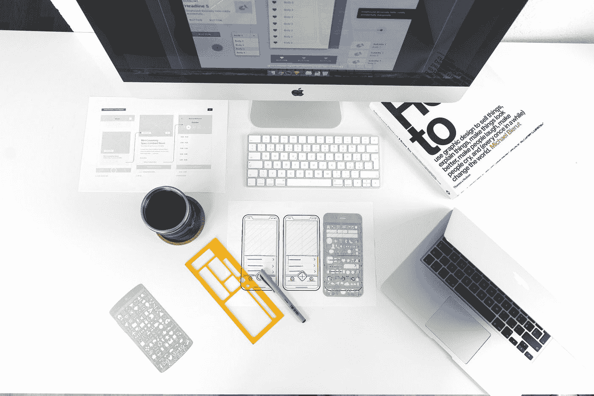
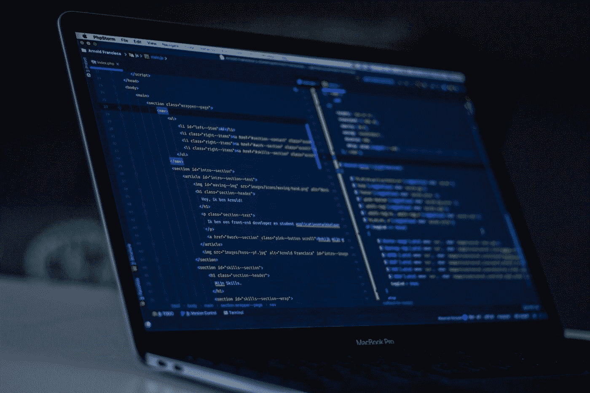

# UX 设计的未来是什么

> 原文：<https://medium.com/geekculture/what-the-future-holds-for-ux-design-3b73fe071068?source=collection_archive---------73----------------------->

## 用户体验发生了怎样的变化，这对设计师的未来意味着什么

Photo by [Owen Beard](https://unsplash.com/@owenbeard?utm_source=medium&utm_medium=referral) on [Unsplash](https://unsplash.com/?utm_source=medium&utm_medium=referral)

感觉就像不久前，用户体验(UX)和用户界面(UI)领域的设计才刚刚起步。他们是市场营销和产品开发时代的婴儿。然而，慢慢地，随着新技术的发展和市场的增长，抓住用户的注意力和喜好的强烈需求呈指数增长。

它们成了自己的产业，而且确实是非常重要的产业。

公司已经意识到，UX 设计不仅仅是一个额外的美学加分，而且在许多情况下，它是让他们在竞争中获胜的优势；在当今不断变化的市场中生存所需的优势。

尽管在许多行业中已经达到如此重要的水平，但仍有一些超出了它们当前的范围。更重要的是，技术的不断变化将严重改变 UX 设计的方式。这意味着，虽然它的重要性似乎只是在增加，但它的实现方式将会不断变化。

UX 设计肯定不会很快走向任何地方，但它肯定正在经历一些变化。那么，这个行业有哪些变化值得期待呢？未来 5 年、10 年甚至更长时间，UX 设计会在哪里？

# 超越设计的技能

UX 设计将经历的第一个变化是，除了设计之外，设计师将不得不开发和致力于许多不同的技能。他们将不得不掌握时间管理、独立财务、营销等技能——不仅仅是应用于设计，也是营销自己——合作、社交媒体技能等等。

尤其是现在，设计师将不得不考虑过去不在他们工作范围内但现在变得越来越强制性的额外技能，例如可用性工程、文案、用户研究、数据分析、内容策略、企业家精神、产品策略、创新管理、运动设计、设计系统、交互，等等。

这主要是因为越来越多的人将成为独立的自由工作者，而不是大公司的一部分，在大公司，他们的优势是只专注于发展一项技能。

尽管如此，这将开始发生在几乎所有的工作岗位上，特别是在 2020 年之后，人们意识到多技能是多么重要，当然，这要归功于要求我们拥有许多不同技能的技术，以便胜过做我们工作的计算机或数字工具。

> “我该如何解释我在派对上做了什么？简而言之，我说我把技术人性化了。”
> 
> *—《书呆子 UX》的导演弗雷德·比彻*

Photo by [UX Store](https://unsplash.com/@uxstore?utm_source=medium&utm_medium=referral) on [Unsplash](https://unsplash.com/?utm_source=medium&utm_medium=referral)

# UX 设计+产品设计

在 UX 设计的黄金时代，设计师只考虑用户就足够了，完全专注于做什么以及如何让用户感觉更好。

然而，UX 设计需要一个更加健康的任务，结合产品设计的各个方面。

简而言之，UX 设计公司优先考虑的是用户，而产品设计更关注背后的业务，公司。这两个焦点比以前更加交织在一起。如今，要真正为用户创造更好的体验，仅仅让它变得可访问、流畅和实用是不够的，它必须承载更多的东西。它必须在更深的层面上反映公司的核心价值观，以及产品背后的整个理念。因此，UX 设计师需要更多地参与理解业务及其功能和原因，而不仅仅是购买它的用户。

UX 设计不仅仅是一项服务或一个不错的额外奖励，而是一个领域，一个可以为产品开发流程甚至战略商业决策增加很多价值的整个职业——如果做得正确，它可以对企业的成功产生巨大的影响。

> “设计曾经是你用来品尝的调味品；现在它是你在食谱开始时需要的面粉。”
> 
> *—约翰·梅达，设计师兼工艺师*

# 设计和研究技术

在当前技术不断进步的时代，技术是人类互动的一个重要方面。不仅如此，它还改变了许多公司和用户使用其产品的方式。

一个重要的例子是想想 iPhone 是什么时候发布的。没有企业，没有用户，也没有设计师真正知道在这样一个设备中用户的体验是什么。也不清楚可以为它开发什么样的产品，但随着时间的推移，组织、设计师和用户学会了理解它可以做什么。他们已经如此习惯于这项技术，以至于现在它已经成为大多数人的第二天性。

人工智能(AI)、增强和虚拟现实(VR)等新技术以及其他许多正在改变我们与世界互动方式的发展也在发生同样的事情。

这些新工具和设备不仅将改变用户体验的设计和生活方式，还将改变设计师研究市场的方式。例如，通过使用人工智能，我们将能够以更快的速度分析更多的数据，不仅如此，我们还能够为每个用户提供更加具体的定制解决方案。

随着 UX 设计作为一种竞争优势变得越来越重要，研究市场是关键。然而，由于我们生活在一个快节奏的时代，假设的测试和关于用户行为的信息需要以只有科技才能提供的速度收集和分析。

此外，所有以用户为中心的度量标准不仅有助于实现更好的用户设计，还直接有助于产品和业务目标。这也是为什么 UX 设计现在是，并将继续是任何商业的一个重要方面的另一个原因。

> “设计创造文化。文化塑造价值观。价值观决定未来。”
> 
> *—罗伯特·l·皮特斯，平面设计师*

# UX 为日常生活设计

未来几年，自动化将是王道。汽车会变得更智能，甚至我们的家也会变得更智能。这将给 UX 设计带来全新的挑战。在那里它将成为我们日常生活的一部分。

要做到这一点，让人们的生活变得更好，而不是更复杂，设计师需要真正理解人类的行为和人类的本能。正如我们之前解释过的，只有使用技术才有可能。

> *“如果你认为好的设计很贵，你应该看看坏设计的成本。”*
> 
> *—捷豹路虎首席执行官 Ralf Speth 博士*

Photo by [Arnold Francisca](https://unsplash.com/@clark_fransa?utm_source=medium&utm_medium=referral) on [Unsplash](https://unsplash.com/?utm_source=medium&utm_medium=referral)

# 代码、低代码和无代码

另一个重要的变化是编码能力和设计者需求的变化，这个行业将会有并且已经开始了。多亏了云计算和互联网，越来越多的平台涌现出来，让完全没有编码或编程背景的人也能进行设计。

这让几乎每个人都有可能创建一个网站、移动平台，甚至 app。然而，这些解决方案大多是通用的，不容易扩展，这就是为什么设计师需要提高他们的所有其他技能，以超越这些平台。此外，由于赌注和竞争似乎只会增加，设计师将不得不以完美为目标，或每次都接近完美。

过去好的设计就足够了，但现在不是了。现在伟大的设计是最起码的期望。

我们无法预测未来，但我们可以预测和看到当前的趋势，以了解行业的发展方向。超越我们的工作头衔的含义，和机器人一起用技术工作已经变得至关重要。

UX 设计永远不会消失，它只会在未来几年不断变化和调整。