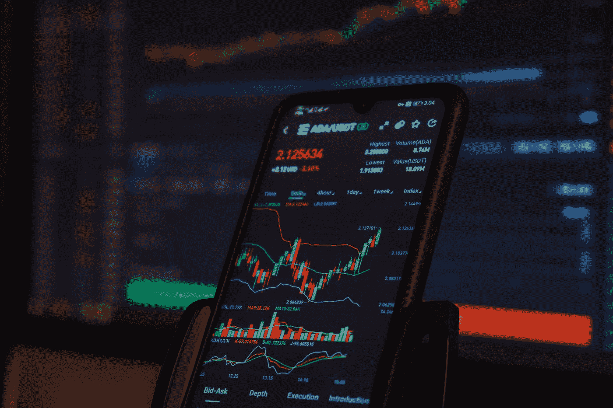

# 卡尔达诺到底是什么？

> 原文：<https://medium.com/geekculture/what-the-heck-is-cardano-3bfd3be019d1?source=collection_archive---------4----------------------->

## 这是你的 ADA 101 课程，以及它与比特币&以太坊有何不同。

Photo by [Sajad Nori](https://unsplash.com/@sajad_sqs9966b?utm_source=medium&utm_medium=referral) on [Unsplash](https://unsplash.com?utm_source=medium&utm_medium=referral)

# 一些背景

嗨，又是我。我通常写的是过简单的生活，做有意义的工作。但我也算是一个极客，所以偶尔我会写一些关于个人金融和(对书呆子来说更令人兴奋的)加密货币的文章。