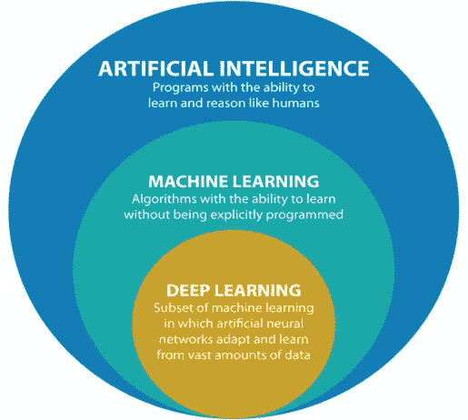
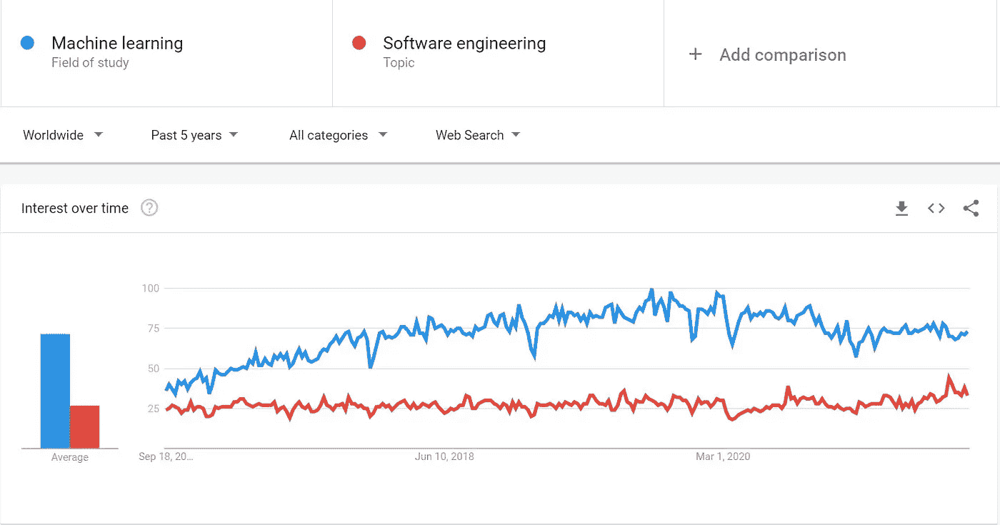
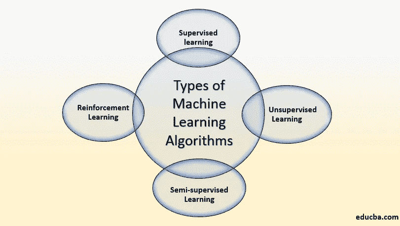

# “机器学习”到底是什么？{解释时没有一个等式}

> 原文：<https://medium.com/geekculture/what-the-heck-is-machine-learning-explained-without-a-single-equation-760b104978ca?source=collection_archive---------44----------------------->

有哪个术语能比“机器学习”更好地定义自己吗？这个术语字面上描述了它自己。用最简单的话来说，机器学习就是教机器如何执行任务并从中学习。再补充一点，它是一个过程，通过这个过程，人们可以要求机器(通常是计算机设备)重复多次执行某个任务，然后从这些任务中学习，并随着时间的推移提高性能。它是在教机器如何像人一样行事，以防我们忘记，以便有人提醒我们。除了笑话，它基本上是教机器学习和改进，类似于我们人类如何学习执行一些任务，然后逐渐提高效率。

亚瑟·塞缪尔被认为是 1959 年提出“机器学习”这个名称的，他通常被认为是这个领域的创始人。他是第一个成功教会机器执行一些任务(在这种情况下是玩跳棋)而不告诉它如何做的人。随着时间的推移，机器越来越有经验，并最终成为一个比亚瑟自己更好的球员！从那以后，这个领域有了长足的发展。

机器学习涉及计算机发现如何在没有明确编程的情况下执行某些任务。它使用历史数据，然后使用一些繁重的数学和统计建模和算法来执行任务。微积分、线性代数等数学概念以及概率等统计概念是机器学习的支柱。有人可能会说，机器学习是伪装的统计学。

ML(从现在开始，我将机器学习简称为 ML)属于 AI，人工智能的大范围内。人工智能又是不言自明的，它意味着模仿人类智能，赋予机器或机器人像人一样思考的能力。人工的意思是机器不拥有大脑，所以我们人为地给它们提供一个工作机制，像人脑一样工作。AI 之下也落了深度学习。深度学习也是 ML 的一个子集，它处理人工神经网络(现在不需要担心这个)。这是一个相对较新的领域。下图更有效地展示了这种关系。

过去的十年比以往任何时候都更加普及了 ML。如果你认为“软件工程”是计算机科学中最受欢迎的分支，那么你将会大吃一惊。

Img Source : Google Trends

这是最近 5 年来 ML 和软件工程的流行趋势。很明显，ML 是编程和计算领域的新热点。

你可能没有意识到，但 ML 就在你身边。如果你拥有一台电子设备，那么你很有可能遇到过 ML 技术。它有从家用电器到医疗保健的各种应用。由于其广泛的应用，它仍然是计算机科学的头号研究领域。

现在让我们更深入地了解 ML 的确切构成。

正如我们之前讨论的，ML 使用过去的数据来评估新数据的结果，然后应用一些算法来评估结果。通常，我们称这些数据为“训练数据”。该模型建立在该数据的基础上，并且该部分可以被构造为机器的学习，因为它识别不同的特征并从中学习。现在不测试你学了什么，你实际上无法量化你学了什么。电脑也是一样。“训练”完成后，我们将一些从未见过的外来数据输入计算机，测试计算机实际学习了多少，并根据这些“测试数据”衡量其性能。

算法是那些实际上执行复杂任务的算法，帮助机器学习，然后将其嵌入到它们的存储器中。算法的选择通常取决于问题陈述(我们试图实现什么)、数据类型和期望输出的类型。让我们简单地讨论主要的最大似然算法，而不去讨论它们背后复杂的数学。

Img Source : Google Images

1.  **监督学习算法—**

这是最常见和最广泛使用的 ML 算法。这基本上意味着有一个控制值提供给我们，让我们检查我们对训练数据的预测输出的健全性。在我们的数据集中，我们通常有两种变量——自变量和因变量。自变量(也称为*特征，属性*)基本上是现象背后的潜在因素或属性。因变量是正在研究的最终结果或现象。让我们借助一个例子来理解这一点。假设我们想建立一个模型，帮助我们找到一把吉他的价格，给我们 1000 把吉他的价格，以及影响吉他价格的一些因素，如木质材料、琴弦材料、尺寸、制造商等。这里，影响价格的因素是自变量(或特征),这 1000 把吉他的最终价格是因变量，因为价格取决于这些因素。如果我们假设改变某个特性的价值，那么它将对应于价格的变化。

在监督学习算法中，我们有这个因变量的值(或者我们可以说我们有**标记的数据**)。在该算法中，我们试图在特征和最接近因变量实际值的预测输出之间找到合适的映射。在这里，因变量起控制作用，以防止实际值和预测值之间出现较大差异。

在监督算法下，还有另外两个分支——回归和分类。当我们想要预测一些连续的值时，就使用回归。就像上面给出的例子，我们试图预测吉他的价格，所以这是一个回归问题。吉他的成本是一个连续的数值。另一方面，分类用于将对象区分和分组到类中。当我们希望输出是一个类别而不是一个数值时，就使用它。再次回顾吉他的例子，如果我们想确定哪种类型的木材用于制造特定的吉他，而不是价格，那么我们将使用分类。但是在这种情况下，我们的数据集看起来会有所不同。

**2。无监督学习算法—**

无监督学习算法在一个主要方面不同于监督学习算法。我们没有因变量的分数。最终结果缺失/不可用，仅给出特征(数据为**未标注**)。在这种情况下，在做出任何预测之前，机器必须首先对数据得出自己的结论。这是通过在我们的数据中寻找模式或聚类来完成的，以查看它们是否在某些方面相似。

无监督学习有两个部分——聚类和降维。聚类意味着将具有相似属性的数据点分组在一起，使得一个组中的所有点相似，而不同组中的点不相似。顾名思义，降维旨在减少输入变量的数量，以提高模型的准确性。大量的特征会导致模型以不受欢迎的方式运行。

最后一大类算法是强化学习。

3.**强化学习算法—**

强化学习是基于奖励期望的行为和/或惩罚不期望的行为的 ML 训练方法的一个分支。这类似于孩子们因为做了不恰当的事情而被责骂，比如玩泥巴或躺在地板上，而因为问候长辈等事情而被奖励(我不记得我因为如此有限的例子而被责骂或奖励了什么，但我希望你明白这一点)。一般来说，强化学习代理能够感知和解释其环境，采取行动，并通过反复试验来学习。强化学习的主要应用是自动驾驶车辆，在这种情况下，我们会奖励机器一些适当的动作，并在动作不好时责骂它。就像在自我学习的汽车中，当机器在红灯前停下来时，这被归类为良好的行为，机器从中学习，并将这种行为灌输给未来的驾驶，而像闯红灯或超速这样的行为是不受欢迎的。

半监督学习算法是监督学习和非监督学习的融合，其中模型从标记的数据中学习，并对训练数据的某些部分进行聚类。它没有被广泛使用。

讨论的最后一个主题是监督学习算法中涉及的步骤。它们非常标准和简单。优选的执行顺序是

1.  定义你的问题陈述——弄清楚你想用这个模型达到什么目的，并弄清楚你想要什么类型的输出。
2.  预处理数据——这意味着清理数据、执行 EDA、处理缺失值等。
3.  将数据拆分为训练数据和测试数据-清理后的数据集应划分为两个没有重叠值的数据集。训练在训练集上进行，测试在测试集上进行。
4.  训练你的模型——这是你通过算法训练你的机器的地方。
5.  评估你的模型——这基本上意味着在测试集上测试你的模型的性能，看看它有多准确。
6.  改进模型-这是您微调模型以提高其性能和准确性的时候。在一个 ML 项目的生命周期中，步骤 4、5、6 通常要执行不止一次。
7.  部署——现在您的模型工作得很好，接下来是时候为其他用户部署它了，然后实时监控它，看看部署后是否会出现一些不可预见的错误。

谢谢你坚持到最后。祝你的 ML 之旅一切顺利。