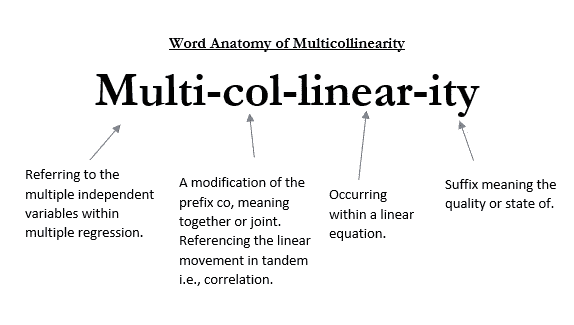
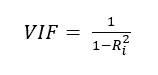
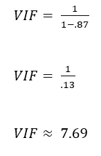
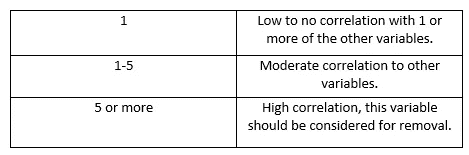

# 多重共线性到底是什么？

> 原文：<https://medium.com/geekculture/what-the-heck-is-multicollinearity-c5582ddbb2f7?source=collection_archive---------28----------------------->

多重共线性的对象、位置、时间、内容、原因和方式。

# 世卫组织

*多重共线性*是多元回归特有的现象，当两个实际上应该独立的变量具有高度相关性时，就会出现这种现象。[1]这场争论的关键是他们*应该*独立。拥有不独立的变量会产生偏差。特别是如果相关性非常高，它会导致分析师曲解结果。这是一个非常快速的概述，所以让我们再细分一下。

# 在哪里

在现实世界中，这种情况会发生在哪里？收集相似的特征允许公司跟踪特定的细节以及这些细节随时间的变化。在进行预测的实例中，当尝试构建预测模型时，特征之间的这种相似性会导致问题。可能出现多重共线性的一些常见数据实例包括:

*   医疗数据
*   住房数据
*   就业信息
*   教育评估
*   财务习惯

# 当...的时候

多重共线性何时出现？如前所述，当两个应该独立的变量沿着相同的线性趋势移动时，就会发生这种情况。如果有两个变量应该用于预测另一个变量的结果，但同时可以用于预测彼此，则存在多重共线性。[3]

下面是华盛顿州国王县住房数据集中的所有列名和描述。从下面看，有四个特征可以告诉我们不同的有用的东西，但都是高度相关的:平方英尺的居住空间，平方英尺的地段，平方英尺以上(无地下室)，平方英尺的地下室。我们可以假设，随着地下室面积的增加，地下室上方区域的面积也会增加。同样，我们假设房子的总面积将随着这些变量的增加而增加。

住房数据的另一个例子是卧室和浴室。我们假设随着卧室数量的增加，浴室的数量也会增加。有一个 6 间卧室和 1 间浴室的房子会很奇怪。在色域的另一端，一个有 6 个浴室的一居室甚至更奇怪。

*   **id** —为一栋房子唯一标识
*   **日期** —房子被卖掉了
*   **价格价格** —是预测目标
*   **卧室数量** —卧室/房屋数量
*   **浴室数量** —浴室/卧室
*   **sqft_livingsquare** —家的镜头
*   **sqft_lotsquare** —地块的长度
*   **楼层总数** —室内楼层
*   海滨——可以看到海滨的房子
*   **视图** —已被查看
*   **状况** —状况有多好(总体)
*   **等级** —根据金县等级系统，给予住房单元的总体等级
*   **sqft_above** —除地下室以外的房屋面积
*   **平方英尺 _ 地下室** —地下室的平方英尺
*   **yr _ build**—建造年份
*   **yr _ recruited**—房屋装修的年份
*   **邮编** —邮编
*   **纬度** —纬度坐标
*   **long** —经度坐标
*   **sqft_living15** —最近的 15 个邻居的室内居住面积
*   **sqft _ lot 15**——最近的 15 个邻居的土地面积

# 什么

我们用什么来衡量回归问题中多重共线性的存在。相关矩阵和方差膨胀因子将是检查多重共线性是否存在的两个最有用的策略。

***关联矩阵*** —关联类似于热图。创建时，矩阵会根据两个特征的相关程度分配一系列颜色。以下是基于住房数据的数据集中的要素的关联矩阵。比较像卧室和浴室这样的特征可以解释左上角的一小块蓝色。

***方差膨胀因子—*** 方差膨胀因子是一种量化模型运行时方差被膨胀了多少的方式。我有一个以前的帖子，在那里我介绍了方差，可以在这里找到。偏离预测模型的误差或方差随着多重共线性的出现而增大。多元回归模型中的每个预测值都有一个方差膨胀因子。[2]

决定系数(或 R 的平方)是一个测量单位，用于帮助测量 VIF。这个指标告诉我们模型解释了多少差异。R 的平方值是一个介于 0 和 100 之间的数字。它通常从 0 到 1 计算，或计算到第一百位小数，即 87%将是 0.87。[4]

这就是棘手的地方。然后在 1 或更高的等级上计算 VIF。这到底是怎么回事？让我们继续以 R 的平方值为 0.87 的变量为例。下面是它的方差膨胀因子的计算。

Formula for Variance Inflation Factor

解释 VIF 的一般指南如下:

看上面的图表，如果我们计算的 VIF 与现实生活中的变量相关，我们应该考虑将其从最终模型中移除。

# 为什么

为什么会产生问题？更具体地说，为什么它会导致方差膨胀？从数学上对此的解释变得极其复杂，我不知道我现在是否有资格去解释它到底为什么会发生。我可以告诉你一些事情。你有两个相互冲突的独立变量。这些变量本身对模型的影响可能很小，甚至没有影响，但是它们相互结合起来可能会增加对模型的影响。回到有多个平方英尺的记录；如果一个家庭的平方英尺的形式被记录 4 次，它可能会对该变量产生偏差。该模型不是一个人，可以辨别这些都是基本相同的测量。

# 怎么

我们如何解决这个问题？删除列是这里显而易见的答案，但不一定总是正确的。选择要删除的列很重要。VIF 分数应该可以很好地指示哪些列应该删除。通常的想法是删除其中一个冲突的列。当考虑要删除的列时，确定违规特征描述因变量结果的相似程度非常重要。

# 关闭

我记得当多重共线性第一次被引入时，它对我来说是一个谜。我觉得我的大脑无法理解它，即使是现在，我仍然有时间停下来思考它的数学含义。为简单起见，你可以说这只是当两个独立变量过于密切相关。然而，这一定义并没有公平对待这一概念。

# 参考

[1][https://statisticsbyjim . com/regression/多重共线性-回归-分析/](https://statisticsbyjim.com/regression/multicollinearity-in-regression-analysis/)

[2]https://online.stat.psu.edu/stat462/node/180/

[3]https://www.statisticshowto.com/multicollinearity/

[4][https://statisticsbyjim . com/regression/interpret-r-squared-regression/](https://statisticsbyjim.com/regression/interpret-r-squared-regression/)