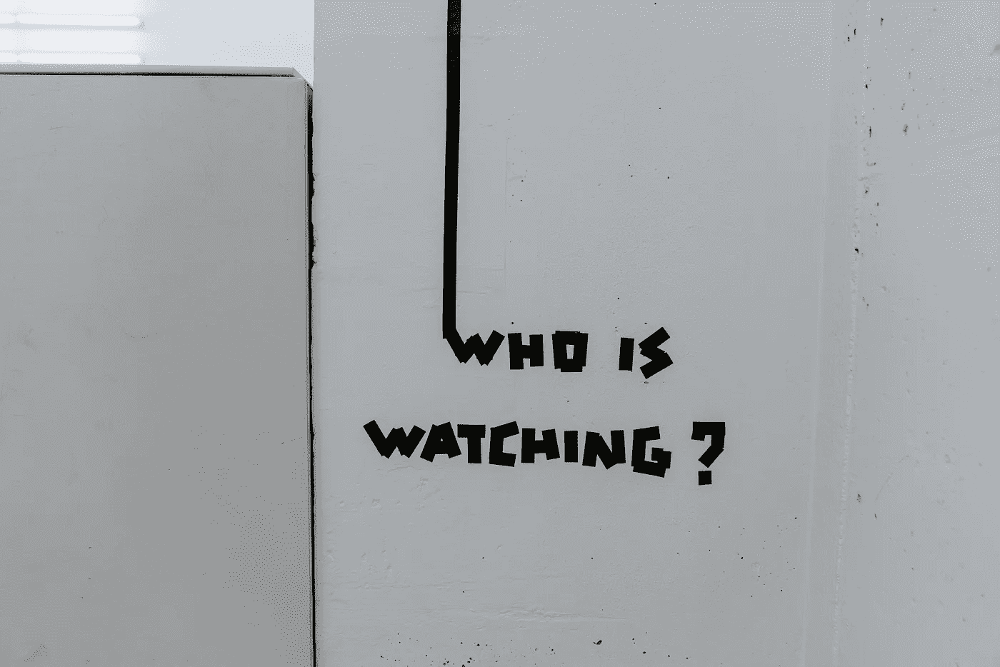

# 苹果新隐私规则对 iOS 产品意味着什么

> 原文：<https://medium.com/geekculture/what-the-new-apple-privacy-rules-mean-for-ios-products-968e2401d8fb?source=collection_archive---------16----------------------->

## iOS 14.5 将如何影响使用分析、广告或跟踪的应用

Photo by [Claudio Schwarz | @purzlbaum](https://unsplash.com/@purzlbaum?utm_source=unsplash&utm_medium=referral&utm_content=creditCopyText) on [Unsplash](https://unsplash.com/s/photos/surveillance?utm_source=unsplash&utm_medium=referral&utm_content=creditCopyText)

作为一名与客户合作开发移动战略和应用程序的顾问，我一直在密切关注新的苹果隐私规则。到目前为止，它们很受用户欢迎，所以它们看起来会一直存在下去。如果您的企业是建立在…