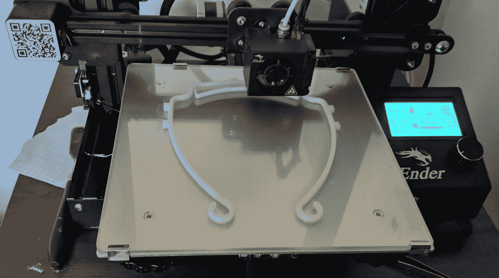

# 疫情告诉我们关于 3D 打印的未来

> 原文：<https://medium.com/geekculture/what-the-pandemic-taught-us-about-the-future-of-3d-printing-ce74dae496a0?source=collection_archive---------9----------------------->

## 3D 打印机是制造业的下一个重大范式转变吗？

Photo by author (taken in 2019)

# 介绍

2019 年-2020 年初，3D 打印面罩有一个大趋势，即捐赠给医院、当地企业或供个人使用。你可以在这里找到更多信息: