# 2021 年圣诞节买什么——苹果版

> 原文：<https://medium.com/geekculture/what-to-buy-for-christmas-2021-apple-edition-999858c58beb?source=collection_archive---------19----------------------->

我们只有几个星期的时间，所以来获得一些最后一分钟的想法！

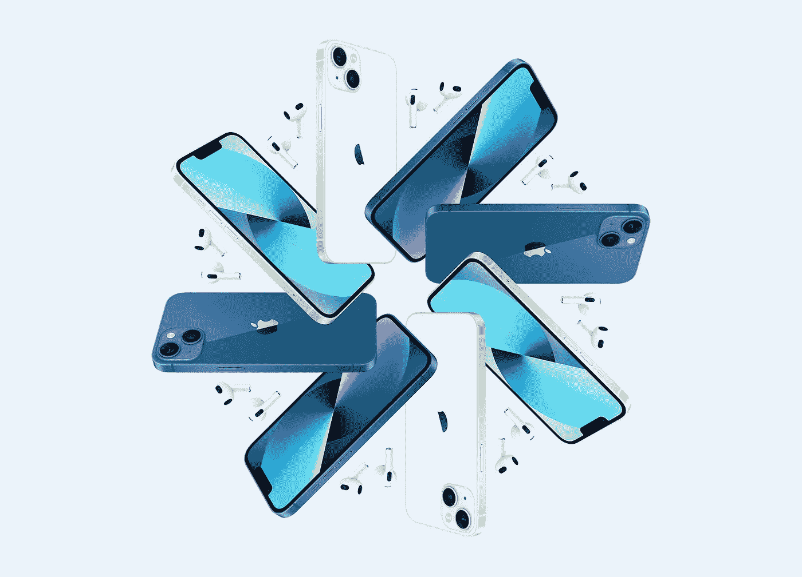

我想我会在这个圣诞节提供一些关于苹果最超值产品的建议，希望能给你一些想法。

**iphone 手机**

**iPhone 12** 仍然是我认为的 2021 年最物有所值的 iPhone，其次是 **iPhone SE** ，适用于那些只需要一部 iPhone 来完成基本功能，如发消息或拍照的人。

iPhone 12 和 iPhone 12 mini 仍然拥有最新的设计，有机发光二极管显示屏，A14 SoC，5G，无线充电和一流的摄像头。iPhone 13 是一款很棒的设备，但它确实没有太多更高的价格，所以我仍然推荐去年的型号。

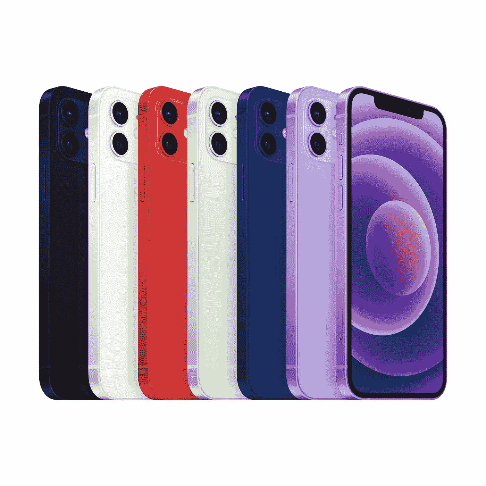

**iPhone 12 and 12 mini.**

5.4 英寸的 iPhone 12 mini 起价为 599/ 579 美元，6.1 英寸的 iPhone 12 起价为 699/ 679 美元，SE 的起价为 399/ 389 美元，我明白，价格相差很大，但我们在这里谈论的是苹果产品，谢天谢地，他们出售的手机价格低于 1000 美元以上，这些在中低端价位上都给了你很好的选择。

然而，与 iPhone SE 相比，这些是非常不同的，价格会显示这一点。SE 比 6.1 英寸的 iPhone 12 便宜 300 美元，但设计和规格看起来也有点过时，12 和 12 mini 有更大的有机发光二极管显示屏和 face ID，这要归功于现代的新设计，而 SE 有 2014 年的设计，脂肪多汁的边框，无线充电和带 touch ID 的 4.7 英寸 LCD 显示屏。

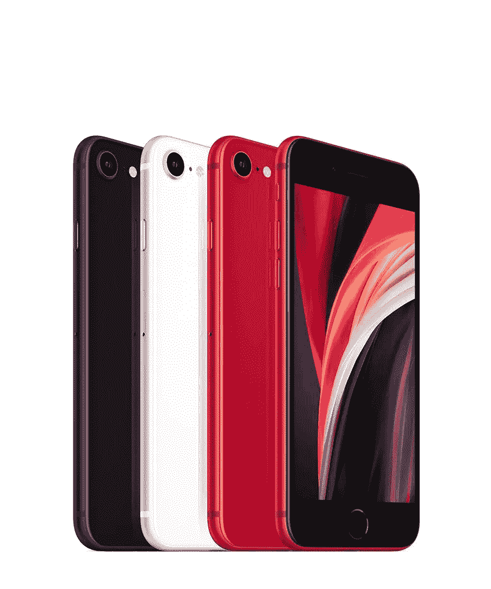

**iPhone SE.**

有了 12，你会得到一个现代规格和设计的伟大全能，但与 SE 相比价格较高，SE 的价格很高，但设计非常过时。

对于任何想要升级或完全接触 iOS 的人来说，这些都是令人惊讶的礼物，只是你的预算或屏幕尺寸偏好将决定你最终的选择。

**手表**

就价格而言，Apple watch SE 仍然是一款出色的 Apple watch，售价为 279 美元/ 249 美元，比 Series 7 便宜 120 美元，只是在更大的常亮显示、血氧和心电图应用上输了，许多人可能永远不会使用这些应用。

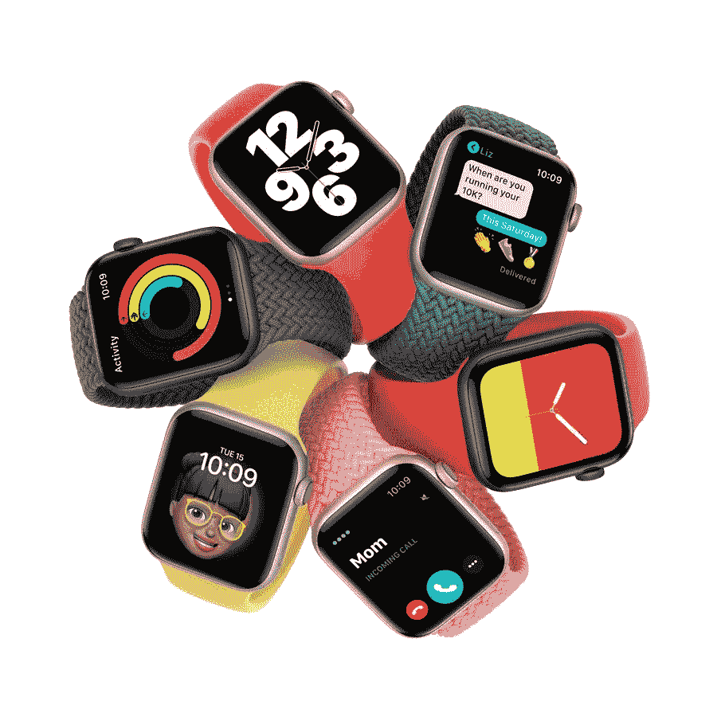

**Apple Watch SE.**

这基本上是一个更新的系列 4 运动模型，并在太空灰，银和金。

然而，Series 3 仍然以 199/ 179 美元的价格出售，但它的**现在已经过时了，无法想象它会再有一两年以上的更新，而 SE 应该会给你至少 3 到 4 年的更新，并且它有一个更新的设计。**

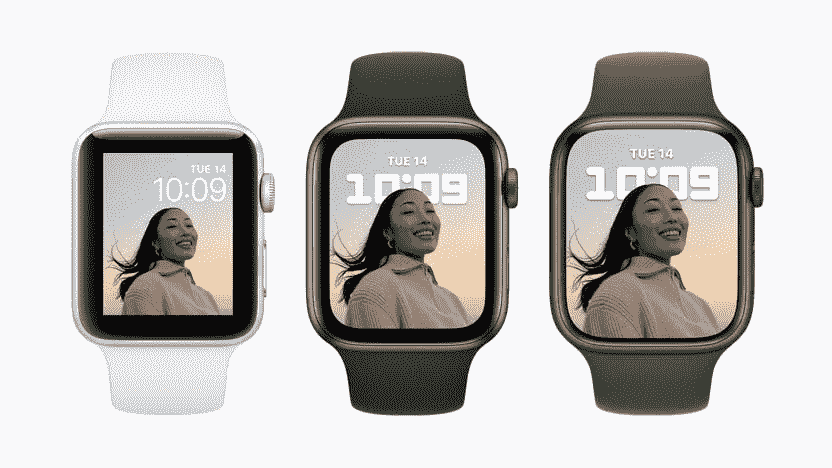

**Apple Watch Series 3, SE and Series 7 comparison.**

但话说回来，如果你是为你的孩子买的话，系列 3 可能适合你的孩子，并且会是青少年使用的很好的健康追踪器。

**花蕾**

这些是稍微贵一点的长袜填充物，所以我会把它们保持在 200 美元以下。

我们正处于一个真正的无线蓝牙耳塞的世界，现在耳机插孔正在消亡，所以首先是 Beats Flex，他们有电线将耳塞相互连接，所以他们不是真正的无线耳塞，但他们有 W1 芯片，可以像 AirPods 一样立即连接到 iPhone。

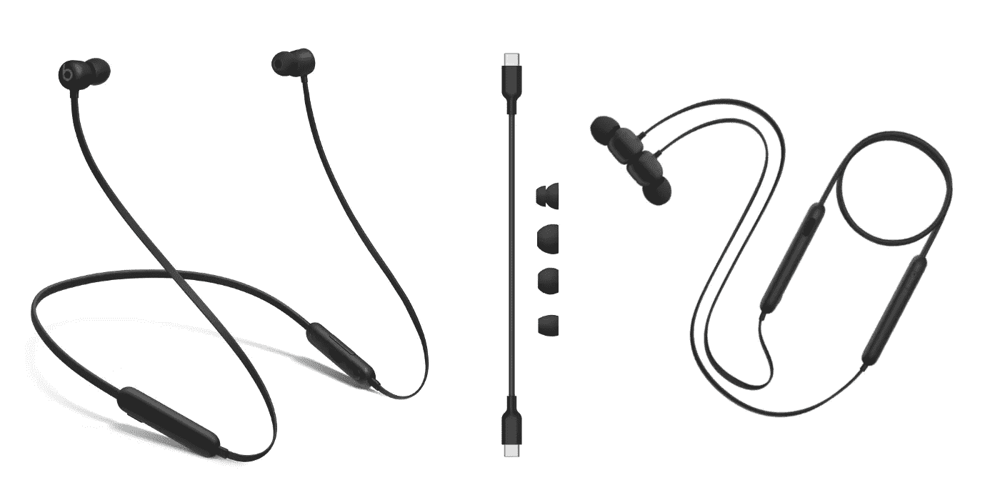

**Everything included in the Beats Flex box.**

Beats Flex 售价 69/ 59 美元，是苹果最便宜的无线耳塞，低于苹果 129/ 119 美元的 AirPods 2。

我的其他选择是低于 200 美元并无缝连接到苹果设备的真正的真正的无线 buds 是 AirPods 2，Beats Studio Buds，Beats Fit Pro 和 AirPods 3。

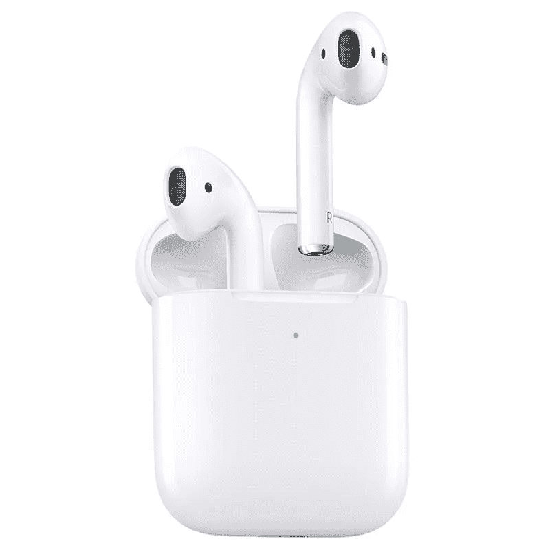

**AirPods 2**

AirPods 2 的价格是 129/ 119 美元，现在已经超过 2 年了，在设计上看起来过时了，就个人而言，如果这是我的价格点，我会以 149/ 129 美元的价格购买 Beats Studio Buds，因为它们有主动噪音消除，透明模式和更紧凑的现代设计。

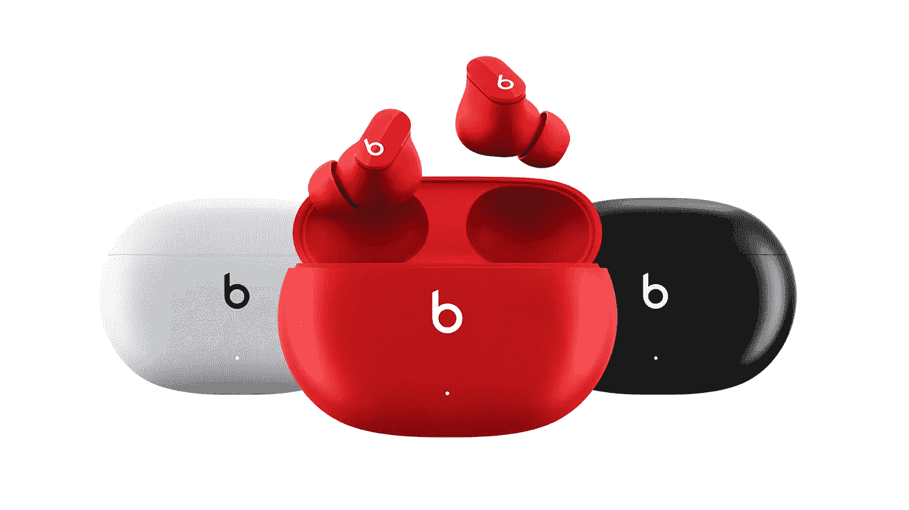

**Beats Studio Buds.**

然后我们开始用 Beats Fit Pro 和 AirPods 3 爬上价格阶梯， **Beats Fit Pro** 像 Studio buds 一样带有 ANC 和透明模式，但它们也有翼尖，空间音频，价格为 199 美元(目前仅在美国)。

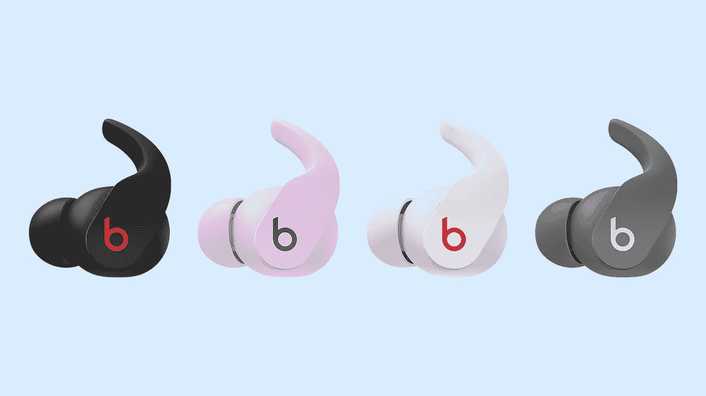

**Beats Fit Pro**

最后，AirPods 3 可能是最受欢迎的一款，价格为 179 美元/ 169 美元，采用了新的设计，空间音频，无线充电，MagSafe 充电支持和自适应均衡器。

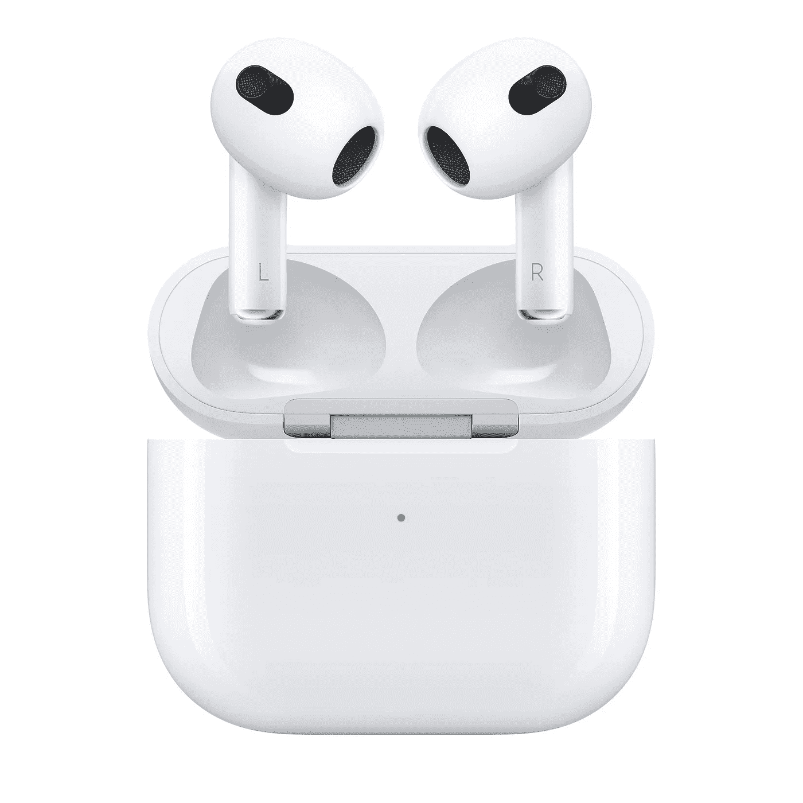

**AirPods 3**

就音质而言，我上面提到的四个中的任何一个都不会错，但我认为 Beats Fit Pro 是最好的声音，如果你不想花那么多钱，那么 Beats Flex 是进入无线 buds 的一个很好的入口。

我个人选择的是 Beats Studio Buds 或 AirPods 3，价格适中，根据你的需求提供良好的混合功能。

**iPad**

这是一个棘手的问题，iPad Air 和 iPad 9 代是很棒的机型，对普通用户来说确实很棒。

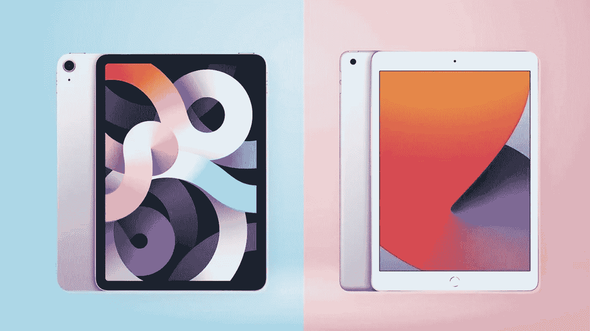

**iPad Air and iPad 8th Gen.**

这两个都不会错，但我相信 iPad Air 是两者中最好的，对我来说这又一次归结于设计和规格，我认为 Air 将持续多年，因为它有最新的芯片和设计，而 iPad 9 代有非常过时的设计和旧芯片。

然而，我认为 iPad 9 代是老人或孩子的最佳设备，其基本设计、10.2 英寸显示屏、Apple Pencil 支持和更低的规格更适合他们的使用。它的起价为 329/ 319 美元，对于入门级 iPad 来说，这是一个很好的价格点。

起价 599/ 579 美元的 iPad Air 支持 Apple Pencil 2，可以连接到 iPad Air 的侧面进行充电，如果你愿意，还可以连接[苹果魔法键盘](https://www.apple.com/shop/product/MJQJ3LL/A/magic-keyboard-for-ipad-pro-11-inch-3rd-generation-and-ipad-air-4th-generation-us-english-white)。

以更高的价格，您将获得更好的设计、更新的芯片、更大更亮的 10.9 英寸显示屏、电源按钮上的 touch ID、配件支持和摄像头。

那么如果你不想要一个大的 iPad 呢？你可能想要一个可以兼做 Kindle 替代品的东西？这样，新款 iPad mini 的起价为 499 美元/ 479 美元，在价格区间上介于上述机型之间。

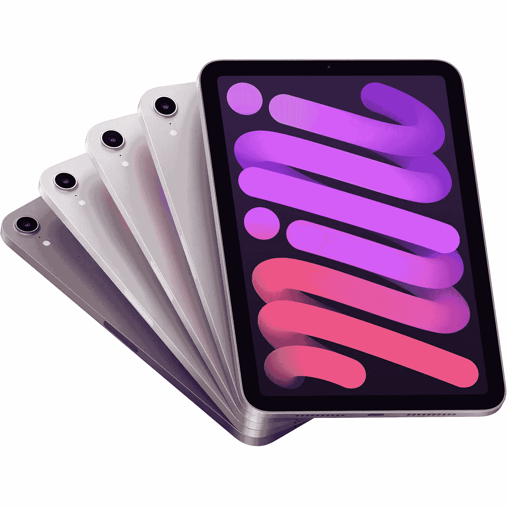

**iPad mini**

它的规格与 iPad Air 非常匹配，但在 8.3 英寸显示屏的较小机身中，你可以获得相同的现代设计，Apple Pencil 2 支持，电源按钮上的 touch ID，配件支持和摄像头，但前置摄像头增加了中央舞台。

**iPad Air** 有银色、太空灰、天蓝色、绿色和玫瑰金可选。

**iPad 9 代**有银色、太空灰和金色三种颜色。

iPad mini 有星光、紫色、粉色和太空灰四种颜色。

那么我们只剩下…

**配件**

**HomePod**迷你

HomePod 迷你售价 99/ 89 美元，是一个很好的小扬声器，可以放在家里。如果你不想使用 Siri 或更喜欢 Spotify，你可以让 Siri 直接从 iPhone 播放 Apple music 或 airplay 上的任何音乐。

当你在苹果电视上看东西时，HomePod 迷你还可以充当额外的扬声器。

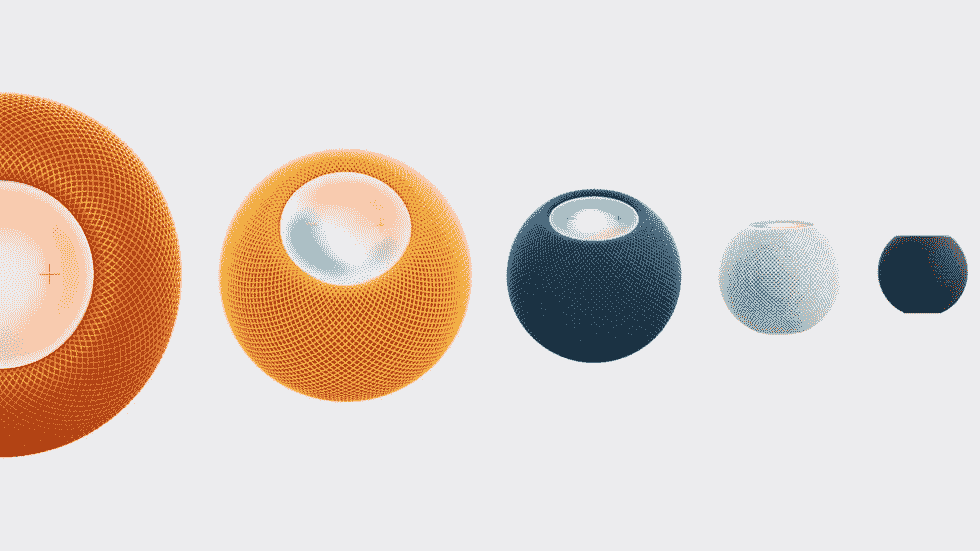

**空中标签**

AirTags 售价 29/ 29 美元，是一种方便的物品，可以挂在钥匙或行李上，如果你的 iPhone 丢失或被盗，可以帮助你跟踪它们，这些是一种不错的小袜子填充物，可以在苹果商店进行个性化设置。

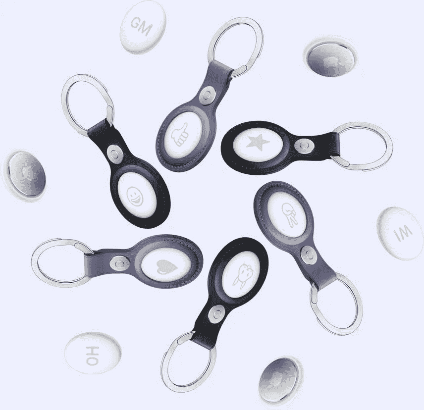

**插头和充电**

Anker Nano 20W brick 是一款很棒的产品，比苹果官方产品略便宜，也更小，更容易携带。

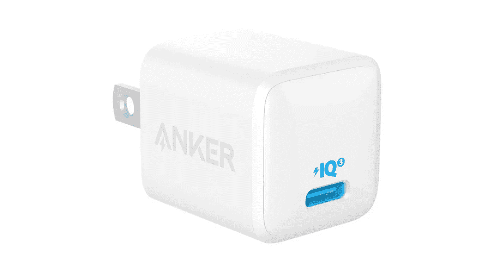

**Anker Nano 20W charger.**

你可以在亚马逊[这里](https://www.amazon.co.uk/stores/Anker/AnkerNano/page/1616ADC1-A824-4193-B7DC-CAB090281BDD)或者从美国、欧盟和英国的 [Anker direct](https://uk.anker.com/products/anker-nano) 找到它。

无线充电也是给你的新 iPhone 或 AirPods 3 充电的另一个好方法，这个有点棘手，因为 iPhone 12 系列的标准 Qi 无线充电充电 7.5W，MagSafe 充电 15W，这是苹果新的无线充电器，售价 39/ 39 美元，但仍然需要单独出售的 20W 充电砖。

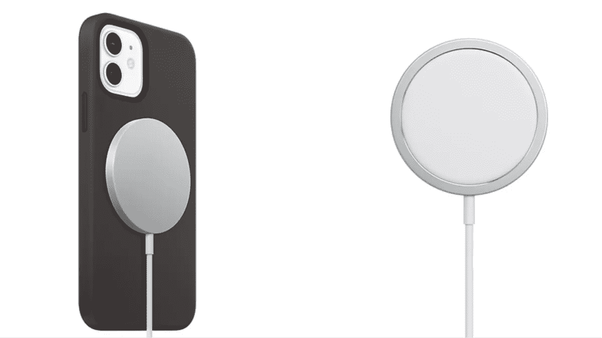

**MagSafe Charger**

MagSafe 充电器在这里[有售](https://www.apple.com/shop/product/MHXH3AM/A/magsafe-charger)售价 39 美元，你可以将它与上面的 Anker Nano 20W 或苹果官方$20/ 20 20W brick 配对。

就这样了，朋友们，我会给你们留下今年我最喜欢的苹果圣诞精选…

黑色的 6.1 英寸 iPhone 12，星光的 iPad mini，太空灰的 Apple Watch SE 和 Beats Studio Buds 或 AirPods 3。

我希望这对你有所帮助，或者至少给你一些启发，节日快乐！

