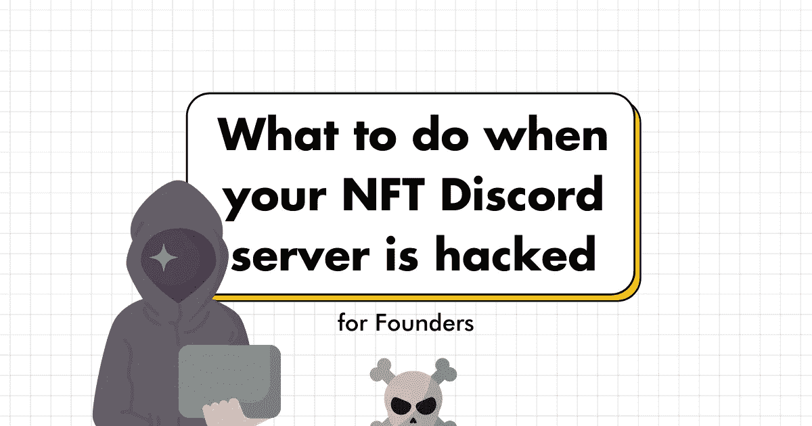
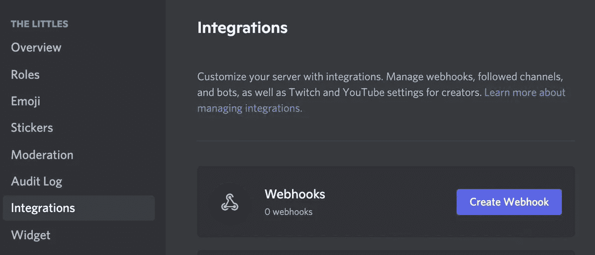
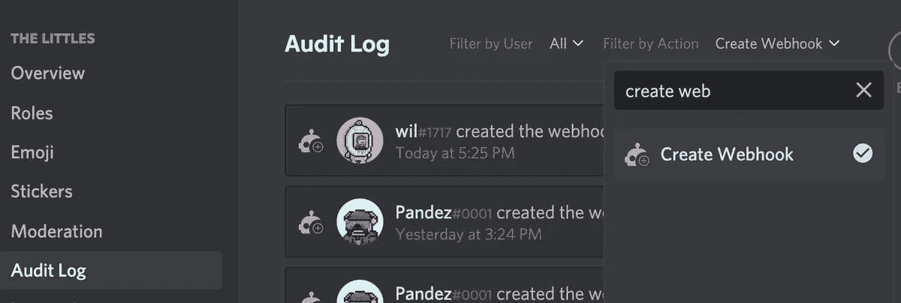

# 当你的 NFT 不和谐服务器被黑客攻击时，创始人该怎么办

> 原文：<https://medium.com/geekculture/what-to-do-when-your-nft-discord-server-is-hacked-for-founders-9a2751d4d066?source=collection_archive---------10----------------------->

Graphics by author

你有你的 NFT 收集所有设置和你越来越接近薄荷日期和骗子和攻击进来，你感到不知所措。好吧，这种事经常发生在大多数 NFT 收藏上，不和谐不是最好的选择，但这是我们唯一的选择。

当你的不和谐被破解时该怎么办:

# 让我们按时间顺序分解一下:

**当**你被黑
后你被黑
防止你被黑

# 1.当你被黑客攻击时

> “我活下来了。我会再活下来的。”

这是你开始缩小视野的时候。你最大的噩梦实现了。你必须呼吸。你必须思考。你必须表演。如果你感到恐慌，那么你对你的社区有什么期望？

这是你要按顺序遵循的指南。

## 沟通

-在 Twitter 上告诉你的社区，你的不和谐已经妥协，以尽量减少损失。
-通常情况下，黑客会不和谐地关闭所有形式的通信，因此不会发出警告。

## 控制

-现在大多数黑客都是通过一种叫做“ *webhooks* ”的东西进行攻击的。基本上，黑客在你的家中安装一个遥控器来窃取控制权，并在你的渠道中发布假冒的 mint 站点
**你的工作是删除遥控器，但如何做到呢？**

-转到您的服务器→服务器设置→集成→ webhooks →选择并全部删除。

-通过这样做，你应该能够阻止黑客发布消息。
你还没有脱离困境，**你必须通过创建新的网页钩子**来找到黑客，但是怎么做呢？

-进入您的服务器→服务器设置→审计日志→按操作过滤(右上)→输入“创建 webhook”
-这将允许您找出是谁的帐户被入侵并创建了这些 web hook。这是黑客居住的地方。
-暂时禁止此人。

## 喘口气

黑客现在出来了。伤害已经造成了。你真正的工作现在开始了，因为你让每个人都依赖你。保持坚强。

## 沟通

-没人知道发生了什么。大家都很害怕，没有方向。保持沟通是至关重要的。
-恢复你的公告和常规聊天频道。告诉你的社区，你重新控制了局面，并将保持沟通。

> -不要鬼。不要过度承诺。不要回避问题。

## 审核您的服务器

这时候你应该有来自四面八方的消息来帮助你。找一个你信任的人来帮助你审计服务器，确保它是完全干净的。一旦你 100%清楚了，你就可以开始下一步了。

## 准备行动计划

-想出一个关于你如何计划处理这种情况的行动计划
-协调损害，寻求解决方案，预防协议，全面审计。
-这是我们的计划。

## 再次沟通

-在未来的日子里，会有很多重建，很多问题，很多压力。
-不管你的决定如何，尽可能透明地沟通是你的责任。永远不要欺骗你的社区，他们应该参与进来。

# 2.在你被黑之后。

——沟通，过度沟通，不断沟通。如果你或你的团队可以的话，给每一个受害者发信息或打电话。你崩溃了，他们一样，如果不是更多的话。移情和同情是你最好的朋友。

> 这确实是一个展示你的领导能力的时候了。

没有隐藏，你必须凭直觉去领导。我可以告诉你有一个答案，但没有正确的答案，因为你不能满足每个人。

此外，*没有路线图*，因为这是一个未知的领域。

想想你的社区
想想你的受害者
想想你自己

# 3.防止被黑。

## 服务器所有者应该做什么

-确保您是服务器所有者。
-你可能不是服务器的创造者，但你必须告诉创造者将所有权转让给你，这样当事情变糟时你可以采取正确的行动

## 版主需要什么许可

-只允许几个经过挑选的可信的人访问。大多数 mod 不需要完全许可
——即使如此，队友仍然是人类，因此总有办法进入。不管是社会工程还是新技术，我们都必须保持警惕

## 为什么你需要一个以上的版主

-总是有足够的覆盖所有时区，所以如果有任何事情发生，你会立即得到通知，并可以采取行动。
-给你的几个可信任的模块一条直线，确保他们能联系到你。
-永远不要有单点故障，并设置冗余

## 为什么要避免隐形掉落

-如果你在考虑这个，忘了它吧。除了创造一个不健康的信息环境，让人们冒着失去时间和金钱的风险，我不明白为什么这是一个可以使用的策略。
——所以任何隐形掉落都可以被看做是骗局。

## 为什么要提醒社区官方链接

-提醒人们只从你的官方网站造币。
-通常，骗子会把人们引导到以其他域名结尾的虚假网站，比如。艺术，。xyz 等。

## 你还能做什么来保证安全

-让机器人每隔 15 分钟提醒公众上述安全协议。永远让社区了解你是如何运作的，这样如果任何事情看起来不正常，你的社区就不会成为牺牲品。

## 结论

对抗骗局/黑客的最佳方式是保持警惕并接受教育。作为这个行业的先驱，我们必须尽我们所能来保持这个空间尽可能的安全，以迎接下一波浪潮。

## 👇评论在一次不和谐的黑客攻击中我们还能做什么？

> 👋**在[媒体](/@pooriaarab)—[LinkedIn](https://www.instagram.com/pooria.arab/)—[Twitter](https://twitter.com/pooria_arab)—[insta gram](https://www.instagram.com/pooria.arab/)—[抖音](https://www.tiktok.com/@pooria.arab)**
> 
> 更多关于 Web3，Crypto，NFTs，DeFi 等的好东西…
> 
> 点击获取 NFT 发布战略

**参考文献**

*   来自 Twitter 的 [Wilxlee](https://twitter.com/wilxlee) 的想法帖子
*   不和谐安全[论坛](https://discord.com/safety/360044104071-Tips-against-spam-and-hacking)
*   不和可以让[被黑吗？](https://streamersplaybook.com/can-discord-get-hacked/)