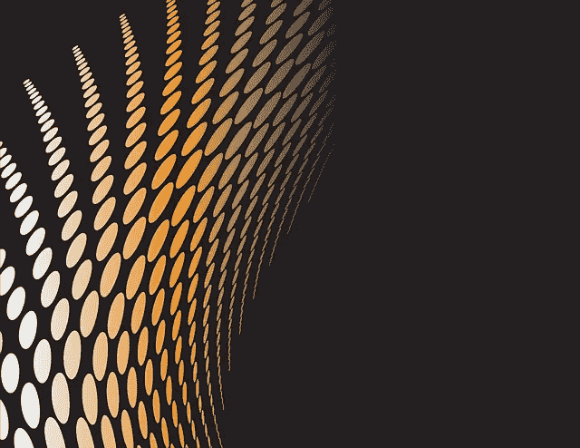

# 和谐(一)有什么价值？—市场疯人院

> 原文：<https://medium.com/geekculture/what-value-does-harmony-one-have-market-mad-house-698b37f11b46?source=collection_archive---------13----------------------->

和谐(ONE) 是一个区块链，是分散自治组织(Dao)的两倍。

事实上，Harmony 向希望成立 Dao 的个人和组织提供了[3 亿美元的资助。另外，Harmony 正在建立一个开放的 DAO 社区。我认为开放的道社区是道的网络。为了支持社区，他们建立了一个 3 亿美元的道赠款基金。](https://www.harmony.one/)

