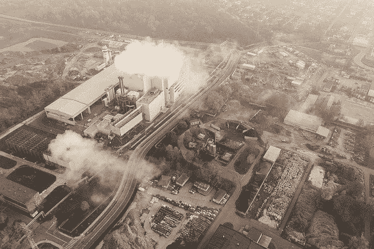

# Chia 加密有什么价值？—市场疯人院

> 原文：<https://medium.com/geekculture/what-value-does-the-chia-crypto-have-market-mad-house-ff86d4670e45?source=collection_archive---------12----------------------->

市场先生对中国(XCH)表现出一些兴趣。【2022 年 4 月 22 日，CoinMarketCap 将第 189 种最大的加密货币 Chia 命名为 65.46 美元的硬币价格。

那么什么是 Chia，它值 65.46 美元吗？Chia 是一个开源的区块链，比**比特币(BTC)** 和**以太坊(ETH)** 更环保。对加密货币最普遍的批评之一是采矿的高能耗。

