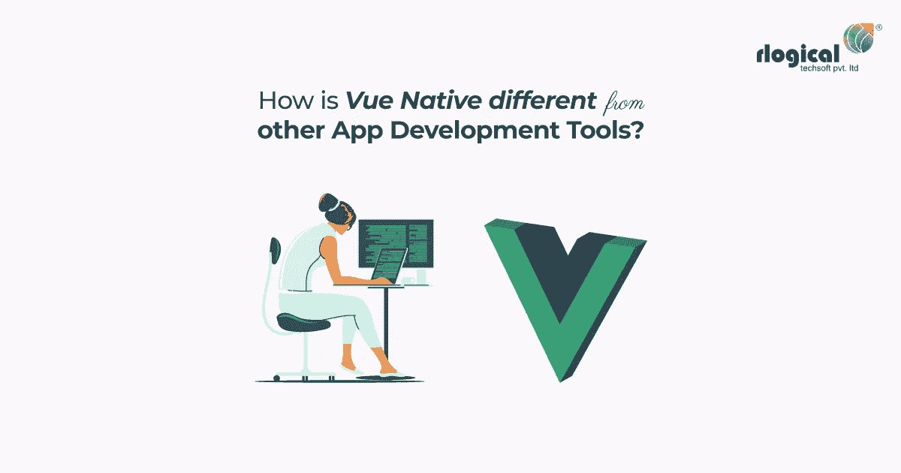
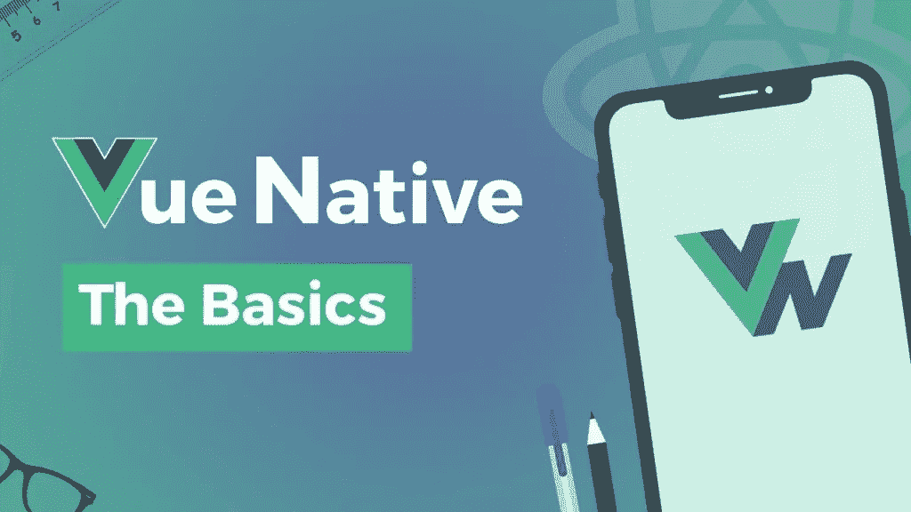
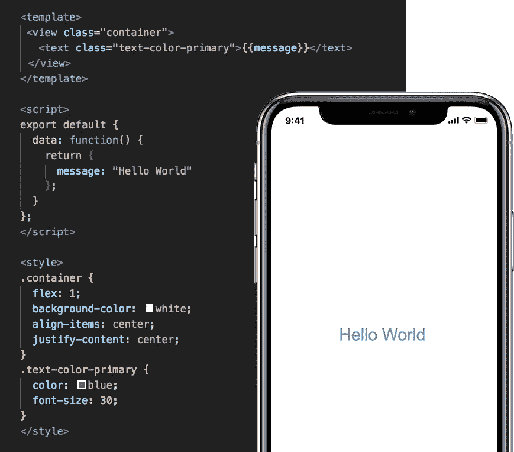

# 你如何将 Vue Native 与其他应用开发工具区分开来？

> 原文：<https://medium.com/geekculture/what-way-can-you-differentiate-vue-native-from-the-rest-of-the-app-development-tools-a3d4f72c1d5?source=collection_archive---------50----------------------->

Vue Native from the rest of the App Development Tools

It 行业持续增长是一个事实，全年都在发生巨大的变化。找出合适的技术来跟上最新的变化是很重要的。**移动应用开发者意识到了这一点。出于这个原因，他们总是期待通过使用创新技术来创建一个移动应用程序，以节省时间和成本。**

**React Native of 脸书是移动应用程序开发领域的一个巨大转变。**它碰巧是第一款帮助应用开发者创建廉价混合移动应用的应用开发工具。

Vue JS 被认为是一个更神奇的工具，在移动应用程序开发人员中变得非常受欢迎，当谈到创建本地和跨平台应用程序时。*[***Vue 原生***](https://vue-native.io/) ***app 开发框架变得流行有很多原因，尤其是在初创公司和新开发者当中。****

# ***你说的 Vue 原生是什么意思？***

**

*What exactly is Vue Native?*

*简单来说， ***Vue Native 恰好是一个基于 JavaScript 的框架，可以帮助使用 Vue JS 创建移动应用。****

*Vue JS 有很多好处，其中之一就是它组织了 UI 开发。此外，Vue JS 专注于视图层，这使得它很容易理解。*

*由于简单的学习曲线，使用 Vue JS 在 JavaScript 中创建原生移动应用已经成为最知名的移动应用开发解决方案之一。*

*如果你**熟悉基于组件的工作流，**你会发现事情**对 Vue JS 相当熟悉。对 Angular 或 React 有丰富经验的移动应用程序开发人员会发现这个特定的框架非常熟悉这些指令。***

*Vue Native 使移动应用程序开发人员能够将更多的时间用于创建样板源代码，而不是编写代码。它是为 JavaScript 的当代移动应用开发而创建的，你可以在短时间内上手。*

*这恰好是一个灵活、简单、轻量级的移动应用开发框架。它被创造性地设计成一个适应性非常强的框架，而且它也很容易与其他库集成。*

*Vue JS 是一个基于 JavaScript 的框架，用于创建 100%访问 API 而不依赖插件的应用程序。它同样允许你**为 iOS 创建移动应用程序以及** [**Android 应用程序开发**](https://www.rlogical.com/mobile-app-development/android-app-development/) **。可以使用 Vue Native 使用 CSS 范围样式的 CSS 来创建您需要的设计。***

*Ivan Yu 在 2014 年创建了这个创新的基于 JavaScript 的移动应用程序开发框架。这是因为提取你最喜欢的有角度的重要部分的概念而诞生的，从长远来看，使它更轻。*

*这个框架为您提供了与其他开发人员共享源代码的能力。目前，许多知名公司都在他们的移动应用开发项目中使用原生脚本。*

> ***必读:** [**Vue 原生:使用 Vue 原生构建移动 App 完整指南**](https://www.rlogical.com/blog/vue-native-complete-guide-to-build-mobile-app-using-vue-native/)*

# ***为什么 Vue Native 被认为是创建原生应用的好选择？***

**

*Benefits of Vue Native*

****Vue JS 有几个你应该理解的好处:****

*Vue JS 被认为是一个被广泛接受的应用，尤其是如果你熟悉 JavaScript、HTML 或 CSS 的话。如果你熟悉所有这些语言，你将有可能**快速开始制作一个跨平台的移动应用。***

*您所做的任何更改都会很快同步，并且您将会遇到更具体的工具来更快地创建 Vue 应用程序。*

*人们可以很容易地将 Vue 与 React 进行比较，因为它使用虚拟 DOM 和 Vue 代码，这些代码已被编译成 React 本机代码。这被认为是快速移动应用程序开发的一个极好的选择。*

*Vue 可以通过跟踪变化和自动更新 DOM 来实现反应性。迅速的速度恰好是 Vue 最显著的优势之一，它将**能够每秒更新和提供数百个 DOM 元素。***

## *总的来说，Vue 有很多好处，包括:*

*易于开始*

*重量轻*

*卓越的文档*

*轻松支持 JSX*

*人们可以用它来代替 jQuery*

# ***为您的企业提供原生移动应用的优势:***

*你的公司可以通过多种方式从选择原生应用中获益。*

*Vue Native 可用于**简化用户界面开发**，从而在很大程度上简化流程。*

*你没有任何关于 Vue Native 的版权问题，因为它是在麻省理工学院的许可下。*

*可以很容易地**定制 Vue Native，以便很容易地将其集成到大型项目中进行前端开发。***

*它们既有效又快速地迎合了客户的兴趣。本地应用程序将允许您推出新的服务、产品、折扣、功能和促销。*

*企业**所有者将能够通过接收地理位置、人口统计和购物相关行为等信息来了解他们的目标受众**。*

*除了有利于数据营销活动，它还将使您能够创建卓越的战略。原生移动应用程序将允许您使用通知与您的潜在受众或客户以及品牌识别建立更多关系。应用程序可以带来大量的销售。*

# ***Vue 原生特性***

*Vue 附带了许多特性，这些特性有助于使它成为应用程序的合适选择。你会遇到许多 [**移动应用程序开发公司**](https://www.rlogical.com/mobile-app-development/) 正在利用这项技术开发富有创新特色的应用程序。*

## ***1。数据绑定***

**

*image : [https://vue-native.io/](https://vue-native.io/) Good example for two-way binding, loops and local data.*

*这恰好是一个帮助操作或分配 HTML 属性值的属性。除此之外，它还有助于改变样式，并利用绑定指令来分配类。这个绑定指令同样可以从 Vue JS 获得。*

## ***2。虚拟 DOM***

*与 Ember 和 React 类似，Vue JS 使用相同的虚拟 DOM。不是对虚拟 DOM 进行某些修改，而是用 DOM 制作一个副本。当数据结构将要被修改时，它与原始数据结构进行比较。最终，所有这些修改都将在实际的 DOM 中重现。*

## ***3。组件***

*该组件恰好是用来创建可在 HTML 中重用的定制元素的基本特性。*

## ***4。动画/过渡***

*使用 Vue JS 时，在虚拟 DOM 中删除、添加或升级时，可以轻松地将过渡应用于 HTML 元素。通过添加第三方动画库可以增加交互性。*

## ***5。计算属性***

*这恰好是计算属性的基本特征之一，即监听对用户界面元素所做的修改所需的计算。*

## *6。路由*

*v-router 支持在页面间导航。*

## *7 .**。Vue CLI***

*通过使用 Vue CLI(命令行界面)，可以在命令行中轻松安装 Vue JS。使用 [**Vue CLI 创建项目没有任何问题。**](https://cli.vuejs.org/)*

# *如何使用 Vue Native 让开发变得更好？*

*这个框架碰巧是开源的。开始使用 Vue Native 时，首先安装 React Native 是非常重要的。*

*在此之后，必须安装 Vue 本地 CLI。 Vue JS 具有状态管理模式和移动应用程序库。*

*中央存储由移动应用程序的每个组件组成。然而，如果你打算**创建一个原生的移动应用，Vuex 可能根本没有必要。***

***Vuex 主要面向中大型 SPA(单页应用)。**如果想更好地处理 Vue 组件外的位置，应选择 Vuex 作为后续步骤。让我们看看下面带有验证和 Vuex 的示例登录应用程序:*

**

*image source: [https://vue-native.io/](https://vue-native.io/)*

*有了 Vuex 的存在，人们就不需要依赖 React 路由器或 MobX 来获得移动应用中的关键组件。 **Vue 可以很好地处理数据绑定，从而帮助** [**手机应用开发者**](https://www.rlogical.com/hire-dedicated-developers/hire-mobile-app-developer/) **从 DOM 的微观管理中解脱出来。**Vue 对此的回答将是一个双向数据绑定反应系统。*

*让我们看看这里的 Hello World 示例:*

**

*image source: [https://vue-native.io/](https://vue-native.io/)*

# ***结论***

*毫无疑问，Vue JS 关心的是如何轻松地将更高的交互性添加到移动应用程序中。这意味着将**创新功能快速引入你的业务移动应用**，这是你的潜在用户或客户会一直重视的。*

*此外，如果你 [**雇佣 Vue 本地开发者**](https://www.rlogical.com/hire-dedicated-developers/hire-vue-native-developer/) ，他们会欢迎使用 Vue 进行移动应用开发，因为它恰好是 JavaScript 框架、**以及来自他们所有人的概念的当代融合，加速了应用开发的过程。***

# *还读出:*

*   *[**Vue 原生与颤振的比较**](https://www.rlogical.com/blog/comparison-between-vue-native-and-flutter/)*
*   *[**Vue 原生 vs React 原生**](https://www.rlogical.com/blog/vue-native-vs-react-native/)*