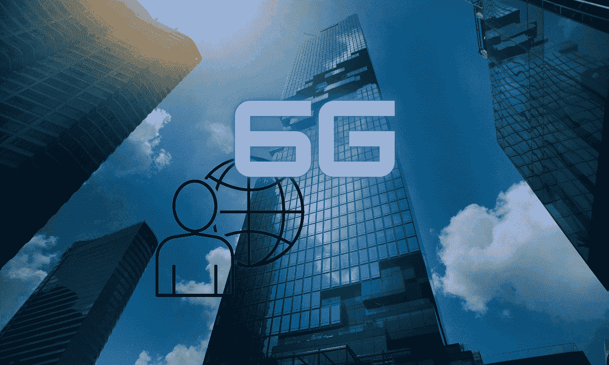

# 5G 之后的下一个会是什么？

> 原文：<https://medium.com/geekculture/what-will-be-next-after-5g-93e5d5cf837b?source=collection_archive---------19----------------------->

## 6G，它可能会比你想象的更快到来

Image created in Canva by the author

5G 要完全实现还有很长的路要走，但这项技术过时后会发生什么？6G 将会到来，而且可能比你想象的要早，因为现在的技术比以前进步得更快。

根据对 6G 实现的一些估计，这一惊人的冒险将在仅仅十年后开始。似乎很早，但想想以下事实，你就可以想象下一代技术将对我们的日常生活产生的影响。

# 从 1G 到 5G 甚至更高

让我们从这个演变的开始说起，这样我们就能更好地理解接下来会发生什么！

[1G](https://en.wikipedia.org/wiki/1G) 是模拟通信系统，始于 80 年代，然后 [2G](https://en.wikipedia.org/wiki/2G) 在 90 年代过渡到数字信号，带来了新的东西，短信系统，速度提高了 10 倍以上。

通信系统中的下一个主要技术是 2000 年后的 3G，这是事情变得更加复杂的地方，因为这是互联网第一次在移动设备上可用。与前两代无线网络相比，3G 要快得多。

[4G](https://en.wikipedia.org/wiki/4G) 在 2010 年之后进入了无线通信领域，带来了速度和带宽的巨大增长，LTE 将移动网络带到了一个新的水平，并开始了我们已经知道的智能手机革命。

## 5G——物联网的开端

从 2019 年开始， [5G](https://en.wikipedia.org/wiki/5G) 带来了速度和带宽的另一个提升，高达 10 倍。但真正引起轰动的是将所有活动领域的设备连接起来的可能性，如汽车、智能手机、智能电视、家电，以及基本上所有“智能”的东西，以创建所谓的“物联网”。

## 6G —增强现实和自主设备

6G 时代可能还没有开始，但这项技术的工作已经开始了。就在当下，有人在为之努力。实际上，这意味着 5G 的速度已经被超越了。

会有新的科技革命吗？有了 6G，我们可能会有一个自动驾驶设备的网络，如自动驾驶汽车、飞行汽车、电器、机器人、信号天线、全息图、人工智能，基本上，一切都将互联。它不仅仅是 5G 启动的物联网，可能是现有现实之上的一个新现实。

到 2030 年，假设这一年将开始 6G 的实施，我们只能预测这项技术的婴儿期。它到底会是什么，它的所有分支会是什么，我们现在还不能有一个完整的概念。我们只是建立基础，其余的将根据不久的将来的要求。这可能会是一个完整的数字生态系统，一个改变我们生活的网格。

很难想象到 2040 年，当 6G 已经成为我们日常生活的一部分时，世界会变成什么样子。