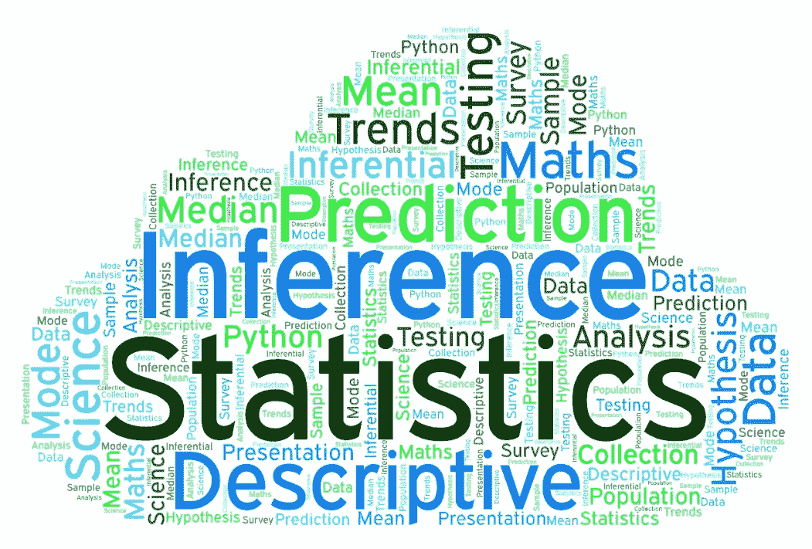

# 关于推断统计学你需要知道什么

> 原文：<https://medium.com/geekculture/what-you-need-to-know-about-inferential-statistics-c65d7540ccd6?source=collection_archive---------7----------------------->

## 数据科学

## 剧透—了解如何在不到 1 分钟的时间内计算置信区间

Statistics in Data Science | Image created by Author

统计学是数据科学的基石！

在[***上一部分***](/geekculture/2-most-popular-statistics-concepts-in-data-science-b2b166b779da) 中，我讨论了描述统计学中的概念。还快速而全面地概述了…