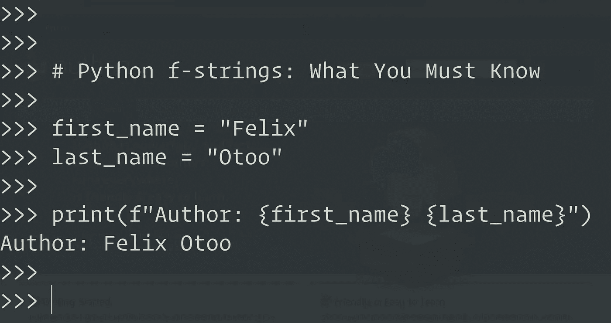

# Python f-strings:你必须知道的

> 原文：<https://medium.com/geekculture/what-you-need-to-know-about-python-f-strings-a410059fbc99?source=collection_archive---------0----------------------->

Photo by Author (A screenshot of my terminal 😃)

**字符串格式化**在 [Python](https://www.python.org/) 中确实有了很大的进步。它在许多编程语言中被称为 [**字符串插值**。](https://en.wikipedia.org/wiki/String_interpolation)

字符串插值是包含插值表达式或占位符的文字字符串，通过用提供的值替换插值表达式，可将插值表达式或占位符解析为结果字符串