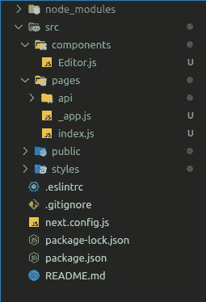
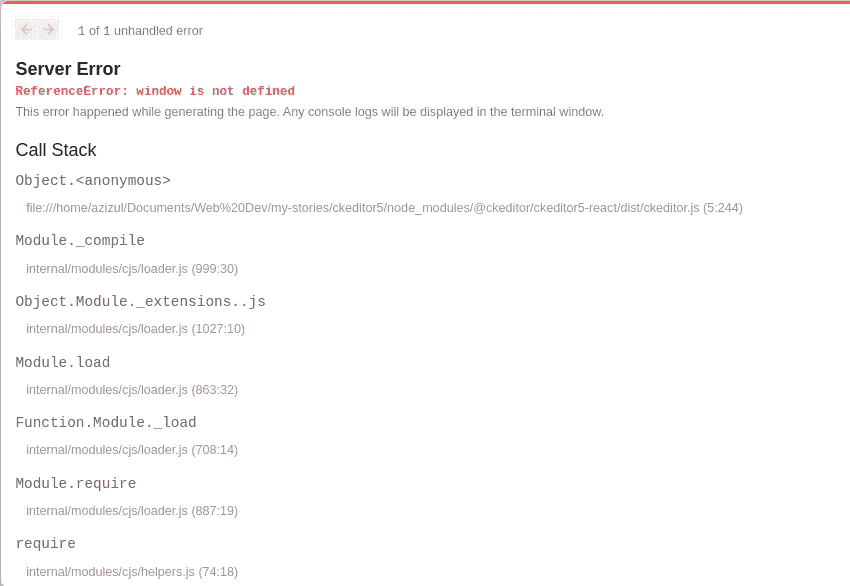

# 所见即所得| NextJs

> 原文：<https://medium.com/geekculture/what-you-see-is-what-you-get-nextjs-7523dfe01bd5?source=collection_archive---------6----------------------->

等一下，你可能不明白我们到底在说什么。你在想这个标题没有任何意义。不要走开，静观其变，因为我们将学习一个非常有用的主题，将最终用户界面带到下一个级别。

## 介绍

WYSIWYG 代表“所见即所得”是一个丰富的文本编辑器。而且，正如其名称所暗示的那样，当涉及到文本编辑器时，WYSIWYG UI 可以让您在编辑过程中看到您的内容，就像它在您的站点上实时显示一样。你必须熟悉微软 Word，谷歌文档等。这些都是富文本编辑器的很好的例子。

> 所见即所得意味着一个[用户界面](https://en.wikipedia.org/wiki/User_interface)，允许用户在创建文档时查看与最终结果非常相似的内容。


Rich text editor (WYSIWYG)

一般来说，我们开发人员在我们的博客网站上使用这种技术。为我们的最终用户提供一个成熟的交互式编辑器是有意义的。用户既可以写，也可以预览观众看到的效果。它改善了用户体验。

有很多富文本编辑器。其中一些是 [CKEditor 5、](https://ckeditor.com/ckeditor-5/) [Editor。Js](https://editorjs.io/) 、 [MediumEditor](https://yabwe.github.io/medium-editor/) 等等。今天，我们将讨论 CKEditor 5 的用例及实现。让我们开始吧…

## cke editor 5—一个富文本编辑器

CKEditor 有一些可用的构建版本。每个“构建”都提供了一种具有一组特性的编辑器。但是，我们将在我们的项目中实现[“经典构建”](https://ckeditor.com/ckeditor-5/demo/#classic)。先说第一件事，假设我们有一个 nextJs app，如果没有，可以先按照 [Next.js 文档](https://nextjs.org/docs/getting-started)。

到目前为止，我们已经初始化了我们的应用程序，移动到项目目录并在您喜欢的代码编辑器中打开应用程序。如下修改您项目层次结构(可选)。



Project hierarchy

现在，是时候和我们的老师一起玩了。为了在我们的应用程序中初始化它，我们需要安装 CKEditor 5 中的两个包。首先，我们将安装它们，然后我将解释每一个软件包以及我们为什么需要它们。

运行下面的命令

```
$ npm install --save @ckeditor/ckeditor5-react @ckeditor/ckeditor5-build-classic
```

for [Editor.js](https://github.com/azizulbappy0096/CKEditor5/blob/master/src/components/Editor.js)

恭喜，我们实现了有史以来第一个富文本编辑器。但是这里发生了什么？在这里，我们的包装显示了它们的价值。CKEditor 将包装我们实际的编辑器，并运行所有的逻辑来渲染到 [DOM](https://developer.mozilla.org/en-US/docs/Web/API/Document_Object_Model/Introduction) 。[**cke editor**](https://www.npmjs.com/package/@ckeditor/ckeditor5-react)接受一个必需的编辑器参数和一些其他事件处理程序。在这里，我们已经通过 **ClassicEditor** 作为我们的编辑器，它来自我们之前选择的 CKEditor 5。它有一些内置功能，但我们可以根据自己的喜好进行修改。从[这里](https://ckeditor.com/docs/ckeditor5/latest/builds/guides/integration/configuration.html)了解更多。

由于 CKEditor 延迟了将编辑器呈现到我们的 web 窗口的时间，所以我们为最终用户实现了一个加载屏幕。

我们的编辑器已经准备好显示了，我们要做的最后一件事就是在 [index.js](https://github.com/azizulbappy0096/CKEditor5/blob/master/src/pages/index.js) (主页)中呈现我们的编辑器。

现在，让我们在浏览器中查看我们的应用程序。糟糕，出现了问题。有一个错误如下



Error message

别慌，让我们深入研究一下，看看我们做错了什么。如你所知，NextJs 向客户端发送了一个优化的“服务器端渲染”页面。这就是我们的问题所在。CKEditor 需要一个 [DOM](https://developer.mozilla.org/en-US/docs/Web/API/Document_Object_Model/Introduction) 来呈现。但是因为 [SSR](https://developers.google.com/web/updates/2019/02/rendering-on-the-web) ，所以没有得到 DOM，抛出错误。让我们一起解决这个问题。

我将向你展示两种方法来衡量这个问题。从简单的开始。做一些改变…

**记住，不要同时使用两种解决方案，否则会破坏你的站点**。

对于 [index.js](https://github.com/azizulbappy0096/CKEditor5/blob/master/src/pages/index.js) (解决方案-1)

这里我们展示了一个技巧。我们没有直接导入编辑器组件**，**，而是使用了 nextJs [动态导入](https://nextjs.org/docs/advanced-features/dynamic-import)，并关闭了 [SSR](https://developers.google.com/web/updates/2019/02/rendering-on-the-web) **。**那会导致加载迟缓。它不会导入编辑器，直到找到一个 [DOM](https://developer.mozilla.org/en-US/docs/Web/API/Document_Object_Model/Introduction) ，然后在不抛出任何错误的情况下呈现自己。

让我们换一种方式。撤消我们在 index.js 中所做的所有更改，然后

for [Editor.js](https://github.com/azizulbappy0096/CKEditor5/blob/master/src/components/Editor.js) (解决方案 2)

这里我们使用了 ReactJs 的 [useRef](https://reactjs.org/docs/hooks-reference.html#useref) 钩子。我们已经将钩子初始化为一个空文档。然后，当我们的组件在客户端呈现时，它运行它的副作用。这就是我们导入 CKEditor 模块的地方，并将它们作为对象放入定义的文档中。从那里，它更新了 DOM 以呈现编辑器应该呈现的样子。提醒你，不要同时使用两种解决方案。

## 结论

现在它在网络上运行得非常好。啊，我们已经走了很远了。我们对 WYSIWYG 和 CKEditor 5 的例子有了一个简单的概念。这只是一个小小的实现。有更多的选项可以控制编辑器的行为。如果你愿意，你甚至可以添加定制的插件。深入研究并尝试找到 WYSIWYG/富文本编辑器的所有可能的特性。

项目回购:[https://github.com/azizulbappy0096/CKEditor5](https://github.com/azizulbappy0096/CKEditor5)

所见即所得:[https://en.wikipedia.org/wiki/WYSIWYG](https://en.wikipedia.org/wiki/WYSIWYG)

cke editor 5:[https://cke editor . com/docs/cke editor 5/latest/builds/guides/overview . html](https://ckeditor.com/docs/ckeditor5/latest/builds/guides/overview.html)