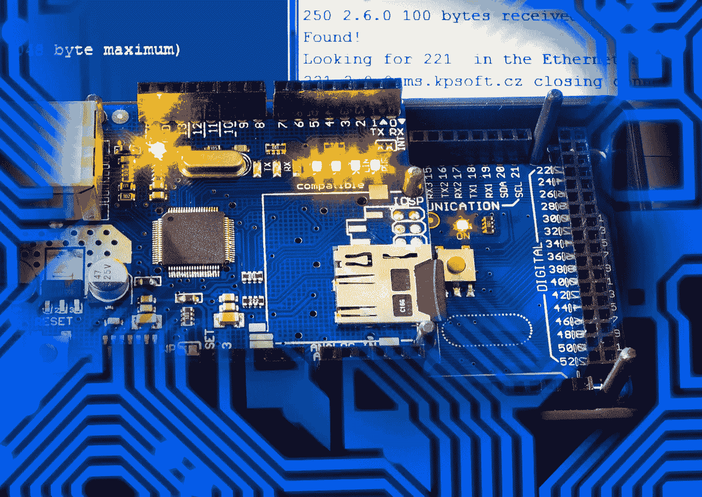

# 关于物联网安全管理你应该知道什么

> 原文：<https://medium.com/geekculture/what-you-should-know-about-iot-security-management-f5dd54c0e631?source=collection_archive---------22----------------------->

近 20%的公司在过去三年中至少遭受过一次基于物联网的攻击。这是全球研究公司 Gartner 进行的一项调查显示的。此外，惠普安全部门最近开展的一项研究显示，约 90%的物联网设备倾向于获取某种形式的个人信息。同样值得注意的是，在同一年，超过 1 . 558 亿美国人在 2020 年面临数据泄露。因此，解决物联网安全问题必须是任何物联网安全公司提出的解决方案的优先事项。不用说，必须集成的安全措施的数量与物联网解决方案将访问的数据和系统的重要性和敏感性相关联。

# 不同层面的物联网安全威胁

可以将物联网安全分为三个主要类别，并且需要在每个类别中实施最佳实践，以减轻物联网安全问题带来的问题:

**一、装置**

为了在设备层适当保护物联网解决方案，公司必须确保有形特征以及技术属性(如固件、操作系统和设备上运行的应用)保持安全。当涉及到与软件相关的属性时，在设计过程中必须考虑潜在的安全问题，以更新固件并保护设备免受不必要的访问和配置更改。

此外，一些物联网设备尺寸较小，其用于处理信息和支持高级安全功能的内存和资源必然有限。在这种情况下，公司可以考虑基于云的物联网安全解决方案。

**二世。通信**

为了正确保护物联网解决方案下的通信层，公司应该考虑执行以基础设施和数据为中心的解决方案。

通常，网络基础设施的安全性由公司的网络连接提供商进行验证。当与连接提供商交互时，企业必须考虑加密方法以及防火墙技术。此外，他们必须检查公司网络中的每台服务器以及网络元素是否都进行了更新，以保持配备有最新的安全补丁。

当谈到物联网设备的以数据为中心的安全性时，在制定最佳实践解决方案时，通常会优先考虑数据加密。在加密的帮助下，物联网数据受到保护，不会被访问和读取，因为它要通过几个网络，如公共互联网。

确保传输数据保持真实性和完整性的一些示例包括站点到站点虚拟专用网络(VPN)解决方案，以及数据签名解决方案。

**三世。应用程序**

在整个开发过程中，为了保护 web、移动和云组件，必须考虑应用程序安全性，就像其他层一样。为了保护物联网解决方案，一些最佳实践包括:

代码分析工具，用于自动检查源代码并识别可能的安全缺陷

及时且自动化的应用程序更新，可快速高效地更新应用程序，确保抵御新病毒攻击或其他潜在的安全风险

密钥交换解决方案确保物联网应用安全密钥得到安全更新。

证书注册解决方案，用于确保每个物联网设备都有一个唯一的标识符，并在促进系统或网络访问之前验证该标识符。

# 物联网漏洞和安全问题

日常物联网操作由指挥和控制(C&C)中心和 API 有效处理。其结果是，由于其集中的性质，产生了几个薄弱和易受攻击的点，例如:

*   **未打补丁的漏洞** —通常，由于连接问题或最终用户需要从 C 中心手动下载每个更新，设备倾向于在过时的软件上运行。结果是，此类设备仍然容易出现新的物联网安全问题。
*   **弱认证** —通常，制造商倾向于销售具有简单密码的物联网设备，这些密码由供应商和最终用户保持不变。当这些设备对远程访问开放时，它们很容易受到攻击者的攻击，攻击者会运行自动化脚本来执行批量攻击。
*   **易受攻击的 API**—由于 API 的功能是通往 C 中心的网关，因此它们经常成为多种威胁的目标，例如针对 API 的攻击。

# 克服物联网安全挑战的必备最佳实践

1.  **管理运营风险:**评估攻击的风险及其对[物联网生态系统](https://orientedsoft.com/most-beneficial-iot-applications-vertical-and-horizontal)的影响，以了解安全强度。例如，与倾向于在会议室中开灯和关灯的传感器相比，能够监控、调节和自动化工厂地板上的机器的系统需要更严格的协议。
2.  **限制设备到设备的通信:**注意这一点:如果有多个设备相互交互，中断一个连接点并进入物联网网络的可能性更大。大多数设备只有一个目的，就是将数据传输到一个采集点。通过选择参与双向交换的设备，公司可以将物联网安全问题限制在巨大生态系统中的一个小区域。
3.  **控制物联网基础设施:**选择配备有您需要的安全功能的设备，或者可以根据其操作方式和如何弥补安全漏洞进行评估的设备。在少数情况下，物联网设备有可能通过安全连接自动升级，或者公司可以决定更新的时间、频率和交付。
4.  **使用端到端加密:**各种设备和数据消费点之间的通信必须加密，以防止敏感数据被未经授权的监听、篡改、欺骗、操纵和恢复。此过程必须附加到设备身份，以确保数据从委派的设备中出现。
5.  **寻找并考虑最新的专业知识:**在您的物联网系统中利用经过测试的安全技术、工具和最佳实践，以及您的 IT 环境。通常，这种策略可以使用数字证书直接执行。基于设备的功能以及通信流，限制方法也是可能的，或者可以集成机制来保护和监控。在少数情况下，其中存在微控制器和低功率网络；利用现有的原则和概念创造新的方法是可能的。

Photo by [Jason Blackeye](https://unsplash.com/@jeisblack?utm_source=unsplash&utm_medium=referral&utm_content=creditCopyText) on [Unsplash](https://unsplash.com/s/photos/technology?utm_source=unsplash&utm_medium=referral&utm_content=creditCopyText)

# 最后的想法

要推出一个没有物联网安全问题的成功物联网计划，通过考虑本质上不同的几个相互关联的事物来识别和预防各种安全风险非常重要。重要的是将安全性构建到解决方案中，以涵盖多种事物，如新的终端设备、网关、应用程序、云服务和“工厂/医院/商店货架即数据中心”类型的模型。根据 Juniper Research 的研究，这对于物联网来说是一个至关重要的问题，该研究预测，到 2023 年，物联网安全支出可能会增加 300%。